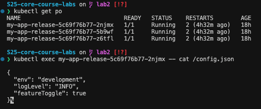
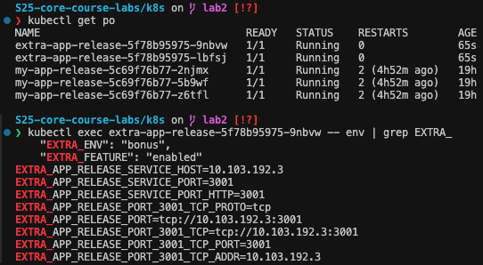

# Kubernetes ConfigMaps and Persistence - Lab 12 Report

## ConfigMap

I have created a `config.json` file inside the `files` folder and mounted it into the application using settings defined in `values.yaml` of my Helm chart.

**Command Output:**

```bash
$ kubectl get po
NAME                              READY   STATUS    RESTARTS        AGE
my-app-release-5c69f76b77-2njmx   1/1     Running   2 (4h32m ago)   18h
my-app-release-5c69f76b77-5b9wf   1/1     Running   2 (4h32m ago)   18h
my-app-release-5c69f76b77-z6tfl   1/1     Running   2 (4h32m ago)   18h
```

```bash
$ kubectl exec my-app-release-5c69f76b77-2njmx -- cat /config.json
{
  "env": "development",
  "logLevel": "INFO",
  "featureToggle": true
}
```

And as a screenshot:



---

## Bonus Task Steps (ConfigMap via Environment Variables)

I have used the `envFrom` property in the deployment manifest of my bonus application to load configuration values from a ConfigMap into environment variables.

**Command Output:**

```bash
$ kubectl get po
NAME                                 READY   STATUS    RESTARTS        AGE
extra-app-release-5f78b95975-9nbvw   1/1     Running   0               65s
extra-app-release-5f78b95975-lbfsj   1/1     Running   0               65s
```

```bash
$ kubectl exec extra-app-release-5f78b95975-9nbvw -- env | grep EXTRA_
    "EXTRA_ENV": "bonus",
    "EXTRA_FEATURE": "enabled"
EXTRA_APP_RELEASE_SERVICE_HOST=10.103.192.3
EXTRA_APP_RELEASE_SERVICE_PORT=3001
EXTRA_APP_RELEASE_SERVICE_PORT_HTTP=3001
EXTRA_APP_RELEASE_PORT_3001_TCP_PROTO=tcp
EXTRA_APP_RELEASE_PORT=tcp://10.103.192.3:3001
EXTRA_APP_RELEASE_PORT_3001_TCP=tcp://10.103.192.3:3001
EXTRA_APP_RELEASE_PORT_3001_TCP_PORT=3001
EXTRA_APP_RELEASE_PORT_3001_TCP_ADDR=10.103.192.3
```

As you can see, the environment variables from the ConfigMap are available inside the container.

---


## Summary

- **ConfigMap Mounting:** The `config.json` file was successfully mounted into the main application via a ConfigMap, allowing the app to access configuration data from `/config.json`.
- **Persistent Storage:** The application was upgraded to persist a visit counter in a file (`/data/visits.txt`), ensuring data persistence across pod restarts.
- **Bonus (envFrom):** In the extra application, configuration data is loaded as environment variables using `envFrom`. The output of the `printenv` command confirms that the variables `EXTRA_ENV` and `EXTRA_FEATURE` are set.
- All steps have been documented and verified with the respective command outputs.
