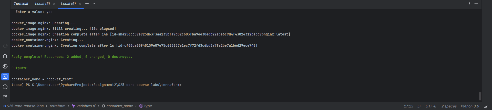
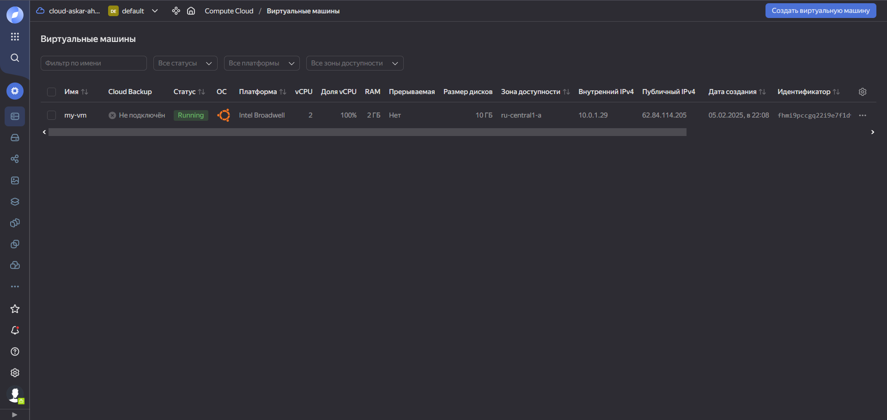
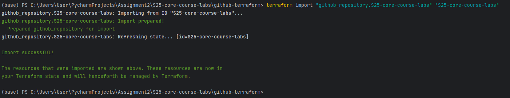
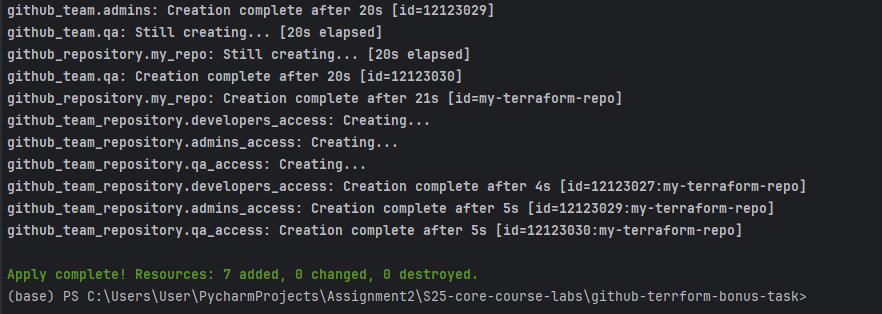
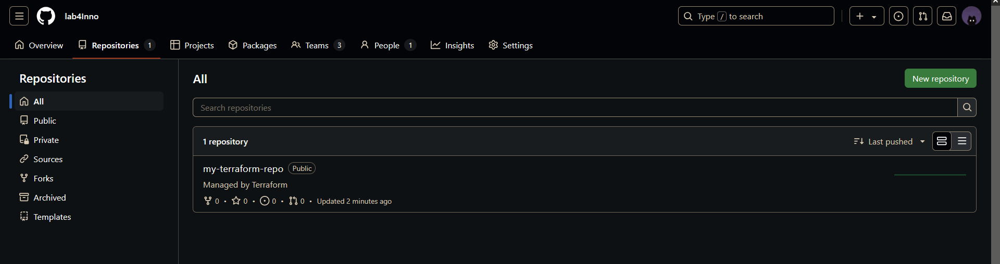
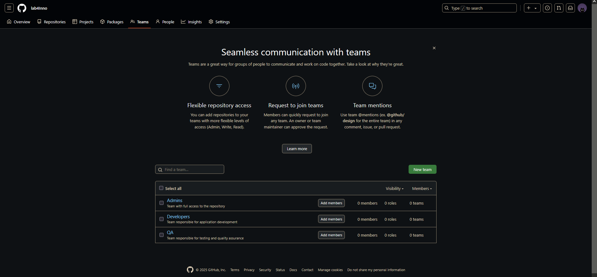

# Task 1

## Install Terraform

Verify installation:

```bash
terraform -version
```

## Set Up Terraform Workspace

Create a directory for your Terraform work:

```bash
mkdir terraform && cd terraform
touch TF.md
```

## Initialize Terraform:

```bash
terraform init
```

Apply changes with default value:

```bash
terraform apply -auto-approve
```

If you want to specify a custom name when running terraform apply, use:

```bash
terraform apply -var="container_name=new-container-name" -auto-approve
```

After applying the changes, check the Terraform output:

```bash
terraform output
```

Log with applied changes:


## Yandex Cloud

### Create an Account on Yandex Cloud
1. Go to Yandex Cloud.
2. Sign up or log in using your Yandex account.
3. Activate the free-tier trial (750 hours of a small VM).

### Install Required Tools

Install Terraform

Verify installation:
```bash
terraform -version
```

### Install Yandex CLI

Restart your shell and verify:
```bash
yc --version
```

### Authenticate with Yandex Cloud
Run the initialization command:
```bash
yc init
```

Follow the prompts to:
1. Log in via a browser.
2. Select or create a new cloud.
3. Select or create a folder.
4. Set up a default compute zone (e.g., ru-central1-a).
4. Enable a free-tier VM instance.

### Configure Terraform for Yandex Cloud

create a Terraform Directory

```bash
mkdir yandex-terraform && cd yandex-terraform
```

Create a Terraform configuration file:

```bash
touch main.tf
```

define Terraform Configuration [main.tf](github-terraform/main.tf)

Replace placeholders (<YOUR_YANDEX_CLOUD_TOKEN>, <YOUR_CLOUD_ID>, etc.) with actual values.

## Initialize and Apply Terraform

Initialize Terraform
```bash
terraform init
```

validate and Format
```bash
terraform fmt
terraform validate
```

apply Configuration
```bash
terraform apply -auto-approve
```

### Verify the Deployment
Once Terraform applies the changes, check your Yandex Cloud dashboard to confirm that the VM instance is running.

Retrieve VM Details
```bash
terraform state list
terraform state show yandex_compute_instance.vm
```

### Document the Process

1. Terraform authentication issues	
   2. Ensure yc init is properly configured
2. Incorrect resource parameters	
   3. Double-check image_id and subnet_id
3. Connection issues	
   4. Ensure firewall and SSH settings are correct


## Yandex Cloud Setup with Terraform

### Steps Followed:
1. Created a Yandex Cloud account.
2. Installed Terraform and Yandex CLI.
3. Initialized `yc` and configured authentication.
4. Wrote a Terraform script to create a VM instance.
5. Applied Terraform configurations.
6. Verified deployment using `terraform state show`.



# Task 2
## Terraform Best Practices for GitHub Infrastructure

### 1. Structure Terraform Code
- Used separate directories (`terraform/github-terraform/`) for better organization.

### 2. Use Terraform Formatting and Validation
- Ran `terraform fmt` and `terraform validate` to ensure consistency.

### 3. Use Branch Protection Rules
- Ensured the `main` branch requires pull request reviews and status checks before merging.

### 4. Manage Existing Repositories
- Used ` terraform import "github_repository.S25-core-course-labs" "S25-core-course-labs"` to manage existing repositories.

### Commands Run:
```sh
terraform init
terraform validate
terraform apply -auto-approve
terraform import "github_repository.S25-core-course-labs" "S25-core-course-labs"
```


## GitHub Teams Using Terraform

### Steps Taken:
1. Upgraded GitHub account to an organization.
2. Configured Terraform to create two teams: Developers (push access) and Admins (admin access).
3. Applied Terraform configuration to add teams to the repository.

### Best Practices:
- Used `terraform validate` to check for errors.
- Used teams instead of individual users for better access management.

### Commands Used:
```sh
terraform init
terraform apply -auto-approve
```



