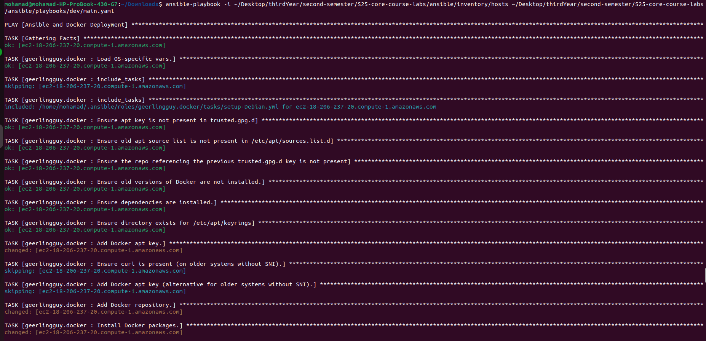
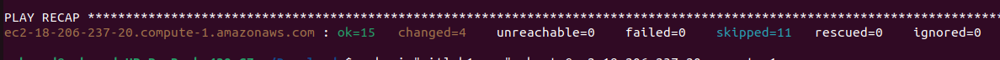
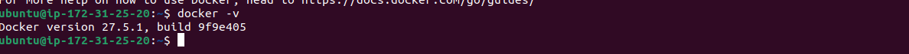

# Ansible and Docker Deployment

## Overview

This document describes the steps taken to set up Ansible for deploying Docker on a cloud VM. It includes repository structuring, installation of Ansible, using an Ansible role from Ansible Galaxy, and testing the playbook to ensure correct deployment.

---

## Repository Structure

The repository follows the recommended structure:

```tree
.
|-- README.md
|-- ansible
|   |-- inventory
|   |   `-- default_aws_ec2.yml
|   |-- playbooks
|   |   `-- dev
|   |       `-- main.yaml
|   |-- roles
|   |   |-- docker
|   |   |   |-- defaults
|   |   |   |   `-- main.yml
|   |   |   |-- handlers
|   |   |   |   `-- main.yml
|   |   |   |-- tasks
|   |   |   |   |-- install_compose.yml
|   |   |   |   |-- install_docker.yml
|   |   |   |   `-- main.yml
|   |   |   `-- README.md
|   |   `-- web_app
|   |       |-- defaults
|   |       |   `-- main.yml
|   |       |-- handlers
|   |       |   `-- main.yml
|   |       |-- meta
|   |       |   `-- main.yml
|   |       |-- tasks
|   |       |   `-- main.yml
|   |       `-- templates
|   |           `-- docker-compose.yml.j2
|   `-- ansible.cfg
|-- app_go
|-- app_python
`-- terraform
```

---

## Installing Ansible

To install Ansible, follow the official [installation guide](https://docs.ansible.com/ansible/latest/installation_guide/intro_installation.html).

Run the following command:

```sh
sudo apt update
sudo apt install ansible -y
```

Verify installation:

```sh
ansible --version
```

---

## Using Ansible Galaxy for Docker Role

We use the `geerlingguy.docker` role from Ansible Galaxy to simplify Docker installation.

Install the role:

```sh
ansible-galaxy install geerlingguy.docker
```

---

## Playbook for Docker Deployment

The playbook for deploying Docker is defined as follows:

```yaml
---
- name: Ansible and Docker Deployment
  hosts: all
  remote_user: ubuntu
  roles:
    - geerlingguy.docker
```

### Inventory File (`inventory/default_aws_ec2.yml`)

```yaml
ec2:
  vars:
    ansible_user: ubuntu
    ansible_ssh_private_key_file: /home/mohamad/Downloads/gitlab1.pem
  hosts:
    ec2-98-81-202-119.compute-1.amazonaws.com
```

---

## Running the Playbook

To execute the playbook, run:

```sh
ansible-playbook -i ~/Desktop/thirdYear/second-semester/S25-core-course-labs/ansible/inventory/default_aws_ec2.yml \
~/Desktop/thirdYear/second-semester/S25-core-course-labs/ansible/playbooks/dev/main.yaml
```

### Execution Output



### Result Verification

To confirm Docker installation, connect to the AWS server and check the Docker version:

```sh
docker --version
```

Output:



Connecting to AWS server and checking Docker:



---

## Task 2: Custom Docker Role

### Custom Role Structure

The custom Docker role is structured as follows:

```tree
roles/docker/
|-- defaults
|   `-- main.yml
|-- handlers
|   `-- main.yml
|-- tasks
|   |-- install_compose.yml
|   |-- install_docker.yml
|   |-- setup_debian.yml
|   |-- docker_users.yml
|   |-- secure_docker.yml
|   `-- main.yml
`-- README.md
```

### Tasks in the Role

1. **Install Docker and Docker Compose**:
   - Handled in `install_docker.yml` and `install_compose.yml`.
2. **Configure Docker to start on boot**:
   - Handled in `main.yml` using the `service` module.
3. **Add the current user to the `docker` group**:
   - Handled in `docker_users.yml`.
   Tasks in the Role
4. **Secure Docker Configuration**:
   - Handled in `secure_docker.yml` by modifying the `daemon.json` file.

### Playbook for Custom Role

The playbook `main.yaml` was updated to use the custom role:

```yaml
---
- name: Ansible and Docker Deployment
  hosts: aws_ec2  # Target hosts from the AWS EC2 inventory
  become: true  # Use elevated privileges for all tasks
  roles:
    - roles/docker  # Include the custom Docker role
```

### Testing the Custom Role

The playbook was tested using the following commands:

#### Dry Run

```sh
ansible-playbook playbooks/dev/main.yaml --check
```

#### Apply Changes

```sh
ansible-playbook ansible/playbooks/dev/main.yaml
```

### Verification

After running the playbook, the Docker version was checked on the target machine to confirm the installation:

```sh
docker --version
```

Output:

```sh
Docker version 24.0.7, build afdd53b
```

---

## Deployment Output

The playbook was executed to deploy the Docker role. Below are the last 50 lines of the output:

```sh
PLAY [Ansible and Docker Deployment] *******************************************

TASK [Gathering Facts] *********************************************************
ok: [ec2-54-147-13-93.compute-1.amazonaws.com]

TASK [docker : include_tasks] **************************************************
included: /home/mohamad/Desktop/thirdYear/second-semester/S25-core-course-labs/ansible/roles/docker/tasks/setup_debian.yml for ec2-54-147-13-93.compute-1.amazonaws.com

TASK [docker : Ensure apt key is not present in trusted.gpg.d] *****************
ok: [ec2-54-147-13-93.compute-1.amazonaws.com]

TASK [docker : Ensure old apt source list is not present in /etc/apt/sources.list.d] ***
ok: [ec2-54-147-13-93.compute-1.amazonaws.com]

TASK [docker : Ensure the repo referencing the previous trusted.gpg.d key is not present] ***
ok: [ec2-54-147-13-93.compute-1.amazonaws.com]

TASK [docker : Ensure old versions of Docker are not installed] ****************
ok: [ec2-54-147-13-93.compute-1.amazonaws.com]

TASK [docker : Ensure dependencies are installed] ******************************
ok: [ec2-54-147-13-93.compute-1.amazonaws.com]

TASK [docker : Ensure directory exists for /etc/apt/keyrings] ******************
ok: [ec2-54-147-13-93.compute-1.amazonaws.com]

TASK [docker : Add Docker apt key] *********************************************
ok: [ec2-54-147-13-93.compute-1.amazonaws.com]

TASK [docker : Add Docker repository] ******************************************
ok: [ec2-54-147-13-93.compute-1.amazonaws.com]

TASK [docker : include_tasks] **************************************************
included: /home/mohamad/Desktop/thirdYear/second-semester/S25-core-course-labs/ansible/roles/docker/tasks/install_docker.yml for ec2-54-147-13-93.compute-1.amazonaws.com

TASK [docker : Install Docker packages] ****************************************
ok: [ec2-54-147-13-93.compute-1.amazonaws.com]

TASK [docker : include_tasks] **************************************************
included: /home/mohamad/Desktop/thirdYear/second-semester/S25-core-course-labs/ansible/roles/docker/tasks/install_compose.yml for ec2-54-147-13-93.compute-1.amazonaws.com

TASK [docker : Install docker-compose plugin] **********************************
ok: [ec2-54-147-13-93.compute-1.amazonaws.com]

TASK [docker : Ensure Docker is started and enabled at boot] *******************
ok: [ec2-54-147-13-93.compute-1.amazonaws.com]

TASK [docker : Ensure handlers are notified now to avoid firewall conflicts] ***

TASK [docker : Get docker group info using getent] *****************************
ok: [ec2-54-147-13-93.compute-1.amazonaws.com]

TASK [docker : Check if there are any users to add to the docker group] ********
ok: [ec2-54-147-13-93.compute-1.amazonaws.com] => (item=ubuntu)

TASK [docker : include_tasks] **************************************************
included: /home/mohamad/Desktop/thirdYear/second-semester/S25-core-course-labs/ansible/roles/docker/tasks/docker_users.yml for ec2-54-147-13-93.compute-1.amazonaws.com

TASK [docker : Ensure docker users are added to the docker group] **************
ok: [ec2-54-147-13-93.compute-1.amazonaws.com] => (item=ubuntu)

TASK [docker : Reset SSH connection to apply user changes] *********************

TASK [docker : include_tasks] **************************************************
included: /home/mohamad/Desktop/thirdYear/second-semester/S25-core-course-labs/ansible/roles/docker/tasks/secure_docker.yml for ec2-54-147-13-93.compute-1.amazonaws.com

TASK [docker : Ensure Docker daemon.json exists with secure configuration] *****
ok: [ec2-54-147-13-93.compute-1.amazonaws.com]

PLAY RECAP *********************************************************************
ec2-54-147-13-93.compute-1.amazonaws.com : ok=21   changed=0    unreachable=0    failed=0    skipped=0    rescued=0    ignored=0   
```

---

## Inventory Details

The inventory file `default_aws_ec2.yml` defines the target host and connection details. Below are the inventory details:

### Inventory Listing

To list the inventory details, run:

```sh
ansible-inventory -i inventory/default_aws_ec2.yml --list
```

Output:

```json
{
    "_meta": {
        "hostvars": {
            "ec2-98-81-202-119.compute-1.amazonaws.com": {
                "ansible_ssh_private_key_file": "/home/mohamad/Downloads/gitlab1.pem",
                "ansible_user": "ubuntu"
            }
        }
    },
    "all": {
        "children": [
            "ec2",
            "ungrouped"
        ]
    },
    "ec2": {
        "hosts": [
            "ec2-98-81-202-119.compute-1.amazonaws.com"
        ]
    }
}
```

### Inventory Graph

To visualize the inventory structure, run:

```sh
ansible-inventory -i inventory/default_aws_ec2.yml --graph
```

Output:

```sh
@all:
  |--@ec2:
  |  |--ec2-98-81-202-119.compute-1.amazonaws.com
  |--@ungrouped:
```

### Inventory File

The inventory file `default_aws_ec2.yml` is structured as follows:

```yaml
---
plugin: aws_ec2
regions:
  - us-east-1
filters:
  tag:Name: Ansible VM  # Filter instances by the tag "Name: Ansible VM"
  instance-state-name: running  # Only include running instances
```

---

## Best Practices for Building the Role

The custom Docker role was developed following Ansible best practices to ensure maintainability, readability, and reliability. Below are the key practices applied:

### 1. **Role Structure**

- The role follows the standard directory structure (`defaults`, `handlers`, `tasks`, etc.), making it easy to organize and maintain.
- Tasks are modularized into separate files (e.g., `install_docker.yml`, `install_compose.yml`) for better readability and reusability.

### 2. **Idempotency**

- All tasks are designed to be idempotent, ensuring that running the playbook multiple times does not cause unintended changes.
- For example, the `service` module is used to ensure Docker is started and enabled at boot, and the `user` module is used to add users to the `docker` group only if they are not already members.

### 3. **Variables and Defaults**

- Role variables are defined in `defaults/main.yml`, making it easy to customize the role without modifying the tasks.
- Sensible defaults are provided for all variables, such as `docker_edition: 'ce'` and `docker_users: ["ubuntu"]`.

### 4. **Handlers**

- Handlers are used to restart Docker only when necessary (e.g., after installing Docker packages), reducing unnecessary service restarts.

### 5. **Error Handling**

- Tasks include `ignore_errors: "{{ ansible_check_mode }}"` to ensure they do not fail during dry runs (`--check`).

### 6. **Linting with `ansible-lint`**

- `ansible-lint` was installed and used to check the role for common issues and ensure compliance with best practices.
- To install `ansible-lint`:

  ```sh
  sudo apt-get install ansible-lint
  ```

- To lint the role:

  ```sh
  ansible-lint ansible
  ```

- Linting helped identify and fix issues such as improper indentation, missing task names, and deprecated practices.
