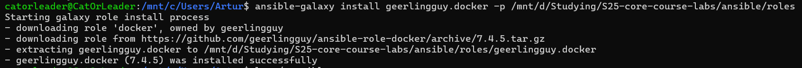
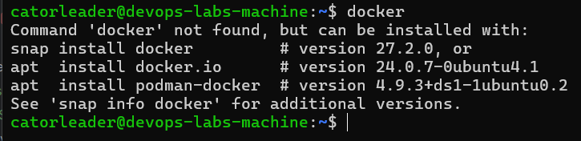
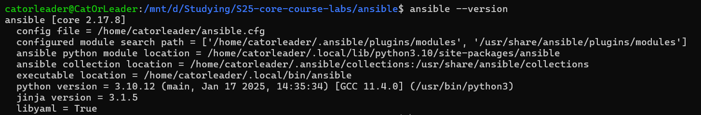
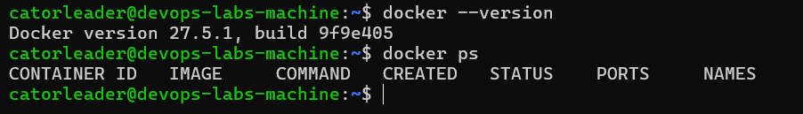
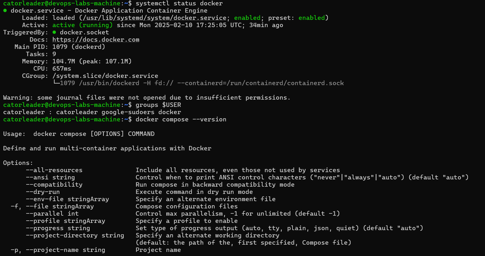

# Ansible

## Installing

I install Ansible using `pip` on WSL, so no difficulties about this, though. Then, I install the gerrlingguy.docker role
to properly use it further—and install it in the folder of the current project, by the following command:

- 

## Virtual Machine (before)

Firstly, on the virtual machine there is no docker:



## Config file usage

I cannot place ansible.cfg in the folder of the current project and properly use it, because folder is writable
(that is prohibited by the ansible). So therefore, I just copy all the content from the ansible.cfg in project
and put it in the file on the path (wsl): `~/ansible.cfg`. Then, I export the `ANSIBLE_CONFIG` variable into the
sysenv and properly use it:



## Deploying Docker on VM

```bash
ansible-playbook -i inventory/docker-inventory.ini playbooks/docker/main.yml

PLAY [Deploy Docker] *****************************************************************************************************************************************************

TASK [Gathering Facts] ***************************************************************************************************************************************************
[WARNING]: Platform linux on host 51.250.37.20 is using the discovered Python interpreter at /usr/bin/python3.12, but future installation of another Python interpreter
could change the meaning of that path. See https://docs.ansible.com/ansible-core/2.17/reference_appendices/interpreter_discovery.html for more information.
ok: [51.250.37.20]

TASK [geerlingguy.docker : Load OS-specific vars.] ***********************************************************************************************************************
ok: [51.250.37.20]

TASK [geerlingguy.docker : include_tasks] ********************************************************************************************************************************
skipping: [51.250.37.20]

TASK [geerlingguy.docker : include_tasks] ********************************************************************************************************************************
included: /mnt/d/Studying/S25-core-course-labs/ansible/roles/geerlingguy.docker/tasks/setup-Debian.yml for 51.250.37.20

TASK [geerlingguy.docker : Ensure apt key is not present in trusted.gpg.d] ***********************************************************************************************
ok: [51.250.37.20]

TASK [geerlingguy.docker : Ensure old apt source list is not present in /etc/apt/sources.list.d] *************************************************************************
ok: [51.250.37.20]

TASK [geerlingguy.docker : Ensure the repo referencing the previous trusted.gpg.d key is not present] ********************************************************************
ok: [51.250.37.20]

TASK [geerlingguy.docker : Ensure old versions of Docker are not installed.] *********************************************************************************************
ok: [51.250.37.20]

TASK [geerlingguy.docker : Ensure dependencies are installed.] ***********************************************************************************************************
ok: [51.250.37.20]

TASK [geerlingguy.docker : Ensure directory exists for /etc/apt/keyrings] ************************************************************************************************
ok: [51.250.37.20]

TASK [geerlingguy.docker : Add Docker apt key.] **************************************************************************************************************************
ok: [51.250.37.20]

TASK [geerlingguy.docker : Ensure curl is present (on older systems without SNI).] ***************************************************************************************
skipping: [51.250.37.20]

TASK [geerlingguy.docker : Add Docker apt key (alternative for older systems without SNI).] ******************************************************************************
skipping: [51.250.37.20]

TASK [geerlingguy.docker : Add Docker repository.] ***********************************************************************************************************************
ok: [51.250.37.20]

TASK [geerlingguy.docker : Install Docker packages.] *********************************************************************************************************************
skipping: [51.250.37.20]

TASK [geerlingguy.docker : Install Docker packages (with downgrade option).] *********************************************************************************************
ok: [51.250.37.20]

TASK [geerlingguy.docker : Install docker-compose plugin.] ***************************************************************************************************************
skipping: [51.250.37.20]

TASK [geerlingguy.docker : Install docker-compose-plugin (with downgrade option).] ***************************************************************************************
ok: [51.250.37.20]

TASK [geerlingguy.docker : Ensure /etc/docker/ directory exists.] ********************************************************************************************************
skipping: [51.250.37.20]

TASK [geerlingguy.docker : Configure Docker daemon options.] *************************************************************************************************************
skipping: [51.250.37.20]

TASK [geerlingguy.docker : Ensure Docker is started and enabled at boot.] ************************************************************************************************
ok: [51.250.37.20]

TASK [geerlingguy.docker : Ensure handlers are notified now to avoid firewall conflicts.] ********************************************************************************

TASK [geerlingguy.docker : include_tasks] ********************************************************************************************************************************
skipping: [51.250.37.20]

TASK [geerlingguy.docker : Get docker group info using getent.] **********************************************************************************************************
ok: [51.250.37.20]

TASK [geerlingguy.docker : Check if there are any users to add to the docker group.] *************************************************************************************
ok: [51.250.37.20] => (item=catorleader)

TASK [geerlingguy.docker : include_tasks] ********************************************************************************************************************************
included: /mnt/d/Studying/S25-core-course-labs/ansible/roles/geerlingguy.docker/tasks/docker-users.yml for 51.250.37.20

TASK [geerlingguy.docker : Ensure docker users are added to the docker group.] *******************************************************************************************
changed: [51.250.37.20] => (item=catorleader)

TASK [geerlingguy.docker : Reset ssh connection to apply user changes.] **************************************************************************************************

PLAY RECAP ***************************************************************************************************************************************************************
51.250.37.20               : ok=18   changed=1    unreachable=0    failed=0    skipped=8    rescued=0    ignored=0
```

Then, there is an available docker on the VM:



---

## Self-written Ansible role

- Initializing role

```bash
catorleader@CatOrLeader:/mnt/d/Studying/S25-core-course-labs/ansible/roles$ ansible-galaxy init docker
- Role docker was created successfully
```

- Then, configure the following files:
  - `roles/docker/tasks/main.yml` -- describe the steps and all the scenario that will be executed
  - `playbooks/docker/main.yml` -- adjust playbook to a new role

- Run command

```bash
catorleader@CatOrLeader:/mnt/d/Studying/S25-core-course-labs/ansible$ ansible-playbook -i inventory/docker-inventory.ini playbooks/docker/main.yml

PLAY [Deploy Docker] ***************************************************************************************************************************************

TASK [Gathering Facts] *************************************************************************************************************************************
[WARNING]: Platform linux on host 51.250.40.65 is using the discovered Python interpreter at /usr/bin/python3.12, but future installation of another Python
interpreter could change the meaning of that path. See https://docs.ansible.com/ansible-core/2.17/reference_appendices/interpreter_discovery.html for more
information.
ok: [51.250.40.65]

TASK [docker : Gather package facts] ***********************************************************************************************************************
ok: [51.250.40.65]

TASK [docker : Check if Docker is installed] ***************************************************************************************************************
ok: [51.250.40.65]

TASK [docker : Check if Docker Compose plugin is installed] ************************************************************************************************
ok: [51.250.40.65]

TASK [docker : Install prerequisite packages] **************************************************************************************************************
skipping: [51.250.40.65]

TASK [docker : Add Docker's official GPG key] **************************************************************************************************************
skipping: [51.250.40.65]

TASK [docker : Check if Docker apt repository is already added] ********************************************************************************************
ok: [51.250.40.65]

TASK [docker : Add Docker apt repository] ******************************************************************************************************************
skipping: [51.250.40.65]

TASK [docker : Update apt package index] *******************************************************************************************************************
skipping: [51.250.40.65]

TASK [docker : Install Docker Engine] **********************************************************************************************************************
skipping: [51.250.40.65]

TASK [docker : Install Docker Compose plugin] **************************************************************************************************************
skipping: [51.250.40.65]

TASK [docker : Enable and start Docker service] ************************************************************************************************************
ok: [51.250.40.65]

TASK [docker : Create 'docker' group if it doesn't exist] **************************************************************************************************
ok: [51.250.40.65]

TASK [docker : Add 'root' to 'docker' group] ***************************************************************************************************************
changed: [51.250.40.65]

PLAY RECAP *************************************************************************************************************************************************
51.250.40.65               : ok=8    changed=1    unreachable=0    failed=0    skipped=6    rescued=0    ignored=0
```

- Check out the result



- `... --diff`

```bash
catorleader@CatOrLeader:/mnt/d/Studying/S25-core-course-labs/ansible$ ansible-playbook playbooks/docker/main.yml --diff
[WARNING]: No inventory was parsed, only implicit localhost is available
[WARNING]: provided hosts list is empty, only localhost is available. Note that the implicit localhost does not match 'all'
[WARNING]: Could not match supplied host pattern, ignoring: docker_hosts

PLAY [Deploy Docker] ***************************************************************************************************************************************
skipping: no hosts matched

PLAY RECAP *************************************************************************************************************************************************
```

- `... --list`

```bash
catorleader@CatOrLeader:/mnt/d/Studying/S25-core-course-labs/ansible$ ansible-inventory -i inventory/docker-inventory.ini --list
{
    "_meta": {
        "hostvars": {
            "51.250.40.65": {
                "ansible_ssh_private_key_file": "~/.ssh/id_ed25519",
                "ansible_user": "catorleader"
            }
        }
    },
    "all": {
        "children": [
            "ungrouped",
            "docker_hosts"
        ]
    },
    "docker_hosts": {
        "hosts": [
            "51.250.40.65"
        ]
    }
}
```

- `... --graph`

```bash
catorleader@CatOrLeader:/mnt/d/Studying/S25-core-course-labs/ansible$ ansible-inventory -i inventory/docker-inventory.ini --graph
@all:
  |--@ungrouped:
  |--@docker_hosts:
  |  |--51.250.40.65
```

---

## Dynamic Inventory

```bash
catorleader@CatOrLeader:/mnt/d/Studying/S25-core-course-labs/ansible$ ansible-inventory -i inventory/yacloud_compute.yml --list
{
    "_meta": {
        "hostvars": {
            "51.250.40.65": {
                "ansible_become": true,
                "ansible_ssh_private_key_file": "~/.ssh/id_ed25519",
                "ansible_user": "catorleader"
            }
        }
    },
    "all": {
        "children": [
            "ungrouped",
            "yacloud"
        ]
    },
    "yacloud": {
        "hosts": [
            "51.250.40.65"
        ]
    }
}
WARNING: All log messages before absl::InitializeLog() is called are written to STDERR
E0000 00:00:1739217688.766444   11235 init.cc:232] grpc_wait_for_shutdown_with_timeout() timed out.
```

## Usage of added task steps

```bash
catorleader@CatOrLeader:/mnt/d/Studying/S25-core-course-labs/ansible$ ansible-playbook -i inventory/yacloud_compute.yml playbooks/docker/main.yml

PLAY [Deploy Docker] ***************************************************************************************************************************************

TASK [Gathering Facts] *************************************************************************************************************************************
[WARNING]: Platform linux on host 51.250.40.65 is using the discovered Python interpreter at /usr/bin/python3.12, but future installation of another Python
interpreter could change the meaning of that path. See https://docs.ansible.com/ansible-core/2.17/reference_appendices/interpreter_discovery.html for more
information.
ok: [51.250.40.65]

TASK [docker : Set facts of the OS packages] ***************************************************************************************************************
ok: [51.250.40.65]

TASK [docker : Is Docker installed?] ***********************************************************************************************************************
ok: [51.250.40.65]

TASK [docker : Is Docker Compose installed?] ***************************************************************************************************************
ok: [51.250.40.65]

TASK [docker : Install necessary packages] *****************************************************************************************************************
skipping: [51.250.40.65]

TASK [docker : Add Docker's official GPG key] **************************************************************************************************************
skipping: [51.250.40.65]

TASK [docker : Check if Docker apt repository is already added] ********************************************************************************************
ok: [51.250.40.65]

TASK [docker : Add Docker apt repository] ******************************************************************************************************************
skipping: [51.250.40.65]

TASK [docker : Update apt package] *************************************************************************************************************************
skipping: [51.250.40.65]

TASK [docker : Install Docker Engine] **********************************************************************************************************************
skipping: [51.250.40.65]

TASK [docker : Install Docker Compose plugin] **************************************************************************************************************
skipping: [51.250.40.65]

TASK [docker : Enable & Start Docker service] **************************************************************************************************************
ok: [51.250.40.65]

TASK [docker : Create docker group] ************************************************************************************************************************
ok: [51.250.40.65]

TASK [docker : Add current ansible user to docker group] ***************************************************************************************************
ok: [51.250.40.65]

TASK [docker : Secure Docker configuration by enabling user namespace remapping] ***************************************************************************
ok: [51.250.40.65]

TASK [docker : Restart Docker service if configuration changed] ********************************************************************************************
changed: [51.250.40.65]

PLAY RECAP *************************************************************************************************************************************************
51.250.40.65               : ok=10   changed=1    unreachable=0    failed=0    skipped=6    rescued=0    ignored=0

WARNING: All log messages before absl::InitializeLog() is called are written to STDERR
E0000 00:00:1739217959.891383   11842 init.cc:232] grpc_wait_for_shutdown_with_timeout() timed out.
catorleader@CatOrLeader:/mnt/d/Studying/S25-core-course-labs/ansible$
```

---

## Deploying application using Ansible

- `ansible-playbook -i inventory/docker-inventory.ini playbooks/dev/app_java/main.yaml`

```bash
PLAY [Deploy Java app] *************************************************************************************************************************************

TASK [Gathering Facts] *************************************************************************************************************************************
[WARNING]: Platform linux on host 130.193.45.191 is using the discovered Python interpreter at /usr/bin/python3.12, but future installation of another
Python interpreter could change the meaning of that path. See https://docs.ansible.com/ansible-core/2.17/reference_appendices/interpreter_discovery.html
for more information.
ok: [130.193.45.191]

TASK [docker : Set facts of the OS packages] ***************************************************************************************************************
ok: [130.193.45.191]

TASK [docker : Is Docker installed?] ***********************************************************************************************************************
ok: [130.193.45.191]

TASK [docker : Is Docker Compose installed?] ***************************************************************************************************************
ok: [130.193.45.191]

TASK [docker : Install necessary packages] *****************************************************************************************************************
skipping: [130.193.45.191]

TASK [docker : Add Docker's official GPG key] **************************************************************************************************************
skipping: [130.193.45.191]

TASK [docker : Check if Docker apt repository is already added] ********************************************************************************************
ok: [130.193.45.191]

TASK [docker : Add Docker apt repository] ******************************************************************************************************************
skipping: [130.193.45.191]

TASK [docker : Update apt package] *************************************************************************************************************************
skipping: [130.193.45.191]

TASK [docker : Install Docker Engine] **********************************************************************************************************************
skipping: [130.193.45.191]

TASK [docker : Install Docker Compose plugin] **************************************************************************************************************
skipping: [130.193.45.191]

TASK [docker : Enable & Start Docker service] **************************************************************************************************************
ok: [130.193.45.191]

TASK [docker : Create docker group] ************************************************************************************************************************
ok: [130.193.45.191]

TASK [docker : Add current ansible user to docker group] ***************************************************************************************************
ok: [130.193.45.191]

TASK [docker : Secure Docker configuration by enabling user namespace remapping] ***************************************************************************
ok: [130.193.45.191]

TASK [docker : Restart Docker service if configuration changed] ********************************************************************************************
changed: [130.193.45.191]

TASK [web_app : APP CD] ************************************************************************************************************************************
included: /mnt/d/Studying/S25-core-course-labs/ansible/roles/web_app/tasks/app_cd.yml for 130.193.45.191

TASK [web_app : Pull the application Docker image] *********************************************************************************************************
changed: [130.193.45.191]

TASK [web_app : Ensure the application container is running] ***********************************************************************************************
changed: [130.193.45.191]

TASK [web_app : Create directory for docker-compose configuration] *****************************************************************************************
ok: [130.193.45.191]

TASK [web_app : Deploy docker-compose configuration file] **************************************************************************************************
changed: [130.193.45.191]

TASK [web_app : Stop and remove the application container] *************************************************************************************************
changed: [130.193.45.191]

TASK [web_app : Remove the docker-compose configuration file] **********************************************************************************************
changed: [130.193.45.191]

PLAY RECAP *************************************************************************************************************************************************
130.193.45.191             : ok=17   changed=6    unreachable=0    failed=0    skipped=6    rescued=0    ignored=0
```

## Output

- Docker on the VM

```bash
catorleader@devops-labs-machine:~$ docker ps
CONTAINER ID   IMAGE                                        COMMAND                  CREATED         STATUS         PORTS                    NAMES
478a00474cb1   catorleader/vacation_calculator:distroless   "java -jar app_java-…"   4 seconds ago   Up 3 seconds   0.0.0.0:8000->8000/tcp   vacation_calculator
```
