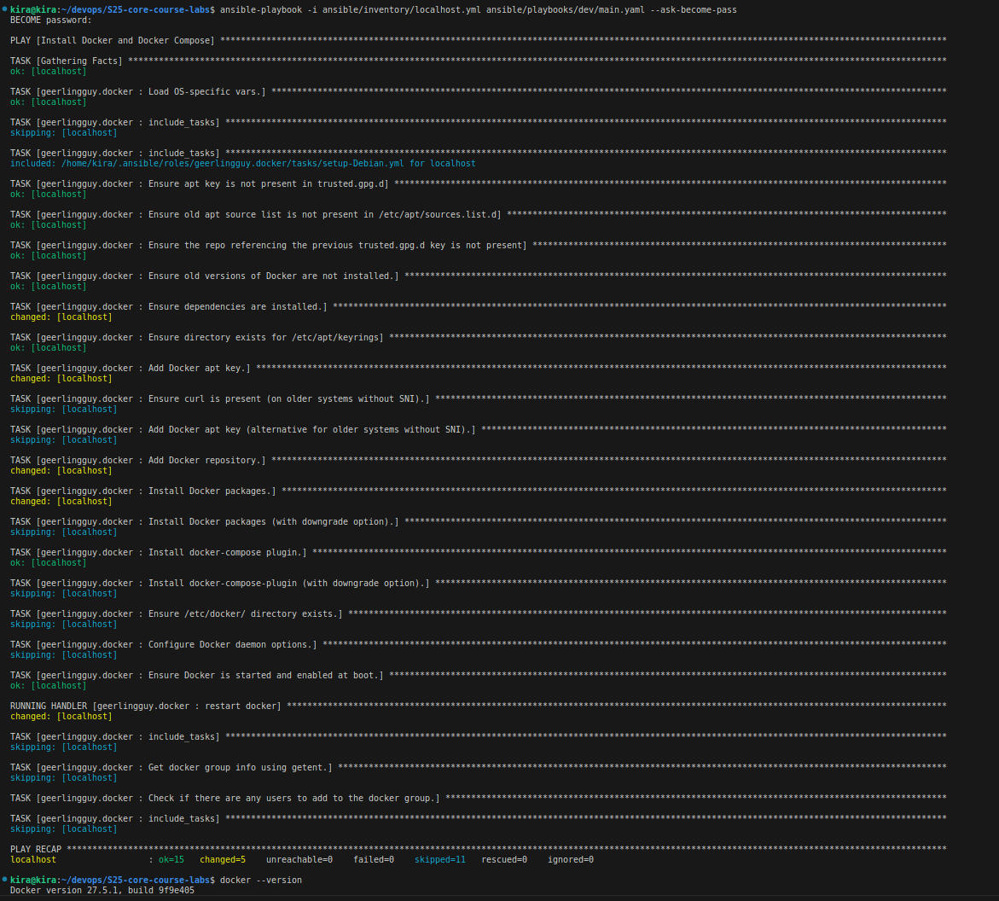
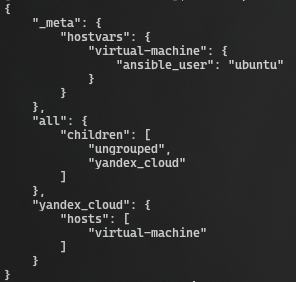

# Ansible

## Best Practices

1. Tasks have explanatory names

## Deployment

### `ansible-playbook -i inventory/yacloud_compute.yaml playbooks/dev/main.yaml`

### `ansible-inventory -i inventory --list`

