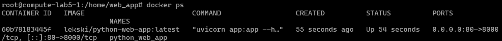
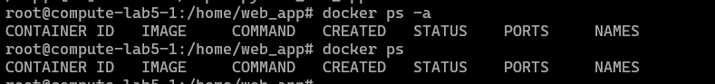

# Lab 6: Ansible and Application Deployment | Mametov Eldar
## Task 1 && Task 2

I have configured the whole infastructure to start docker container, as well as disable and delete it on yandex cloud server. You can see the result in the screenshots and console output text below. 

```
lekski@LAPTOP-EA8M0FT5:/mnt/c/Users/Honor/Desktop/S25-core-course-labs$ ansible-playbook -i ansible/inventory/yandex_inventory.yaml ansible/playbooks/dev/main.yaml --diff --ask-become-pass
BECOME password: 

PLAY [Deploy Docker using Ansible] *******************************************************************************************************************************************

TASK [Gathering Facts] *******************************************************************************************************************************************************
[WARNING]: Platform linux on host compute-lab5-1 is using the discovered Python interpreter at /usr/bin/python3.12, but future installation of another Python interpreter
could change the meaning of that path. See https://docs.ansible.com/ansible-core/2.17/reference_appendices/interpreter_discovery.html for more information.
ok: [compute-lab5-1]

TASK [docker : Docker installation] ******************************************************************************************************************************************
included: /mnt/c/Users/Honor/Desktop/S25-core-course-labs/ansible/roles/docker/tasks/install_docker.yaml for compute-lab5-1

TASK [docker : Install packages] *********************************************************************************************************************************************
ok: [compute-lab5-1] => (item=apt-transport-https)
ok: [compute-lab5-1] => (item=ca-certificates)
ok: [compute-lab5-1] => (item=curl)
ok: [compute-lab5-1] => (item=gnupg)
ok: [compute-lab5-1] => (item=lsb-release)
ok: [compute-lab5-1] => (item=software-properties-common)

TASK [docker : Add Docker GPG key] *******************************************************************************************************************************************
ok: [compute-lab5-1]

TASK [docker : Add Docker repository] ****************************************************************************************************************************************
ok: [compute-lab5-1]

TASK [docker : Install Docker] ***********************************************************************************************************************************************
ok: [compute-lab5-1]

TASK [docker : Adding user to Docker group] **********************************************************************************************************************************
ok: [compute-lab5-1]

TASK [docker : Docker compose installation] **********************************************************************************************************************************
included: /mnt/c/Users/Honor/Desktop/S25-core-course-labs/ansible/roles/docker/tasks/install_compose.yaml for compute-lab5-1

TASK [docker : Download Docker Compose] **************************************************************************************************************************************
ok: [compute-lab5-1]

TASK [docker : Symbolic link for docker-compose] *****************************************************************************************************************************
ok: [compute-lab5-1]

TASK [docker : Verify Docker Compose installation] ***************************************************************************************************************************
changed: [compute-lab5-1]

TASK [docker : Display success message if Docker Compose is installed] *******************************************************************************************************
ok: [compute-lab5-1] => {
    "msg": "docker-compose installed"
}

TASK [docker : Docker secure] ************************************************************************************************************************************************
included: /mnt/c/Users/Honor/Desktop/S25-core-course-labs/ansible/roles/docker/tasks/docker_secure.yaml for compute-lab5-1

TASK [docker : Docker_daemon] ************************************************************************************************************************************************
--- before
+++ after: /home/lekski/.ansible/tmp/ansible-local-5508e6grvjm3/tmp_3mn31ai/docker_daemon.json.j2
@@ -0,0 +1,4 @@
+{
+    "no-new-privileges": true,
+    "userns-remap": "default"
+}
\ No newline at end of file

changed: [compute-lab5-1]

TASK [docker : Docker boot] **************************************************************************************************************************************************
ok: [compute-lab5-1]

TASK [docker : User for docker] **********************************************************************************************************************************************
ok: [compute-lab5-1]

RUNNING HANDLER [docker : Restart Docker] ************************************************************************************************************************************
changed: [compute-lab5-1]

PLAY RECAP *******************************************************************************************************************************************************************
compute-lab5-1             : ok=17   changed=3    unreachable=0    failed=0    skipped=0    rescued=0    ignored=0
```




I then applied the wipe tag to verify that all the docker container would stop and delete. You can see the result in the screenshots below and in the console output text

```
lekski@LAPTOP-EA8M0FT5:/mnt/c/Users/Honor/Desktop/S25-core-course-labs/ansible$ ansible-playbook -i inventory/yandex_inventory.yaml playbooks/dev/python_main.yaml --tags wipe -K
[WARNING]: Ansible is being run in a world writable directory (/mnt/c/Users/Honor/Desktop/S25-core-course-labs/ansible), ignoring it as an ansible.cfg
source. For more information see https://docs.ansible.com/ansible/devel/reference_appendices/config.html#cfg-in-world-writable-dir
BECOME password: 

PLAY [Deploy Docker using Ansible] ***********************************************************************************************************************

TASK [Gathering Facts] ***********************************************************************************************************************************
[WARNING]: Platform linux on host compute-lab5-1 is using the discovered Python interpreter at /usr/bin/python3.12, but future installation of another
Python interpreter could change the meaning of that path. See https://docs.ansible.com/ansible-core/2.17/reference_appendices/interpreter_discovery.html  
for more information.
ok: [compute-lab5-1]

TASK [web_app : Wipe Docker container] *******************************************************************************************************************
changed: [compute-lab5-1]

TASK [web_app : Remove docker-compose file] **************************************************************************************************************
changed: [compute-lab5-1]

PLAY RECAP ***********************************************************************************************************************************************
compute-lab5-1             : ok=3    changed=2    unreachable=0    failed=0    skipped=0    rescued=0    ignored=0
```




## Bonus Task

I set up the infastructure for the bonus task and another docker web-app application as shown in the task. I ran it using the standard method, only selecting playbooks/div/app_golang/main.yaml and got the following result:


And this is after disconnecting using the wipe tag: 

