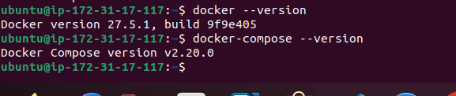

---

### **ansible/ANSIBLE.md**


# Ansible Documentation

## Deployment Output (Last 50 Lines)
```bash
ansible-playbook playbooks/dev/main.yml --check --diff
```

```bash
ansible-playbook playbooks/dev/main.yaml

PLAY [Deploy Docker] **********************************************************************************************************************************************************************************************

TASK [Gathering Facts] ********************************************************************************************************************************************************************************************
[WARNING]: Platform linux on host docker_vm is using the discovered Python interpreter at /usr/bin/python3.10, but future installation of another Python interpreter could change the meaning of that path. See
https://docs.ansible.com/ansible-core/2.17/reference_appendices/interpreter_discovery.html for more information.
ok: [docker_vm]

TASK [docker : include_tasks] *************************************************************************************************************************************************************************************
included: /home/yehia/My station/lab5/ansible/roles/docker/tasks/install_docker.yml for docker_vm

TASK [docker : Remove existing Docker conflicts] ******************************************************************************************************************************************************************
ok: [docker_vm]

TASK [docker : Install prerequisites] *****************************************************************************************************************************************************************************
changed: [docker_vm]

TASK [docker : Add Docker GPG key] ********************************************************************************************************************************************************************************
changed: [docker_vm]

TASK [docker : Add Docker repository] *****************************************************************************************************************************************************************************
changed: [docker_vm]

TASK [docker : Install Docker] ************************************************************************************************************************************************************************************
changed: [docker_vm]

TASK [docker : Start and enable Docker service] *******************************************************************************************************************************************************************
ok: [docker_vm]

TASK [docker : include_tasks] *************************************************************************************************************************************************************************************
included: /home/yehia/My station/lab5/ansible/roles/docker/tasks/install_compose.yml for docker_vm

TASK [docker : Download Docker Compose] ***************************************************************************************************************************************************************************
changed: [docker_vm]

TASK [docker : Validate Docker Compose installation] **************************************************************************************************************************************************************
changed: [docker_vm]

TASK [docker : include_tasks] *************************************************************************************************************************************************************************************
included: /home/yehia/My station/lab5/ansible/roles/docker/tasks/configure_user.yml for docker_vm

TASK [docker : Add user to docker group] **************************************************************************************************************************************************************************
changed: [docker_vm]

TASK [docker : Reload user groups (requires logout/login)] ********************************************************************************************************************************************************

PLAY RECAP ********************************************************************************************************************************************************************************************************
docker_vm                  : ok=13   changed=7    unreachable=0    failed=0    skipped=0    rescued=0    ignored=0    ignored=0

```

---
### Inventory list
```
ansible-inventory -i inventory/default_aws_ec2.yml --list
```


```
{
    "all": {
        "hosts": ["docker_vm"],
        "children": ["ungrouped"]
    },
    "_meta": {
        "hostvars": {
            "docker_vm": {
                "ansible_host": "192.0.2.1",
                "ansible_user": "ubuntu",
                "ansible_ssh_private_key_file": "~/.ssh/aws-key.pem"
            }
        }
    }
}
```

### Inventory Graph
```
 ansible-inventory -i inventory/default_aws_ec2.yml --graph
 ```

 ```
 @all:
  |--@ungrouped:
  |  |--docker_vm
  ```

### Verification Commands
**Check Docker installation**<br>
```
ansible docker_vm -m command -a "docker --version"
```
```
docker_vm | CHANGED | rc=0 >>
Docker version 27.5.1, build 9f9e405


```
**Check Docker Compose installation**
<br>
``` 
ansible docker_vm -m command -a "docker-compose --version"
```
```
docker_vm | CHANGED | rc=0 >>
Docker Compose version v2.20.0
```
**Verify Docker service status**
<br>
```
ansible docker_vm -m systemd -a "name=docker state=started"
```
```
docker_vm | SUCCESS => {
    "ansible_facts": {
        "discovered_interpreter_python": "/usr/bin/python3.10"
    },
    "changed": false,
    "name": "docker",
    "state": "started",
```

**This after SSH connection to the vm**
