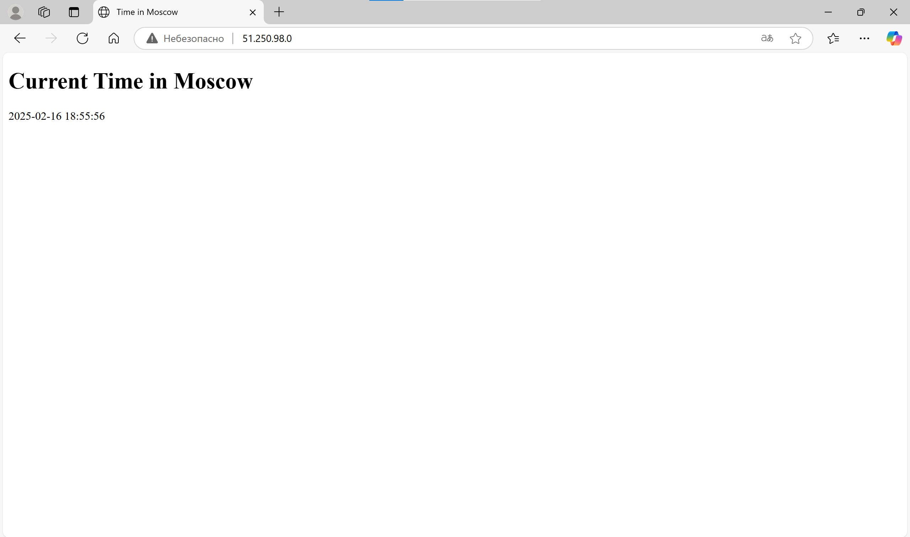
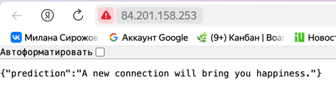

# Ansible

## Installation and Introduction

```bash
> brew install ansible
> ansible --version

ansible [core 2.18.2]
  config file = None
  configured module search path = ['/Users/m.sirozhova/.ansible/plugins/modules', '/usr/share/ansible/plugins/modules']
  ansible python module location = /opt/homebrew/Cellar/ansible/11.2.0/libexec/lib/python3.13/site-packages/ansible
  ansible collection location = /Users/m.sirozhova/.ansible/collections:/usr/share/ansible/collections
  executable location = /opt/homebrew/bin/ansible
  python version = 3.13.2 (main, Feb  4 2025, 14:51:09) [Clang 16.0.0 (clang-1600.0.26.6)] (/opt/homebrew/Cellar/ansible/11.2.0/libexec/bin/python)
  jinja version = 3.1.5
  libyaml = True
```

## Use an Existing Ansible Role for Docker

```bash
> ansible-galaxy role install geerlingguy.docker                  

Starting galaxy role install process
- downloading role 'docker', owned by geerlingguy
- downloading role from https://github.com/geerlingguy/ansible-role-docker/archive/7.4.5.tar.gz
- extracting geerlingguy.docker to /Users/m.sirozhova/.ansible/roles/geerlingguy.docker
- geerlingguy.docker (7.4.5) was installed successfully
```

## Create a Playbook and Testing

```bash
ansible-playbook -i ansible/inventory/default_aws_ec2.yml ansible/playbooks/dev/main.yaml

PLAY [Install Docker] **********************************************************************************************************************************************************

TASK [Gathering Facts] *********************************************************************************************************************************************************
ok: [cloud_vm]

TASK [geerlingguy.docker : Load OS-specific vars.] *****************************************************************************************************************************
ok: [cloud_vm]

TASK [geerlingguy.docker : include_tasks] **************************************************************************************************************************************
skipping: [cloud_vm]

TASK [geerlingguy.docker : include_tasks] **************************************************************************************************************************************
included: /Users/m.sirozhova/.ansible/roles/geerlingguy.docker/tasks/setup-Debian.yml for cloud_vm

TASK [geerlingguy.docker : Ensure apt key is not present in trusted.gpg.d] *****************************************************************************************************
ok: [cloud_vm]

TASK [geerlingguy.docker : Ensure old apt source list is not present in /etc/apt/sources.list.d] *******************************************************************************
ok: [cloud_vm]

TASK [geerlingguy.docker : Ensure the repo referencing the previous trusted.gpg.d key is not present] **************************************************************************
ok: [cloud_vm]

TASK [geerlingguy.docker : Ensure old versions of Docker are not installed.] ***************************************************************************************************
ok: [cloud_vm]

TASK [geerlingguy.docker : Ensure dependencies are installed.] *****************************************************************************************************************
changed: [cloud_vm]

TASK [geerlingguy.docker : Ensure directory exists for /etc/apt/keyrings] ******************************************************************************************************
ok: [cloud_vm]

TASK [geerlingguy.docker : Add Docker apt key.] ********************************************************************************************************************************
changed: [cloud_vm]

TASK [geerlingguy.docker : Ensure curl is present (on older systems without SNI).] *********************************************************************************************
skipping: [cloud_vm]

TASK [geerlingguy.docker : Add Docker apt key (alternative for older systems without SNI).] ************************************************************************************
skipping: [cloud_vm]

TASK [geerlingguy.docker : Add Docker repository.] *****************************************************************************************************************************
changed: [cloud_vm]

TASK [geerlingguy.docker : Install Docker packages.] ***************************************************************************************************************************
skipping: [cloud_vm]

TASK [geerlingguy.docker : Install Docker packages (with downgrade option).] ***************************************************************************************************
changed: [cloud_vm]

TASK [geerlingguy.docker : Install docker-compose plugin.] *********************************************************************************************************************
skipping: [cloud_vm]

TASK [geerlingguy.docker : Install docker-compose-plugin (with downgrade option).] *********************************************************************************************
ok: [cloud_vm]

TASK [geerlingguy.docker : Ensure /etc/docker/ directory exists.] **************************************************************************************************************
skipping: [cloud_vm]

TASK [geerlingguy.docker : Configure Docker daemon options.] *******************************************************************************************************************
skipping: [cloud_vm]

TASK [geerlingguy.docker : Ensure Docker is started and enabled at boot.] ******************************************************************************************************
ok: [cloud_vm]

TASK [geerlingguy.docker : Ensure handlers are notified now to avoid firewall conflicts.] **************************************************************************************

RUNNING HANDLER [geerlingguy.docker : restart docker] **************************************************************************************************************************
changed: [cloud_vm]

TASK [geerlingguy.docker : include_tasks] **************************************************************************************************************************************
skipping: [cloud_vm]

TASK [geerlingguy.docker : Get docker group info using getent.] ****************************************************************************************************************
skipping: [cloud_vm]

TASK [geerlingguy.docker : Check if there are any users to add to the docker group.] *******************************************************************************************
skipping: [cloud_vm]

TASK [geerlingguy.docker : include_tasks] **************************************************************************************************************************************
skipping: [cloud_vm]

PLAY RECAP *********************************************************************************************************************************************************************
cloud_vm                   : ok=15   changed=5    unreachable=0    failed=0    skipped=11   rescued=0    ignored=0
```

Then I tested it:

```bash
> ssh ubuntu@84.201.158.253                                                                
Welcome to Ubuntu 24.04.1 LTS (GNU/Linux 6.8.0-52-generic x86_64)

 * Documentation:  https://help.ubuntu.com
 * Management:     https://landscape.canonical.com
 * Support:        https://ubuntu.com/pro

 System information as of Sun Feb  9 05:49:16 PM UTC 2025

  System load:  0.0                Processes:             141
  Usage of /:   18.2% of 19.59GB   Users logged in:       0
  Memory usage: 14%                IPv4 address for eth0: 192.168.0.12
  Swap usage:   0%

 * Strictly confined Kubernetes makes edge and IoT secure. Learn how MicroK8s
   just raised the bar for easy, resilient and secure K8s cluster deployment.

   https://ubuntu.com/engage/secure-kubernetes-at-the-edge

Expanded Security Maintenance for Applications is not enabled.

10 updates can be applied immediately.
To see these additional updates run: apt list --upgradable

Enable ESM Apps to receive additional future security updates.
See https://ubuntu.com/esm or run: sudo pro status


*** System restart required ***
Last login: Sun Feb  9 17:34:50 2025 from 188.130.155.177

> ubuntu@fhm8l97e5pdu2rs2pmlu:~$ docker --version
Docker version 27.5.1, build 9f9e405
```

## Create Your Custom Docker Role

```bash
> ansible-playbook -i inventory/default_aws_ec2.yml playbooks/dev/main.yaml

PLAY [Install Docker] **********************************************************************************************************************************************************

TASK [Gathering Facts] *********************************************************************************************************************************************************
ok: [cloud_vm]

TASK [docker : Install Docker] *************************************************************************************************************************************************
included: /Users/m.sirozhova/S25-core-course-labs/ansible/roles/docker/tasks/install_docker.yml for cloud_vm

TASK [docker : Install prerequisites] ******************************************************************************************************************************************
ok: [cloud_vm]

TASK [docker : Add Docker GPG key] *********************************************************************************************************************************************
changed: [cloud_vm]

TASK [docker : Add Docker repository] ******************************************************************************************************************************************
changed: [cloud_vm]

TASK [docker : Install Docker] *************************************************************************************************************************************************
ok: [cloud_vm]

TASK [docker : Install Docker Compose] *****************************************************************************************************************************************
included: /Users/m.sirozhova/S25-core-course-labs/ansible/roles/docker/tasks/install_compose.yml for cloud_vm

TASK [docker : Install Docker Compose] *****************************************************************************************************************************************
changed: [cloud_vm]

TASK [docker : Verify Docker Compose installation] *****************************************************************************************************************************
ok: [cloud_vm]

TASK [docker : Configure Docker Compose] ***************************************************************************************************************************************
included: /Users/m.sirozhova/S25-core-course-labs/ansible/roles/docker/tasks/add_user_to_docker.yml for cloud_vm

TASK [docker : Add user to Docker group] ***************************************************************************************************************************************
changed: [cloud_vm]

TASK [docker : Enable Docker service] ******************************************************************************************************************************************
ok: [cloud_vm]

RUNNING HANDLER [docker : Docker Restart] **************************************************************************************************************************************
changed: [cloud_vm]

PLAY RECAP *********************************************************************************************************************************************************************
cloud_vm                   : ok=13   changed=5    unreachable=0    failed=0    skipped=0    rescued=0    ignored=0   
```

Then I tested:

```bash
> ssh ubuntu@84.201.158.253

> ubuntu@fhm8l97e5pdu2rs2pmlu:~$ docker --version 
Docker version 27.5.1, build 9f9e405
> ubuntu@fhm8l97e5pdu2rs2pmlu:~$ docker compose version
Docker Compose version v2.32.4
> ubuntu@fhm8l97e5pdu2rs2pmlu:~$ systemctl status docker
● docker.service - Docker Application Container Engine
     Loaded: loaded (/usr/lib/systemd/system/docker.service; enabled; preset: enabled)
     Active: active (running) since Sun 2025-02-09 18:58:04 UTC; 8min ago
TriggeredBy: ● docker.socket
       Docs: https://docs.docker.com
   Main PID: 64613 (dockerd)
      Tasks: 10
     Memory: 19.8M (peak: 21.3M)
        CPU: 545ms
     CGroup: /system.slice/docker.service
             └─64613 /usr/bin/dockerd -H fd:// --containerd=/run/containerd/containerd.sock

Feb 09 18:58:03 fhm8l97e5pdu2rs2pmlu dockerd[64613]: time="2025-02-09T18:58:03.802437450Z" level=info msg="OTEL tracing is not configured, using no-op tracer provider"
Feb 09 18:58:03 fhm8l97e5pdu2rs2pmlu dockerd[64613]: time="2025-02-09T18:58:03.802629626Z" level=info msg="detected 127.0.0.53 nameserver, assuming systemd-resolved, so using >
Feb 09 18:58:04 fhm8l97e5pdu2rs2pmlu dockerd[64613]: time="2025-02-09T18:58:04.286380669Z" level=info msg="[graphdriver] using prior storage driver: overlay2"
Feb 09 18:58:04 fhm8l97e5pdu2rs2pmlu dockerd[64613]: time="2025-02-09T18:58:04.286702772Z" level=info msg="Loading containers: start."
Feb 09 18:58:04 fhm8l97e5pdu2rs2pmlu dockerd[64613]: time="2025-02-09T18:58:04.693295475Z" level=info msg="Default bridge (docker0) is assigned with an IP address 172.17.0.0/1>
Feb 09 18:58:04 fhm8l97e5pdu2rs2pmlu dockerd[64613]: time="2025-02-09T18:58:04.846355261Z" level=info msg="Loading containers: done."
```

```bash
ubuntu@fhm8l97e5pdu2rs2pmlu:~$ groups
ubuntu adm cdrom sudo dip lxd docker
```

## Deployment Output

```bash
> ansible-playbook playbooks/dev/main.yaml --check 

PLAY [Install Docker] **********************************************************************************************************************************************************

TASK [Gathering Facts] *********************************************************************************************************************************************************
ok: [cloud_vm]

TASK [docker : Install Docker] *************************************************************************************************************************************************
included: /Users/m.sirozhova/S25-core-course-labs/ansible/roles/docker/tasks/install_docker.yml for cloud_vm

TASK [docker : Install prerequisites] ******************************************************************************************************************************************
ok: [cloud_vm]

TASK [docker : Add Docker GPG key] *********************************************************************************************************************************************
ok: [cloud_vm]

TASK [docker : Add Docker repository] ******************************************************************************************************************************************
ok: [cloud_vm]

TASK [docker : Install Docker] *************************************************************************************************************************************************
ok: [cloud_vm]

TASK [docker : Install Docker Compose] *****************************************************************************************************************************************
included: /Users/m.sirozhova/S25-core-course-labs/ansible/roles/docker/tasks/install_compose.yml for cloud_vm

TASK [docker : Install Docker Compose] *****************************************************************************************************************************************
ok: [cloud_vm]

TASK [docker : Verify Docker Compose installation] *****************************************************************************************************************************
skipping: [cloud_vm]

TASK [docker : Configure Docker Compose] ***************************************************************************************************************************************
included: /Users/m.sirozhova/S25-core-course-labs/ansible/roles/docker/tasks/add_user_to_docker.yml for cloud_vm

TASK [docker : Add user to Docker group] ***************************************************************************************************************************************
ok: [cloud_vm]

TASK [docker : Enable Docker service] ******************************************************************************************************************************************
ok: [cloud_vm]

PLAY RECAP *********************************************************************************************************************************************************************
cloud_vm                   : ok=11   changed=0    unreachable=0    failed=0    skipped=1    rescued=0    ignored=0   
```

```bash
> ansible-playbook playbooks/dev/main.yaml --diff 

PLAY [Install Docker] **********************************************************************************************************************************************************

TASK [Gathering Facts] *********************************************************************************************************************************************************
ok: [cloud_vm]

TASK [docker : Install Docker] *************************************************************************************************************************************************
included: /Users/m.sirozhova/S25-core-course-labs/ansible/roles/docker/tasks/install_docker.yml for cloud_vm

TASK [docker : Install prerequisites] ******************************************************************************************************************************************
ok: [cloud_vm]

TASK [docker : Add Docker GPG key] *********************************************************************************************************************************************
ok: [cloud_vm]

TASK [docker : Add Docker repository] ******************************************************************************************************************************************
ok: [cloud_vm]

TASK [docker : Install Docker] *************************************************************************************************************************************************
ok: [cloud_vm]

TASK [docker : Install Docker Compose] *****************************************************************************************************************************************
included: /Users/m.sirozhova/S25-core-course-labs/ansible/roles/docker/tasks/install_compose.yml for cloud_vm

TASK [docker : Install Docker Compose] *****************************************************************************************************************************************
ok: [cloud_vm]

TASK [docker : Verify Docker Compose installation] *****************************************************************************************************************************
ok: [cloud_vm]

TASK [docker : Configure Docker Compose] ***************************************************************************************************************************************
included: /Users/m.sirozhova/S25-core-course-labs/ansible/roles/docker/tasks/add_user_to_docker.yml for cloud_vm

TASK [docker : Add user to Docker group] ***************************************************************************************************************************************
ok: [cloud_vm]

TASK [docker : Enable Docker service] ******************************************************************************************************************************************
ok: [cloud_vm]

PLAY RECAP *********************************************************************************************************************************************************************
cloud_vm                   : ok=12   changed=0    unreachable=0    failed=0    skipped=0    rescued=0    ignored=0  
```

## Inventory Details

```bash
> ansible-inventory -i inventory/default_aws_ec2.yml --list

{
    "_meta": {
        "hostvars": {
            "cloud_vm": {
                "ansible_host": "84.201.158.253",
                "ansible_python_interpreter": "/usr/bin/python3",
                "ansible_ssh_private_key_file": "~/.ssh/id_rsa",
                "ansible_user": "ubuntu"
            }
        }
    },
    "all": {
        "children": [
            "ungrouped"
        ]
    },
    "ungrouped": {
        "hosts": [
            "cloud_vm"
        ]
    }
}
```

```bash
 ansible-inventory -i inventory/default_aws_ec2.yml --graph
@all:
  |--@ungrouped:
  |  |--cloud_vm
```

## Dynamic Inventory

```bash
> ansible-playbook -i inventory/default_yacloud_compute.yml playbooks/dev/main.yaml --diff

PLAY [Install Docker] **********************************************************************************************************************************************************

TASK [Gathering Facts] *********************************************************************************************************************************************************
[WARNING]: Platform linux on host terraform is using the discovered Python interpreter at /usr/bin/python3.12, but future installation of another Python interpreter could
change the meaning of that path. See https://docs.ansible.com/ansible-core/2.18/reference_appendices/interpreter_discovery.html for more information.
ok: [terraform]

TASK [docker : Install Docker] *************************************************************************************************************************************************
included: /Users/m.sirozhova/S25-core-course-labs/ansible/roles/docker/tasks/install_docker.yml for terraform

TASK [docker : Install prerequisites] ******************************************************************************************************************************************
ok: [terraform]

TASK [docker : Add Docker GPG key] *********************************************************************************************************************************************
ok: [terraform]

TASK [docker : Add Docker repository] ******************************************************************************************************************************************
ok: [terraform]

TASK [docker : Install Docker] *************************************************************************************************************************************************
ok: [terraform]

TASK [docker : Install Docker Compose] *****************************************************************************************************************************************
included: /Users/m.sirozhova/S25-core-course-labs/ansible/roles/docker/tasks/install_compose.yml for terraform

TASK [docker : Install Docker Compose] *****************************************************************************************************************************************
ok: [terraform]

TASK [docker : Verify Docker Compose installation] *****************************************************************************************************************************
ok: [terraform]

TASK [docker : Configure Docker Compose] ***************************************************************************************************************************************
included: /Users/m.sirozhova/S25-core-course-labs/ansible/roles/docker/tasks/add_user_to_docker.yml for terraform

TASK [docker : Add user to Docker group] ***************************************************************************************************************************************
ok: [terraform]

TASK [docker : Enable Docker service] ******************************************************************************************************************************************
ok: [terraform]

PLAY RECAP *********************************************************************************************************************************************************************
terraform                  : ok=12   changed=0    unreachable=0    failed=0    skipped=0    rescued=0    ignored=0  
```

```bash
> ansible-inventory -i inventory/default_yacloud_compute.yml --list                       
{
    "_meta": {
        "hostvars": {
            "terraform": {
                "ansible_host": "84.201.158.253"
            }
        }
    },
    "all": {
        "children": [
            "ungrouped",
            "yacloud"
        ]
    },
    "yacloud": {
        "hosts": [
            "terraform"
        ]
    }
}
```

```bash
> ansible-inventory -i inventory/default_yacloud_compute.yml --graph
@all:
  |--@ungrouped:
  |--@yacloud:
  |  |--terraform
```

```bash
> ansible-playbook -i inventory/default_yacloud_compute.yml playbooks/dev/main.yaml --diff


PLAY [Install Docker] **********************************************************************************************************************************************************

TASK [Gathering Facts] *********************************************************************************************************************************************************
[WARNING]: Platform linux on host terraform is using the discovered Python interpreter at /usr/bin/python3.12, but future installation of another Python interpreter could
change the meaning of that path. See https://docs.ansible.com/ansible-core/2.18/reference_appendices/interpreter_discovery.html for more information.
ok: [terraform]

TASK [docker : Install Docker] *************************************************************************************************************************************************
included: /Users/m.sirozhova/S25-core-course-labs/ansible/roles/docker/tasks/install_docker.yml for terraform

TASK [docker : Install prerequisites] ******************************************************************************************************************************************
ok: [terraform]

TASK [docker : Add Docker GPG key] *********************************************************************************************************************************************
ok: [terraform]

TASK [docker : Add Docker repository] ******************************************************************************************************************************************
ok: [terraform]

TASK [docker : Install Docker] *************************************************************************************************************************************************
ok: [terraform]

TASK [docker : Install Docker Compose] *****************************************************************************************************************************************
included: /Users/m.sirozhova/S25-core-course-labs/ansible/roles/docker/tasks/install_compose.yml for terraform

TASK [docker : Install Docker Compose] *****************************************************************************************************************************************
ok: [terraform]

TASK [docker : Verify Docker Compose installation] *****************************************************************************************************************************
ok: [terraform]

TASK [docker : Configure Docker Compose] ***************************************************************************************************************************************
included: /Users/m.sirozhova/S25-core-course-labs/ansible/roles/docker/tasks/add_user_to_docker.yml for terraform

TASK [docker : Add user to Docker group] ***************************************************************************************************************************************
ok: [terraform]

TASK [docker : Disable root access] ********************************************************************************************************************************************
--- before
+++ after: /etc/docker/daemon.json
@@ -0,0 +1,3 @@
+{
+  "userns-remap": "default"
+}

changed: [terraform]

TASK [docker : Enable Docker service] ******************************************************************************************************************************************
ok: [terraform]

RUNNING HANDLER [docker : Docker Restart] **************************************************************************************************************************************
changed: [terraform]

PLAY RECAP *********************************************************************************************************************************************************************
terraform                  : ok=14   changed=2    unreachable=0    failed=0    skipped=0    rescued=0    ignored=0  
```

## Yandex Python Web Application Deployment Output

```bash
ansible-playbook -i inventory/default_yacloud_compute.yml playbooks/dev/app_python/main.yaml            

PLAY [Deploy python web app] ***************************************************************************************************************************************************

TASK [Gathering Facts] *********************************************************************************************************************************************************
[WARNING]: Platform linux on host terraform is using the discovered Python interpreter at /usr/bin/python3.12, but future installation of another Python interpreter could
change the meaning of that path. See https://docs.ansible.com/ansible-core/2.18/reference_appendices/interpreter_discovery.html for more information.
ok: [terraform]

TASK [docker : Install Docker] *************************************************************************************************************************************************
included: /Users/m.sirozhova/S25-core-course-labs/ansible/roles/docker/tasks/install_docker.yml for terraform

TASK [docker : Install prerequisites] ******************************************************************************************************************************************
ok: [terraform]

TASK [docker : Add Docker GPG key] *********************************************************************************************************************************************
ok: [terraform]

TASK [docker : Add Docker repository] ******************************************************************************************************************************************
ok: [terraform]

TASK [docker : Install Docker] *************************************************************************************************************************************************
ok: [terraform]

TASK [docker : Install Docker Compose] *****************************************************************************************************************************************
included: /Users/m.sirozhova/S25-core-course-labs/ansible/roles/docker/tasks/install_compose.yml for terraform

TASK [docker : Install Docker Compose] *****************************************************************************************************************************************
ok: [terraform]

TASK [docker : Verify Docker Compose installation] *****************************************************************************************************************************
ok: [terraform]

TASK [docker : Configure Docker Compose] ***************************************************************************************************************************************
included: /Users/m.sirozhova/S25-core-course-labs/ansible/roles/docker/tasks/add_user_to_docker.yml for terraform

TASK [docker : Add user to Docker group] ***************************************************************************************************************************************
ok: [terraform]

TASK [docker : Disable root access] ********************************************************************************************************************************************
ok: [terraform]

TASK [docker : Enable Docker service] ******************************************************************************************************************************************
ok: [terraform]

TASK [web_app : App dir existence] *********************************************************************************************************************************************
skipping: [terraform]

TASK [web_app : Docker compose existence] **************************************************************************************************************************************
skipping: [terraform]

TASK [web_app : Remove docker compose] *****************************************************************************************************************************************
skipping: [terraform]

TASK [web_app : Remove directory] **********************************************************************************************************************************************
skipping: [terraform]

TASK [web_app : Create Web App directory] **************************************************************************************************************************************
ok: [terraform]

TASK [web_app : Copy docker compose] *******************************************************************************************************************************************
changed: [terraform]

RUNNING HANDLER [web_app : Restart Docker Compose] *****************************************************************************************************************************
changed: [terraform]

PLAY RECAP *********************************************************************************************************************************************************************
terraform                  : ok=16   changed=2    unreachable=0    failed=0    skipped=4    rescued=0    ignored=0   

WARNING: All log messages before absl::InitializeLog() is called are written to STDERR
E0000 00:00:1739216524.474848 46263670 init.cc:232] grpc_wait_for_shutdown_with_timeout() timed out.
```

Check if it started:

```bash
> ssh ubuntu@84.201.158.253
> ubuntu@fhm8l97e5pdu2rs2pmlu:~$ docker ps
CONTAINER ID   IMAGE                                           COMMAND                  CREATED         STATUS         PORTS                                                 NAMES
2662d1f86920   milanamilana/python-distroless-web-app:latest   "/usr/bin/python3.11…"   4 minutes ago   Up 4 minutes   5000/tcp, 0.0.0.0:8000->8000/tcp, :::8000->8000/tcp   python_web_app
```



Remove deployed docker image:

```bash
ansible-playbook -i inventory/default_yacloud_compute.yml playbooks/dev/app_python/main.yaml --tags wipe

PLAY [Deploy python web app] ***************************************************************************************************************************************************

TASK [Gathering Facts] *********************************************************************************************************************************************************
[WARNING]: Platform linux on host terraform is using the discovered Python interpreter at /usr/bin/python3.12, but future installation of another Python interpreter could
change the meaning of that path. See https://docs.ansible.com/ansible-core/2.18/reference_appendices/interpreter_discovery.html for more information.
ok: [terraform]

PLAY RECAP *********************************************************************************************************************************************************************
terraform                  : ok=1    changed=0    unreachable=0    failed=0    skipped=0    rescued=0    ignored=0   

WARNING: All log messages before absl::InitializeLog() is called are written to STDERR
E0000 00:00:1739215938.788752 46208907 init.cc:232] grpc_wait_for_shutdown_with_timeout() timed out.
```

## Yandex Go Web Application Deployment Output

```bash
ansible % ansible-playbook -i inventory/default_yacloud_compute.yml playbooks/dev/app_go/main.yaml            

PLAY [Deploy go web app] *******************************************************************************************************************************************************

TASK [Gathering Facts] *********************************************************************************************************************************************************
[WARNING]: Platform linux on host terraform is using the discovered Python interpreter at /usr/bin/python3.12, but future installation of another Python interpreter could
change the meaning of that path. See https://docs.ansible.com/ansible-core/2.18/reference_appendices/interpreter_discovery.html for more information.
ok: [terraform]

TASK [docker : Install Docker] *************************************************************************************************************************************************
included: /Users/m.sirozhova/S25-core-course-labs/ansible/roles/docker/tasks/install_docker.yml for terraform

TASK [docker : Install prerequisites] ******************************************************************************************************************************************
ok: [terraform]

TASK [docker : Add Docker GPG key] *********************************************************************************************************************************************
ok: [terraform]

TASK [docker : Add Docker repository] ******************************************************************************************************************************************
ok: [terraform]

TASK [docker : Install Docker] *************************************************************************************************************************************************
ok: [terraform]

TASK [docker : Install Docker Compose] *****************************************************************************************************************************************
included: /Users/m.sirozhova/S25-core-course-labs/ansible/roles/docker/tasks/install_compose.yml for terraform

TASK [docker : Install Docker Compose] *****************************************************************************************************************************************
ok: [terraform]

TASK [docker : Verify Docker Compose installation] *****************************************************************************************************************************
ok: [terraform]

TASK [docker : Configure Docker Compose] ***************************************************************************************************************************************
included: /Users/m.sirozhova/S25-core-course-labs/ansible/roles/docker/tasks/add_user_to_docker.yml for terraform

TASK [docker : Add user to Docker group] ***************************************************************************************************************************************
ok: [terraform]

TASK [docker : Disable root access] ********************************************************************************************************************************************
ok: [terraform]

TASK [docker : Enable Docker service] ******************************************************************************************************************************************
ok: [terraform]

TASK [web_app : App dir existence] *********************************************************************************************************************************************
ok: [terraform]

TASK [web_app : Docker compose existence] **************************************************************************************************************************************
ok: [terraform]

TASK [web_app : Remove docker compose] *****************************************************************************************************************************************
changed: [terraform]

TASK [web_app : Remove directory] **********************************************************************************************************************************************
changed: [terraform]

TASK [web_app : Create Web App directory] **************************************************************************************************************************************
changed: [terraform]

TASK [web_app : Copy docker compose] *******************************************************************************************************************************************
changed: [terraform]

RUNNING HANDLER [web_app : Restart Docker Compose] *****************************************************************************************************************************
changed: [terraform]

PLAY RECAP *********************************************************************************************************************************************************************
terraform                  : ok=20   changed=5    unreachable=0    failed=0    skipped=0    rescued=0    ignored=0   

WARNING: All log messages before absl::InitializeLog() is called are written to STDERR
E0000 00:00:1739217080.840758 46310465 init.cc:232] grpc_wait_for_shutdown_with_timeout() timed out.
```

Check if it started:

```bash
> ssh ubuntu@84.201.158.253
> ubuntu@fhm8l97e5pdu2rs2pmlu:~$ docker ps
CONTAINER ID   IMAGE                                       COMMAND        CREATED         STATUS         PORTS                                     NAMES
d6f5889e2964   milanamilana/go-distroless-web-app:latest   "./main.out"   4 minutes ago   Up 4 minutes   0.0.0.0:80->8080/tcp, [::]:80->8080/tcp   go_web_app
```


