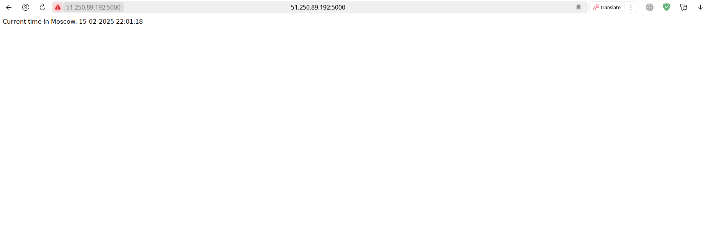
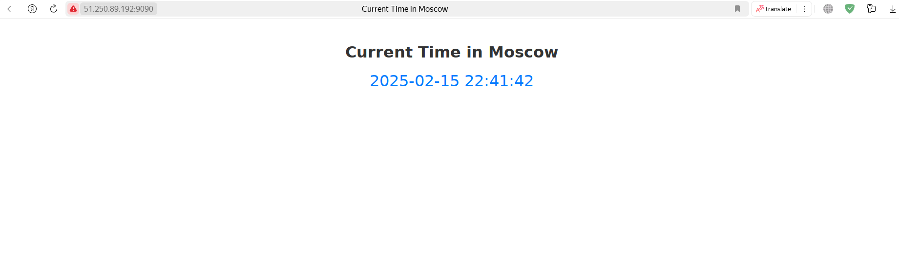

# Ansible Labs

## Lab 5

### Task 1

After installing geerlingguy.docker role and running it, I get this output:

```bash
gleb@gleb-VMware-Virtual-Platform:~/Desktop/DevOps/Labs/S25-core-course-labs$ ansible-playbook -i ansible/inventory/default_aws_ec2.yml ansible/playbooks/dev/main.yaml

PLAY [Install and Configure Docker] ****************************************************************************************************************************************************

TASK [Gathering Facts] *****************************************************************************************************************************************************************
ok: [my_vm]

TASK [geerlingguy.docker : Load OS-specific vars.] *************************************************************************************************************************************
ok: [my_vm]

TASK [geerlingguy.docker : include_tasks] **********************************************************************************************************************************************
skipping: [my_vm]

TASK [geerlingguy.docker : include_tasks] **********************************************************************************************************************************************
included: /home/gleb/.ansible/roles/geerlingguy.docker/tasks/setup-Debian.yml for my_vm

TASK [geerlingguy.docker : Ensure apt key is not present in trusted.gpg.d] *************************************************************************************************************
ok: [my_vm]

TASK [geerlingguy.docker : Ensure old apt source list is not present in /etc/apt/sources.list.d] ***************************************************************************************
ok: [my_vm]

TASK [geerlingguy.docker : Ensure the repo referencing the previous trusted.gpg.d key is not present] **********************************************************************************
ok: [my_vm]

TASK [geerlingguy.docker : Ensure old versions of Docker are not installed.] ***********************************************************************************************************
ok: [my_vm]

TASK [geerlingguy.docker : Ensure dependencies are installed.] *************************************************************************************************************************
changed: [my_vm]

TASK [geerlingguy.docker : Ensure directory exists for /etc/apt/keyrings] **************************************************************************************************************
ok: [my_vm]

TASK [geerlingguy.docker : Add Docker apt key.] ****************************************************************************************************************************************
changed: [my_vm]

TASK [geerlingguy.docker : Ensure curl is present (on older systems without SNI).] *****************************************************************************************************
skipping: [my_vm]

TASK [geerlingguy.docker : Add Docker apt key (alternative for older systems without SNI).] ********************************************************************************************
skipping: [my_vm]

TASK [geerlingguy.docker : Add Docker repository.] *************************************************************************************************************************************
changed: [my_vm]

TASK [geerlingguy.docker : Install Docker packages.] ***********************************************************************************************************************************
skipping: [my_vm]

TASK [geerlingguy.docker : Install Docker packages (with downgrade option).] ***********************************************************************************************************
changed: [my_vm]

TASK [geerlingguy.docker : Install docker-compose plugin.] *****************************************************************************************************************************
skipping: [my_vm]

TASK [geerlingguy.docker : Install docker-compose-plugin (with downgrade option).] *****************************************************************************************************
ok: [my_vm]

TASK [geerlingguy.docker : Ensure /etc/docker/ directory exists.] **********************************************************************************************************************
skipping: [my_vm]

TASK [geerlingguy.docker : Configure Docker daemon options.] ***************************************************************************************************************************
skipping: [my_vm]

TASK [geerlingguy.docker : Ensure Docker is started and enabled at boot.] **************************************************************************************************************
ok: [my_vm]

TASK [geerlingguy.docker : Ensure handlers are notified now to avoid firewall conflicts.] **********************************************************************************************

RUNNING HANDLER [geerlingguy.docker : restart docker] **********************************************************************************************************************************
changed: [my_vm]

TASK [geerlingguy.docker : include_tasks] **********************************************************************************************************************************************
skipping: [my_vm]

TASK [geerlingguy.docker : Get docker group info using getent.] ************************************************************************************************************************
skipping: [my_vm]

TASK [geerlingguy.docker : Check if there are any users to add to the docker group.] ***************************************************************************************************
skipping: [my_vm]

TASK [geerlingguy.docker : include_tasks] **********************************************************************************************************************************************
skipping: [my_vm]

PLAY RECAP *****************************************************************************************************************************************************************************
my_vm                      : ok=15   changed=5    unreachable=0    failed=0    skipped=11   rescued=0    ignored=0
```

And after that docker installed in the yandex cloud vm:

```bash
gleb@gleb-VMware-Virtual-Platform:~$ ssh -i ~/.ssh/id_ed25519 ubuntu@51.250.72.169

Welcome to Ubuntu 24.04.1 LTS (GNU/Linux 6.8.0-48-generic x86_64)

 * Documentation:  https://help.ubuntu.com
 * Management:     https://landscape.canonical.com
 * Support:        https://ubuntu.com/pro

 System information as of Fri Feb 14 07:14:26 PM UTC 2025

  System load:  0.37               Processes:             145
  Usage of /:   17.6% of 19.59GB   Users logged in:       0
  Memory usage: 12%                IPv4 address for eth0: 192.168.0.15
  Swap usage:   0%

 * Strictly confined Kubernetes makes edge and IoT secure. Learn how MicroK8s
   just raised the bar for easy, resilient and secure K8s cluster deployment.

   https://ubuntu.com/engage/secure-kubernetes-at-the-edge

Expanded Security Maintenance for Applications is not enabled.

159 updates can be applied immediately.
47 of these updates are standard security updates.
To see these additional updates run: apt list --upgradable

Enable ESM Apps to receive additional future security updates.
See https://ubuntu.com/esm or run: sudo pro status


Last login: Fri Feb 14 19:13:18 2025 from 188.130.155.182

ubuntu@fhmqu255cc3bd564sjgh:~$ docker --version

Docker version 27.5.1, build 9f9e405
```

---

### Task 2 (+ security part of Bonus Task)

I recorded the output only afted endin up with security part of bonus task, so there are stages related to it. Therefore, this part will be shown here, while part regarding the yandex_compute will be shown in the next section of this file.

I configured 3 tasks (install_docker, install_compose, and configure_docker_security_settings). This is an output for the --check:

```bash
gleb@gleb-VMware-Virtual-Platform:~/Desktop/DevOps/Labs/S25-core-course-labs$ ansible-playbook ansible/playbooks/dev/main.yaml --check

PLAY [Install and configure Docker] ****************************************************************************************************************************************************

TASK [Gathering Facts] *****************************************************************************************************************************************************************
ok: [my_vm]

TASK [docker : include_tasks] **********************************************************************************************************************************************************
included: /home/gleb/Desktop/DevOps/Labs/S25-core-course-labs/ansible/roles/docker/tasks/install_docker.yml for my_vm

TASK [docker : Remove existing Docker repositories] ************************************************************************************************************************************
ok: [my_vm]

TASK [docker : Install prerequisites] **************************************************************************************************************************************************
ok: [my_vm]

TASK [docker : Create directory for Docker GPG key] ************************************************************************************************************************************
ok: [my_vm]

TASK [docker : Add Docker GPG key] *****************************************************************************************************************************************************
ok: [my_vm]

TASK [docker : Add Docker repo] ********************************************************************************************************************************************************
ok: [my_vm]

TASK [docker : Install Docker] *********************************************************************************************************************************************************
ok: [my_vm]

TASK [docker : include_tasks] **********************************************************************************************************************************************************
included: /home/gleb/Desktop/DevOps/Labs/S25-core-course-labs/ansible/roles/docker/tasks/install_compose.yml for my_vm

TASK [docker : Download Docker Compose] ************************************************************************************************************************************************
ok: [my_vm]

TASK [docker : include_tasks] **********************************************************************************************************************************************************
included: /home/gleb/Desktop/DevOps/Labs/S25-core-course-labs/ansible/roles/docker/tasks/configure_docker_security_settings.yml for my_vm

TASK [docker : Add user to Docker group] ***********************************************************************************************************************************************
ok: [my_vm]

TASK [docker : Disable root access] ****************************************************************************************************************************************************
ok: [my_vm]

TASK [docker : Enable Docker service] **************************************************************************************************************************************************
ok: [my_vm]

PLAY RECAP *****************************************************************************************************************************************************************************
my_vm                      : ok=14   changed=0    unreachable=0    failed=0    skipped=0    rescued=0    ignored=0
```

Then I run it:

```bash
gleb@gleb-VMware-Virtual-Platform:~/Desktop/DevOps/Labs/S25-core-course-labs$ ansible-playbook -i ansible/inventory/default_aws_ec2.yml ansible/playbooks/dev/main.yaml --diff

PLAY [Install and configure Docker] ****************************************************************************************************************************************************

TASK [Gathering Facts] *****************************************************************************************************************************************************************
ok: [my_vm]

TASK [docker : include_tasks] **********************************************************************************************************************************************************
included: /home/gleb/Desktop/DevOps/Labs/S25-core-course-labs/ansible/roles/docker/tasks/install_docker.yml for my_vm

TASK [docker : Remove existing Docker repositories] ************************************************************************************************************************************
ok: [my_vm]

TASK [docker : Install prerequisites] **************************************************************************************************************************************************
The following NEW packages will be installed:
  apt-transport-https
0 upgraded, 1 newly installed, 0 to remove and 152 not upgraded.
changed: [my_vm]

TASK [docker : Create directory for Docker GPG key] ************************************************************************************************************************************
ok: [my_vm]

TASK [docker : Add Docker GPG key] *****************************************************************************************************************************************************
changed: [my_vm]

TASK [docker : Add Docker repo] ********************************************************************************************************************************************************
--- before: /dev/null
+++ after: /etc/apt/sources.list.d/download_docker_com_linux_ubuntu.list
@@ -0,0 +1 @@
+deb [signed-by=/etc/apt/keyrings/docker.asc] https://download.docker.com/linux/ubuntu noble stable

changed: [my_vm]

TASK [docker : Install Docker] *********************************************************************************************************************************************************
The following additional packages will be installed:
  docker-buildx-plugin docker-ce-rootless-extras docker-compose-plugin
  libltdl7 libslirp0 pigz slirp4netns
Suggested packages:
  aufs-tools cgroupfs-mount | cgroup-lite
The following NEW packages will be installed:
  containerd.io docker-buildx-plugin docker-ce docker-ce-cli
  docker-ce-rootless-extras docker-compose-plugin libltdl7 libslirp0 pigz
  slirp4netns
0 upgraded, 10 newly installed, 0 to remove and 152 not upgraded.
changed: [my_vm]

TASK [docker : include_tasks] **********************************************************************************************************************************************************
included: /home/gleb/Desktop/DevOps/Labs/S25-core-course-labs/ansible/roles/docker/tasks/install_compose.yml for my_vm

TASK [docker : Download Docker Compose] ************************************************************************************************************************************************
changed: [my_vm]

TASK [docker : include_tasks] **********************************************************************************************************************************************************
included: /home/gleb/Desktop/DevOps/Labs/S25-core-course-labs/ansible/roles/docker/tasks/configure_docker_security_settings.yml for my_vm

TASK [docker : Add user to Docker group] ***********************************************************************************************************************************************
changed: [my_vm]

TASK [docker : Disable root access] ****************************************************************************************************************************************************
--- before
+++ after: /etc/docker/daemon.json
@@ -0,0 +1,3 @@
+{
+  "userns-remap": "default"
+}

changed: [my_vm]

TASK [docker : Enable Docker service] **************************************************************************************************************************************************
ok: [my_vm]

RUNNING HANDLER [docker : Docker Restart] **********************************************************************************************************************************************
changed: [my_vm]

PLAY RECAP *****************************************************************************************************************************************************************************
my_vm                      : ok=15   changed=8    unreachable=0    failed=0    skipped=0    rescued=0    ignored=0
```

This part of output is exectly about a part of a bonus task regarding docker security settings:

```bash
TASK [docker : Disable root access] ****************************************************************************************************************************************************
--- before
+++ after: /etc/docker/daemon.json
@@ -0,0 +1,3 @@
+{
+  "userns-remap": "default"
+}
```

After all these steps I checked that everything installed to the yandex cloud vm:

```bash
ubuntu@fhmqu255cc3bd564sjgh:~$ docker --version

Docker version 27.5.1, build 9f9e405

ubuntu@fhmqu255cc3bd564sjgh:~$ docker compose version

Docker Compose version v2.32.4

ubuntu@fhmqu255cc3bd564sjgh:~$ systemctl status docker

● docker.service - Docker Application Container Engine
     Loaded: loaded (/usr/lib/systemd/system/docker.service; enabled; preset: enabled)
     Active: active (running) since Fri 2025-02-14 19:46:42 UTC; 2min 25s ago
TriggeredBy: ● docker.socket
       Docs: https://docs.docker.com
   Main PID: 4368 (dockerd)
      Tasks: 9
     Memory: 21.1M (peak: 23.4M)
        CPU: 551ms
     CGroup: /system.slice/docker.service
             └─4368 /usr/bin/dockerd -H fd:// --containerd=/run/containerd/containerd.sock

Feb 14 19:46:41 fhmqu255cc3bd564sjgh dockerd[4368]: time="2025-02-14T19:46:41.197106700Z" level=info msg="OTEL tracing is not configured, using no-op tracer provider"
Feb 14 19:46:41 fhmqu255cc3bd564sjgh dockerd[4368]: time="2025-02-14T19:46:41.197314639Z" level=info msg="detected 127.0.0.53 nameserver, assuming systemd-resolved, so using resolv.co>
Feb 14 19:46:41 fhmqu255cc3bd564sjgh dockerd[4368]: time="2025-02-14T19:46:41.197615565Z" level=info msg="User namespaces: ID ranges will be mapped to subuid/subgid ranges of: dockrem>
Feb 14 19:46:41 fhmqu255cc3bd564sjgh dockerd[4368]: time="2025-02-14T19:46:41.975397557Z" level=info msg="Loading containers: start."
Feb 14 19:46:42 fhmqu255cc3bd564sjgh dockerd[4368]: time="2025-02-14T19:46:42.302297106Z" level=info msg="Default bridge (docker0) is assigned with an IP address 172.17.0.0/16. Daemon>
Feb 14 19:46:42 fhmqu255cc3bd564sjgh dockerd[4368]: time="2025-02-14T19:46:42.483335392Z" level=info msg="Loading containers: done."
Feb 14 19:46:42 fhmqu255cc3bd564sjgh dockerd[4368]: time="2025-02-14T19:46:42.502053921Z" level=info msg="Docker daemon" commit=4c9b3b0 containerd-snapshotter=false storage-driver=ove>
Feb 14 19:46:42 fhmqu255cc3bd564sjgh dockerd[4368]: time="2025-02-14T19:46:42.502235484Z" level=info msg="Daemon has completed initialization"
Feb 14 19:46:42 fhmqu255cc3bd564sjgh dockerd[4368]: time="2025-02-14T19:46:42.566653216Z" level=info msg="API listen on /run/docker.sock"
Feb 14 19:46:42 fhmqu255cc3bd564sjgh systemd[1]: Started docker.service - Docker Application Container Engine.
```

Also, there are the inventory details:

```bash
gleb@gleb-VMware-Virtual-Platform:~/Desktop/DevOps/Labs/S25-core-course-labs$ ansible-inventory -i ansible/inventory/default_aws_ec2.yml --list

{
    "_meta": {
        "hostvars": {
            "my_vm": {
                "ansible_host": "51.250.72.169",
                "ansible_python_interpreter": "/usr/bin/python3",
                "ansible_ssh_private_key_file": "~/.ssh/id_ed25519",
                "ansible_user": "ubuntu"
            }
        }
    },
    "all": {
        "children": [
            "ungrouped"
        ]
    },
    "ungrouped": {
        "hosts": [
            "my_vm"
        ]
    }
}

gleb@gleb-VMware-Virtual-Platform:~/Desktop/DevOps/Labs/S25-core-course-labs$ ansible-inventory -i ansible/inventory/default_aws_ec2.yml --graph

@all:
  |--@ungrouped:
  |  |--my_vm
```

---

### Bonus Task

The part regarding docker security settings was in the previous section, now let me describe a part related to yandex_compute.

I configured another inventory file: `default_yacloud_compute.yml`. This is an output for running it:

```bash
gleb@gleb-VMware-Virtual-Platform:~/Desktop/DevOps/Labs/S25-core-course-labs$ ansible-playbook -i ansible/inventory/default_yacloud_compute.yml ansible/playbooks/dev/main.yaml --diff

PLAY [Install and configure Docker] ****************************************************************************************************************************************************

TASK [Gathering Facts] *****************************************************************************************************************************************************************
ok: [terraform1]

TASK [docker : include_tasks] **********************************************************************************************************************************************************
included: /home/gleb/Desktop/DevOps/Labs/S25-core-course-labs/ansible/roles/docker/tasks/install_docker.yml for terraform1

TASK [docker : Remove existing Docker repositories] ************************************************************************************************************************************
ok: [terraform1]

TASK [docker : Install prerequisites] **************************************************************************************************************************************************
ok: [terraform1]

TASK [docker : Create directory for Docker GPG key] ************************************************************************************************************************************
ok: [terraform1]

TASK [docker : Add Docker GPG key] *****************************************************************************************************************************************************
ok: [terraform1]

TASK [docker : Add Docker repo] ********************************************************************************************************************************************************
ok: [terraform1]

TASK [docker : Install Docker] *********************************************************************************************************************************************************
ok: [terraform1]

TASK [docker : include_tasks] **********************************************************************************************************************************************************
included: /home/gleb/Desktop/DevOps/Labs/S25-core-course-labs/ansible/roles/docker/tasks/install_compose.yml for terraform1

TASK [docker : Download Docker Compose] ************************************************************************************************************************************************
ok: [terraform1]

TASK [docker : include_tasks] **********************************************************************************************************************************************************
included: /home/gleb/Desktop/DevOps/Labs/S25-core-course-labs/ansible/roles/docker/tasks/configure_docker_security_settings.yml for terraform1

TASK [docker : Add user to Docker group] ***********************************************************************************************************************************************
ok: [terraform1]

TASK [docker : Disable root access] ****************************************************************************************************************************************************
ok: [terraform1]

TASK [docker : Enable Docker service] **************************************************************************************************************************************************
ok: [terraform1]

PLAY RECAP *****************************************************************************************************************************************************************************
terraform1                 : ok=14   changed=0    unreachable=0    failed=0    skipped=0    rescued=0    ignored=0
```

And inventory info:

```bash
gleb@gleb-VMware-Virtual-Platform:~/Desktop/DevOps/Labs/S25-core-course-labs$ ansible-inventory -i ansible/inventory/default_yacloud_compute.yml --list

{
    "_meta": {
        "hostvars": {
            "terraform1": {
                "ansible_host": "51.250.72.169"
            }
        }
    },
    "all": {
        "children": [
            "ungrouped",
            "yacloud"
        ]
    },
    "yacloud": {
        "hosts": [
            "terraform1"
        ]
    }
}

gleb@gleb-VMware-Virtual-Platform:~/Desktop/DevOps/Labs/S25-core-course-labs$ ansible-inventory -i ansible/inventory/default_yacloud_compute.yml --graph

@all:
  |--@ungrouped:
  |--@yacloud:
  |  |--terraform1
```

---

## Lab 6

### Python web app deploying

After configuring new playbook config and web_app role, I run it:

```bash
gleb@gleb-VMware-Virtual-Platform:~/Desktop/DevOps/Labs/S25-core-course-labs$ ansible-playbook -i ansible/inventory/default_aws_ec2.yml ansible/playbooks/dev/app_python/main.yaml

PLAY [Deploy python web app] ***********************************************************************************************************************************************************

TASK [Gathering Facts] *****************************************************************************************************************************************************************
ok: [my_vm]

TASK [docker : include_tasks] **********************************************************************************************************************************************************
included: /home/gleb/Desktop/DevOps/Labs/S25-core-course-labs/ansible/roles/docker/tasks/install_docker.yml for my_vm

TASK [docker : Remove existing Docker repositories] ************************************************************************************************************************************
ok: [my_vm]

TASK [docker : Install prerequisites] **************************************************************************************************************************************************
ok: [my_vm]

TASK [docker : Create directory for Docker GPG key] ************************************************************************************************************************************
ok: [my_vm]

TASK [docker : Add Docker GPG key] *****************************************************************************************************************************************************
ok: [my_vm]

TASK [docker : Add Docker repo] ********************************************************************************************************************************************************
ok: [my_vm]

TASK [docker : Install Docker] *********************************************************************************************************************************************************
ok: [my_vm]

TASK [docker : include_tasks] **********************************************************************************************************************************************************
included: /home/gleb/Desktop/DevOps/Labs/S25-core-course-labs/ansible/roles/docker/tasks/install_compose.yml for my_vm

TASK [docker : Download Docker Compose] ************************************************************************************************************************************************
ok: [my_vm]

TASK [docker : include_tasks] **********************************************************************************************************************************************************
included: /home/gleb/Desktop/DevOps/Labs/S25-core-course-labs/ansible/roles/docker/tasks/configure_docker_security_settings.yml for my_vm

TASK [docker : Add user to Docker group] ***********************************************************************************************************************************************
ok: [my_vm]

TASK [docker : Disable root access] ****************************************************************************************************************************************************
ok: [my_vm]

TASK [docker : Enable Docker service] **************************************************************************************************************************************************
ok: [my_vm]

TASK [web_app : Whether web app directory exists] **************************************************************************************************************************************
ok: [my_vm]

TASK [web_app : Whether docker compose exists] *****************************************************************************************************************************************
ok: [my_vm]

TASK [web_app : Remove docker compose] *************************************************************************************************************************************************
changed: [my_vm]

TASK [web_app : Remove web app directory] **********************************************************************************************************************************************
changed: [my_vm]

TASK [web_app : Create web application directory] **************************************************************************************************************************************
changed: [my_vm]

TASK [web_app : Copy docker compose] ***************************************************************************************************************************************************
changed: [my_vm]

RUNNING HANDLER [web_app : Restart Docker Compose] *************************************************************************************************************************************
changed: [my_vm]

PLAY RECAP *****************************************************************************************************************************************************************************
my_vm                      : ok=21   changed=5    unreachable=0    failed=0    skipped=0    rescued=0    ignored=0
```

And the application was deployed on the yandex cloud virtual machine successfully:



And then I used wipe tag to remove application from virtual machine:

```bash
gleb@gleb-VMware-Virtual-Platform:~/Desktop/DevOps/Labs/S25-core-course-labs$ ansible-playbook -i ansible/inventory/default_aws_ec2.yml ansible/playbooks/dev/app_python/main.yaml --tags wipe

PLAY [Deploy python web app] ***********************************************************************************************************************************************************

TASK [Gathering Facts] *****************************************************************************************************************************************************************
ok: [my_vm]

TASK [web_app : Whether web app directory exists] **************************************************************************************************************************************
ok: [my_vm]

TASK [web_app : Whether docker compose exists] *****************************************************************************************************************************************
ok: [my_vm]

TASK [web_app : Remove docker compose] *************************************************************************************************************************************************
changed: [my_vm]

TASK [web_app : Remove web app directory] **********************************************************************************************************************************************
changed: [my_vm]

PLAY RECAP *****************************************************************************************************************************************************************************
my_vm                      : ok=5    changed=2    unreachable=0    failed=0    skipped=0    rescued=0    ignored=0
```

---

### Scala web app deploying

Then I created new playbook config for Scala application:

```bash
gleb@gleb-VMware-Virtual-Platform:~/Desktop/DevOps/Labs/S25-core-course-labs$ ansible-playbook -i ansible/inventory/default_aws_ec2.yml ansible/playbooks/dev/app_scala/main.yaml

PLAY [Deploy scala web app] ************************************************************************************************************************************************************

TASK [Gathering Facts] *****************************************************************************************************************************************************************
ok: [my_vm]

TASK [docker : include_tasks] **********************************************************************************************************************************************************
included: /home/gleb/Desktop/DevOps/Labs/S25-core-course-labs/ansible/roles/docker/tasks/install_docker.yml for my_vm

TASK [docker : Remove existing Docker repositories] ************************************************************************************************************************************
ok: [my_vm]

TASK [docker : Install prerequisites] **************************************************************************************************************************************************
ok: [my_vm]

TASK [docker : Create directory for Docker GPG key] ************************************************************************************************************************************
ok: [my_vm]

TASK [docker : Add Docker GPG key] *****************************************************************************************************************************************************
ok: [my_vm]

TASK [docker : Add Docker repo] ********************************************************************************************************************************************************
ok: [my_vm]

TASK [docker : Install Docker] *********************************************************************************************************************************************************
ok: [my_vm]

TASK [docker : include_tasks] **********************************************************************************************************************************************************
included: /home/gleb/Desktop/DevOps/Labs/S25-core-course-labs/ansible/roles/docker/tasks/install_compose.yml for my_vm

TASK [docker : Download Docker Compose] ************************************************************************************************************************************************
ok: [my_vm]

TASK [docker : include_tasks] **********************************************************************************************************************************************************
included: /home/gleb/Desktop/DevOps/Labs/S25-core-course-labs/ansible/roles/docker/tasks/configure_docker_security_settings.yml for my_vm

TASK [docker : Add user to Docker group] ***********************************************************************************************************************************************
ok: [my_vm]

TASK [docker : Disable root access] ****************************************************************************************************************************************************
ok: [my_vm]

TASK [docker : Enable Docker service] **************************************************************************************************************************************************
ok: [my_vm]

TASK [web_app : Whether web app directory exists] **************************************************************************************************************************************
ok: [my_vm]

TASK [web_app : Whether docker compose exists] *****************************************************************************************************************************************
ok: [my_vm]

TASK [web_app : Remove docker compose] *************************************************************************************************************************************************
skipping: [my_vm]

TASK [web_app : Remove web app directory] **********************************************************************************************************************************************
skipping: [my_vm]

TASK [web_app : Create web application directory] **************************************************************************************************************************************
changed: [my_vm]

TASK [web_app : Copy docker compose] ***************************************************************************************************************************************************
changed: [my_vm]

RUNNING HANDLER [web_app : Restart Docker Compose] *************************************************************************************************************************************
changed: [my_vm]

PLAY RECAP *****************************************************************************************************************************************************************************
my_vm                      : ok=19   changed=3    unreachable=0    failed=0    skipped=2    rescued=0    ignored=0
```

And the application was deployed on the yandex cloud virtual machine successfully:



And then I used wipe tag to remove application from virtual machine:

```bash
gleb@gleb-VMware-Virtual-Platform:~/Desktop/DevOps/Labs/S25-core-course-labs$ ansible-playbook -i ansible/inventory/default_aws_ec2.yml ansible/playbooks/dev/app_scala/main.yaml --tags wipe

PLAY [Deploy scala web app] ************************************************************************************************************************************************************

TASK [Gathering Facts] *****************************************************************************************************************************************************************
ok: [my_vm]

TASK [web_app : Whether web app directory exists] **************************************************************************************************************************************
ok: [my_vm]

TASK [web_app : Whether docker compose exists] *****************************************************************************************************************************************
ok: [my_vm]

TASK [web_app : Remove docker compose] *************************************************************************************************************************************************
changed: [my_vm]

TASK [web_app : Remove web app directory] **********************************************************************************************************************************************
changed: [my_vm]

PLAY RECAP *****************************************************************************************************************************************************************************
my_vm                      : ok=5    changed=2    unreachable=0    failed=0    skipped=0    rescued=0    ignored=0
```

---

## Best Practices

- **Using variables**: for better configs organization;
- **Non-root access**: to inrease a security;
- **Handler using**: to be sure that docker is running after restarts;
- **Grouping tasks**: to group tasks in logical blocks;
- **Applying tags**: to enable automatic removing of app from virtual machine in this project;
- **Separating roles**: to keep them logically consistent and not to mix roles of different purposes.

---
