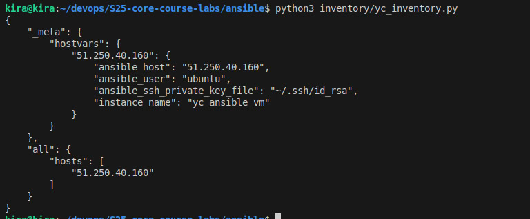
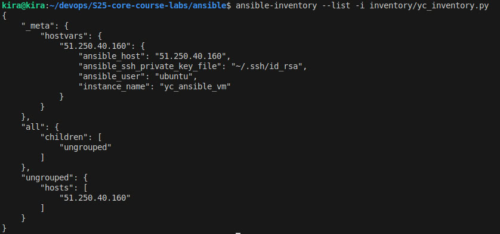
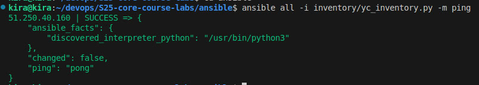
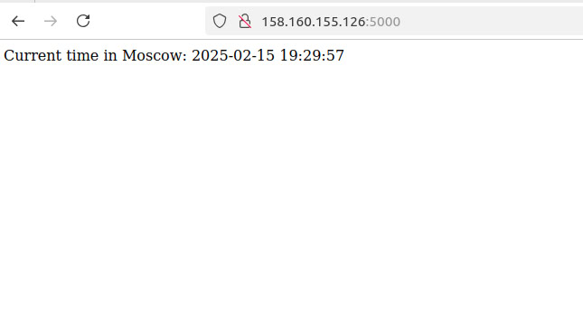

# Ansible Documentation

## Task 1

## Repository Structure

The repository follows the recommended structure.

## Installation

1. Install Ansible following the [official guide](https://docs.ansible.com/ansible/latest/installation_guide/index.html).
2. Verified installation:

   ```sh
   ansible --version
   ```

## Using an Existing Ansible Role for Docker

- Install a Docker role from **Ansible Galaxy**:

  ```sh
  ansible-galaxy install geerlingguy.docker
  ```

## Playbook and Testing

### Playbook

```yaml
- name: Install Docker and Docker Compose
  hosts: all
  become: yes
  roles:
    - geerlingguy.docker  # The installed Docker role
```

### Testing

1. **Execute**:

   ```sh
    cd ansible
    ansible-playbook -i inventory/localhost.yml playbooks/dev/main.yml --ask-become-pass
   ```

    

2. **Verify**:

   ```sh
   docker --version
   ```

Output:

```sh
Docker version 27.5.1
```

## Task 2

## Overview

This document provides details on how to set up and deploy Docker and Docker Compose using Ansible.

## Prerequisites

- Ansible 2.9+ installed on the control node
- Target machine running Ubuntu 22.04+
- Sudo privileges for the Ansible user

## Deployment

### Running the Playbook

To deploy Docker and Docker Compose, navigate to the `ansible` directory and run:

```sh
ansible-playbook -i inventory/localhost.yml playbooks/dev/main.yml --ask-become-pass --diff
```

Use `--check` for a dry run:

```sh
ansible-playbook -i inventory/localhost.yml playbooks/dev/main.yml --ask-become-pass --check
```

### Deployment Output

Here are the last 50 lines of the deployment output (--diff):

```sh
...
TASK [docker : Remove any existing Docker GPG key] ************************************************************************************************************************************
--- before
+++ after
@@ -1,4 +1,4 @@
 {
     "path": "/etc/apt/keyrings/docker.asc",
-    "state": "file"
+    "state": "absent"
 }

changed: [localhost]

TASK [docker : Download Docker GPG key] ***********************************************************************************************************************************************
changed: [localhost]

TASK [docker : Set correct permissions for Docker GPG key] ****************************************************************************************************************************
ok: [localhost]

TASK [docker : Add Docker repository] *************************************************************************************************************************************************
--- before: /dev/null
+++ after: /etc/apt/sources.list.d/docker.list
@@ -0,0 +1 @@
+deb [arch=amd64 signed-by=/etc/apt/keyrings/docker.asc] https://download.docker.com/linux/ubuntu jammy stable

changed: [localhost]

TASK [docker : Run apt update] ********************************************************************************************************************************************************
changed: [localhost]

TASK [docker : Include Docker Compose installation tasks] *****************************************************************************************************************************
included: /home/kira/devops/S25-core-course-labs/ansible/roles/docker/tasks/install_compose.yml for localhost

TASK [docker : Download Docker Compose] ***********************************************************************************************************************************************
ok: [localhost]

TASK [docker : Verify Docker Compose installation] ************************************************************************************************************************************
ok: [localhost]

TASK [docker : Debug Docker Compose version] ******************************************************************************************************************************************
ok: [localhost] => {
    "msg": "Docker Compose installed: docker-compose version 1.29.2, build 5becea4c"
}

TASK [docker : Ensure Docker starts on boot] ******************************************************************************************************************************************
ok: [localhost]

TASK [docker : Add user to the Docker group] ******************************************************************************************************************************************
changed: [localhost]

PLAY RECAP ****************************************************************************************************************************************************************************
localhost                  : ok=15   changed=6    unreachable=0    failed=0    skipped=0    rescued=0    ignored=0   
```

Here are the last 50 lines of the deployment output(dry run --check):

```sh
PLAY [Install Docker and Docker Compose] **********************************************************************************************************************************************

TASK [Gathering Facts] ****************************************************************************************************************************************************************
ok: [localhost]

TASK [docker : Include Docker installation tasks] *************************************************************************************************************************************
included: /home/kira/devops/S25-core-course-labs/ansible/roles/docker/tasks/install_docker.yml for localhost

TASK [docker : Remove old Docker sources] *********************************************************************************************************************************************
changed: [localhost]

TASK [docker : Ensure `/etc/apt/keyrings` exists] *************************************************************************************************************************************
ok: [localhost]

TASK [docker : Remove any existing Docker GPG key] ************************************************************************************************************************************
changed: [localhost]

TASK [docker : Download Docker GPG key] ***********************************************************************************************************************************************
ok: [localhost]

TASK [docker : Set correct permissions for Docker GPG key] ****************************************************************************************************************************
ok: [localhost]

TASK [docker : Add Docker repository] *************************************************************************************************************************************************
ok: [localhost]

TASK [docker : Run apt update] ********************************************************************************************************************************************************
changed: [localhost]

TASK [docker : Include Docker Compose installation tasks] *****************************************************************************************************************************
included: /home/kira/devops/S25-core-course-labs/ansible/roles/docker/tasks/install_compose.yml for localhost

TASK [docker : Download Docker Compose] ***********************************************************************************************************************************************
ok: [localhost]

TASK [docker : Verify Docker Compose installation] ************************************************************************************************************************************
skipping: [localhost]

TASK [docker : Debug Docker Compose version] ******************************************************************************************************************************************
ok: [localhost] => {
    "msg": "Docker Compose installed: {'msg': 'skipped, running in check mode', 'skipped': True, 'failed': False, 'changed': False}"
}

TASK [docker : Ensure Docker starts on boot] ******************************************************************************************************************************************
ok: [localhost]

TASK [docker : Add user to the Docker group] ******************************************************************************************************************************************
ok: [localhost]

PLAY RECAP ****************************************************************************************************************************************************************************
localhost                  : ok=14   changed=3    unreachable=0    failed=0    skipped=1    rescued=0    ignored=0 
```

## Inventory Details

### **Inventory File**

The inventory file is defined in `inventory/localhost.yml`:

```yaml
all:
  hosts:
    localhost:
      ansible_connection: local
      ansible_python_interpreter: /usr/bin/python3
      ansible_distribution_release: jammy
      ansible_user: kira
```

### **Inventory List**

```sh
ansible-inventory -i inventory/localhost.yml --list
```

Output:

```sh
{
    "_meta": {
        "hostvars": {
            "localhost": {
                "ansible_connection": "local",
                "ansible_distribution_release": "jammy",
                "ansible_python_interpreter": "/usr/bin/python3",
                "ansible_user": "kira"
            }
        }
    },
    "all": {
        "children": [
            "ungrouped"
        ]
    },
    "ungrouped": {
        "hosts": [
            "localhost"
        ]
    }
}
```

### **Inventory Graph**

```sh
ansible-inventory -i inventory/localhost.yml --graph
```

Output:

```sh
@all:
  |--@ungrouped:
  |  |--localhost
```

## Bonus Task

The task is completed using yandex cloud




## Application deployment

### Task 1

To deploy the app, navigate to the `ansible` directory and run:

```sh
ansible-playbook -i inventory/yc_inventory.py site.yml --tags deploy -e ansible_python_interpreter=/usr/bin/python3
```

**Output:**

```sh
PLAY [Deploy app_python] ***********************************************************************************************************************************************

TASK [Gathering Facts] *************************************************************************************************************************************************
ok: [158.160.155.126]

TASK [web_app : Run the application container] *************************************************************************************************************************
changed: [158.160.155.126]

PLAY RECAP *************************************************************************************************************************************************************
158.160.155.126            : ok=2    changed=1    unreachable=0    failed=0    skipped=0    rescued=0    ignored=0  
```


