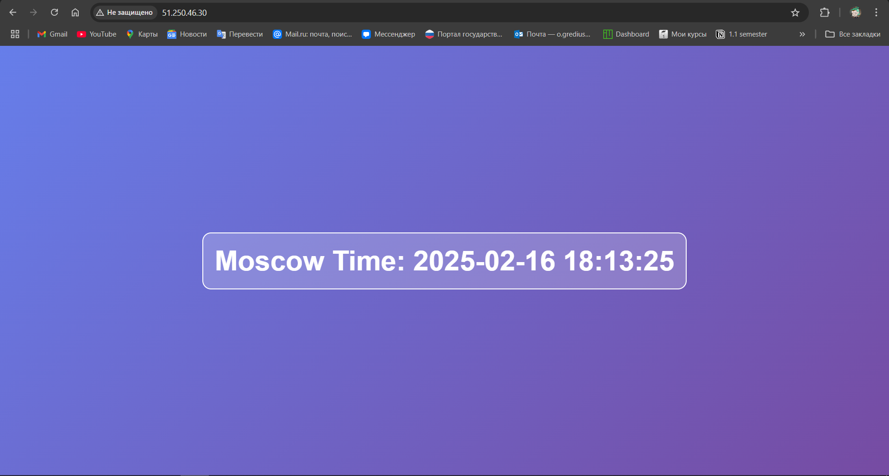
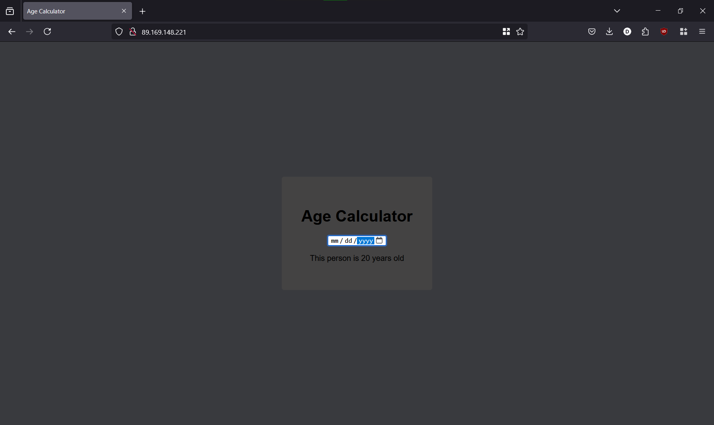

# Ansible

## Existing Ansible Role for Docker

Firstly, I installed existing Ansible role for Docker:

```shell
$ ansible-galaxy role install geerlingguy.docker
Starting galaxy role install process
- downloading role 'docker', owned by geerlingguy
- downloading role from https://github.com/geerlingguy/ansible-role-docker/archive/7.4.5.tar.gz
- extracting geerlingguy.docker to /home/dmitriy/.ansible/roles/geerlingguy.docker
- geerlingguy.docker (7.4.5) was installed successfully
```

Using the provided Github page for existing Ansible Role for Docker, I populated `ansible/playbooks/dev/main.yaml` file. Then I created `ansible/inventory/default_aws_ec2.yml` inventory file to point to my Yandex cloud.

So, I developed an Ansible playbook for deploying Docker:

```shell
$ ansible-playbook -i ansible/inventory/default_aws_ec2.yml ansible/playbooks/dev/main.yaml

PLAY [Install and Configure Docker] ****************************************************************************************************

TASK [Gathering Facts] *****************************************************************************************************************
ok: [my_vm]

TASK [geerlingguy.docker : Load OS-specific vars.] *************************************************************************************
ok: [my_vm]

TASK [geerlingguy.docker : include_tasks] **********************************************************************************************
skipping: [my_vm]

TASK [geerlingguy.docker : include_tasks] **********************************************************************************************
included: /home/dmitriy/.ansible/roles/geerlingguy.docker/tasks/setup-Debian.yml for my_vm

TASK [geerlingguy.docker : Ensure apt key is not present in trusted.gpg.d] *************************************************************
ok: [my_vm]

TASK [geerlingguy.docker : Ensure old apt source list is not present in /etc/apt/sources.list.d] ***************************************
ok: [my_vm]

TASK [geerlingguy.docker : Ensure the repo referencing the previous trusted.gpg.d key is not present] **********************************
ok: [my_vm]

TASK [geerlingguy.docker : Ensure old versions of Docker are not installed.] ***********************************************************
ok: [my_vm]

TASK [geerlingguy.docker : Ensure dependencies are installed.] *************************************************************************
ok: [my_vm]

TASK [geerlingguy.docker : Ensure directory exists for /etc/apt/keyrings] **************************************************************
ok: [my_vm]

TASK [geerlingguy.docker : Add Docker apt key.] ****************************************************************************************
ok: [my_vm]

TASK [geerlingguy.docker : Ensure curl is present (on older systems without SNI).] *****************************************************
skipping: [my_vm]

TASK [geerlingguy.docker : Add Docker apt key (alternative for older systems without SNI).] ********************************************
skipping: [my_vm]

TASK [geerlingguy.docker : Add Docker repository.] *************************************************************************************
ok: [my_vm]

TASK [geerlingguy.docker : Install Docker packages.] ***********************************************************************************
skipping: [my_vm]

TASK [geerlingguy.docker : Install Docker packages (with downgrade option).] ***********************************************************
ok: [my_vm]

TASK [geerlingguy.docker : Install docker-compose plugin.] *****************************************************************************
skipping: [my_vm]

TASK [geerlingguy.docker : Install docker-compose-plugin (with downgrade option).] *****************************************************
ok: [my_vm]

TASK [geerlingguy.docker : Ensure /etc/docker/ directory exists.] **********************************************************************
skipping: [my_vm]

TASK [geerlingguy.docker : Configure Docker daemon options.] ***************************************************************************
skipping: [my_vm]

TASK [geerlingguy.docker : Ensure Docker is started and enabled at boot.] **************************************************************
ok: [my_vm]

TASK [geerlingguy.docker : Ensure handlers are notified now to avoid firewall conflicts.] **********************************************

TASK [geerlingguy.docker : include_tasks] **********************************************************************************************
skipping: [my_vm]

TASK [geerlingguy.docker : Get docker group info using getent.] ************************************************************************
skipping: [my_vm]

TASK [geerlingguy.docker : Check if there are any users to add to the docker group.] ***************************************************
skipping: [my_vm]

TASK [geerlingguy.docker : include_tasks] **********************************************************************************************
skipping: [my_vm]

PLAY RECAP *****************************************************************************************************************************
my_vm                      : ok=14   changed=0    unreachable=0    failed=0    skipped=11   rescued=0    ignored=0
```

Then I tested it by logging into my cloud using SSH (`ssh ubuntu@158.160.34.19`) and running the following command:

```shell
$ docker --version
Docker version 27.5.1, build 9f9e405
```

## Custom Docker Role

Showing Ansible where my `ansible.cfg` file is located:

```shell
export ANSIBLE_CONFIG=/mnt/f/magic/Documents/Projects/S25-core-course-labs/ansible/ansible.cfg
```

Checking the playbook file:

```shell
$ ansible-playbook playbooks/dev/main.yaml --check

PLAY [Install and Configure Docker] ****************************************************************************************************

TASK [Gathering Facts] *****************************************************************************************************************
ok: [my_vm]

TASK [docker : include_tasks] **********************************************************************************************************
included: /mnt/f/magic/Documents/Projects/S25-core-course-labs/ansible/roles/docker/tasks/install_docker.yml for my_vm

TASK [docker : Install prerequisites] **************************************************************************************************
ok: [my_vm]

TASK [docker : Add Docker GPG key] *****************************************************************************************************
ok: [my_vm]

TASK [docker : Add Docker repo] ********************************************************************************************************
ok: [my_vm]

TASK [docker : Install Docker] *********************************************************************************************************
ok: [my_vm]

TASK [docker : include_tasks] **********************************************************************************************************
included: /mnt/f/magic/Documents/Projects/S25-core-course-labs/ansible/roles/docker/tasks/install_compose.yml for my_vm

TASK [docker : Download Docker Compose] ************************************************************************************************
ok: [my_vm]

TASK [docker : include_tasks] **********************************************************************************************************
included: /mnt/f/magic/Documents/Projects/S25-core-course-labs/ansible/roles/docker/tasks/configure_docker.yml for my_vm

TASK [docker : Add user to Docker group] ***********************************************************************************************
ok: [my_vm]

TASK [docker : Enable Docker service] **************************************************************************************************
ok: [my_vm]

PLAY RECAP *****************************************************************************************************************************
my_vm                      : ok=11   changed=0    unreachable=0    failed=0    skipped=0    rescued=0    ignored=0
```

Output of executing the playbook:

```shell
$ ansible-playbook -i inventory/default_aws_ec2.yml playbooks/dev/main.yaml --diff

PLAY [Install and Configure Docker] ****************************************************************************************************

TASK [Gathering Facts] *****************************************************************************************************************
ok: [my_vm]

TASK [docker : include_tasks] **********************************************************************************************************
included: /mnt/f/magic/Documents/Projects/S25-core-course-labs/ansible/roles/docker/tasks/install_docker.yml for my_vm

TASK [docker : Install prerequisites] **************************************************************************************************
The following NEW packages will be installed:
  apt-transport-https
0 upgraded, 1 newly installed, 0 to remove and 11 not upgraded.
changed: [my_vm]

TASK [docker : Add Docker GPG key] *****************************************************************************************************
changed: [my_vm]

TASK [docker : Add Docker repo] ********************************************************************************************************
--- before: /dev/null
+++ after: /etc/apt/sources.list.d/download_docker_com_linux_ubuntu.list
@@ -0,0 +1 @@
+deb https://download.docker.com/linux/ubuntu noble stable

changed: [my_vm]

TASK [docker : Install Docker] *********************************************************************************************************
The following additional packages will be installed:
  docker-buildx-plugin docker-ce-rootless-extras docker-compose-plugin
  libltdl7 libslirp0 pigz slirp4netns
Suggested packages:
  aufs-tools cgroupfs-mount | cgroup-lite
The following NEW packages will be installed:
  containerd.io docker-buildx-plugin docker-ce docker-ce-cli
  docker-ce-rootless-extras docker-compose-plugin libltdl7 libslirp0 pigz
  slirp4netns
0 upgraded, 10 newly installed, 0 to remove and 11 not upgraded.
changed: [my_vm]

TASK [docker : include_tasks] **********************************************************************************************************
included: /mnt/f/magic/Documents/Projects/S25-core-course-labs/ansible/roles/docker/tasks/install_compose.yml for my_vm

TASK [docker : Download Docker Compose] ************************************************************************************************
changed: [my_vm]

TASK [docker : include_tasks] **********************************************************************************************************
included: /mnt/f/magic/Documents/Projects/S25-core-course-labs/ansible/roles/docker/tasks/configure_docker.yml for my_vm

TASK [docker : Add user to Docker group] ***********************************************************************************************
changed: [my_vm]

TASK [docker : Enable Docker service] **************************************************************************************************
ok: [my_vm]

RUNNING HANDLER [docker : Docker Restart] **********************************************************************************************
changed: [my_vm]

PLAY RECAP *****************************************************************************************************************************
my_vm                      : ok=12   changed=7    unreachable=0    failed=0    skipped=0    rescued=0    ignored=0
```

Then I tested the custom Docker role by logging into cloud with SSH and running commands:

1. Docker version:

    ```shell
    $ docker --version
    Docker version 27.5.1, build 9f9e405
    ```

2. Docker Compose version:

    ```shell
    $ docker compose version
    Docker Compose version v2.32.4
    ```

3. Systemd status:

    ```shell
    $ systemctl status docker
    ● docker.service - Docker Application Container Engine
        Loaded: loaded (/usr/lib/systemd/system/docker.service; enabled; preset: enabled)
        Active: active (running) since Sun 2025-02-09 19:00:31 UTC; 3min 1s ago
    TriggeredBy: ● docker.socket
        Docs: https://docs.docker.com
    Main PID: 10131 (dockerd)
        Tasks: 9
        Memory: 20.3M (peak: 22.6M)
            CPU: 559ms
        CGroup: /system.slice/docker.service
                └─10131 /usr/bin/dockerd -H fd:// --containerd=/run/containerd/containerd.sock
    ```

4. Groups for current user:

    ```shell
    $ groups
    ubuntu adm cdrom sudo dip lxd docker
    ```

## Inventory Details

```shell
$ ansible-inventory -i inventory/default_aws_ec2.yml --list
{
    "_meta": {
        "hostvars": {
            "my_vm": {
                "ansible_host": "84.201.173.27",
                "ansible_python_interpreter": "/usr/bin/python3",
                "ansible_ssh_private_key_file": "~/.ssh/id_rsa",
                "ansible_user": "ubuntu"
            }
        }
    },
    "all": {
        "children": [
            "ungrouped"
        ]
    },
    "ungrouped": {
        "hosts": [
            "my_vm"
        ]
    }
}
```

```shell
$ ansible-inventory -i inventory/default_aws_ec2.yml --graph
@all:
  |--@ungrouped:
  |  |--my_vm
```

## Dynamic Inventory

```shell
$ ansible-playbook -i inventory/default_yacloud_compute.yml playbooks/dev/main.yaml --diff

PLAY [Install and Configure Docker] ****************************************************************************************************

TASK [Gathering Facts] *****************************************************************************************************************
[WARNING]: Platform linux on host terraform1 is using the discovered Python interpreter at /usr/bin/python3.12, but future installation
of another Python interpreter could change the meaning of that path. See https://docs.ansible.com/ansible-
core/2.17/reference_appendices/interpreter_discovery.html for more information.
ok: [terraform1]

TASK [docker : include_tasks] **********************************************************************************************************
included: /mnt/f/magic/Documents/Projects/S25-core-course-labs/ansible/roles/docker/tasks/install_docker.yml for terraform1

TASK [docker : Install prerequisites] **************************************************************************************************
ok: [terraform1]

TASK [docker : Add Docker GPG key] *****************************************************************************************************
ok: [terraform1]

TASK [docker : Add Docker repo] ********************************************************************************************************
ok: [terraform1]

TASK [docker : Install Docker] *********************************************************************************************************
ok: [terraform1]

TASK [docker : include_tasks] **********************************************************************************************************
included: /mnt/f/magic/Documents/Projects/S25-core-course-labs/ansible/roles/docker/tasks/install_compose.yml for terraform1

TASK [docker : Download Docker Compose] ************************************************************************************************
ok: [terraform1]

TASK [docker : include_tasks] **********************************************************************************************************
included: /mnt/f/magic/Documents/Projects/S25-core-course-labs/ansible/roles/docker/tasks/configure_docker.yml for terraform1

TASK [docker : Add user to Docker group] ***********************************************************************************************
ok: [terraform1]

TASK [docker : Enable Docker service] **************************************************************************************************
ok: [terraform1]

PLAY RECAP *****************************************************************************************************************************
terraform1                 : ok=11   changed=0    unreachable=0    failed=0    skipped=0    rescued=0    ignored=0

WARNING: All log messages before absl::InitializeLog() is called are written to STDERR
E0000 00:00:1739132182.744746   86091 init.cc:232] grpc_wait_for_shutdown_with_timeout() timed out.
```

```shell
$ ansible-inventory -i inventory/default_yacloud_compute.yml --list
{
    "_meta": {
        "hostvars": {
            "terraform1": {
                "ansible_host": "84.201.173.27"
            }
        }
    },
    "all": {
        "children": [
            "ungrouped",
            "yacloud"
        ]
    },
    "yacloud": {
        "hosts": [
            "terraform1"
        ]
    }
}
WARNING: All log messages before absl::InitializeLog() is called are written to STDERR
E0000 00:00:1739133891.897496   93121 init.cc:232] grpc_wait_for_shutdown_with_timeout() timed out.
```

```shell
$ ansible-inventory -i inventory/default_yacloud_compute.yml --graph
@all:
  |--@ungrouped:
  |--@yacloud:
  |  |--terraform1
WARNING: All log messages before absl::InitializeLog() is called are written to STDERR
E0000 00:00:1739133914.894979   93235 init.cc:232] grpc_wait_for_shutdown_with_timeout() timed out.
```

## Secure Docker Configuration

```shell
$ ansible-playbook -i inventory/default_yacloud_compute.yml playbooks/dev/main.yaml --diff

PLAY [Install and Configure Docker] ****************************************************************************************************

TASK [Gathering Facts] *****************************************************************************************************************
[WARNING]: Platform linux on host terraform1 is using the discovered Python interpreter at /usr/bin/python3.12, but future installation
of another Python interpreter could change the meaning of that path. See https://docs.ansible.com/ansible-
core/2.17/reference_appendices/interpreter_discovery.html for more information.
ok: [terraform1]

TASK [docker : include_tasks] **********************************************************************************************************
included: /mnt/f/magic/Documents/Projects/S25-core-course-labs/ansible/roles/docker/tasks/install_docker.yml for terraform1

TASK [docker : Install prerequisites] **************************************************************************************************
ok: [terraform1]

TASK [docker : Add Docker GPG key] *****************************************************************************************************
ok: [terraform1]

TASK [docker : Add Docker repo] ********************************************************************************************************
ok: [terraform1]

TASK [docker : Install Docker] *********************************************************************************************************
ok: [terraform1]

TASK [docker : include_tasks] **********************************************************************************************************
included: /mnt/f/magic/Documents/Projects/S25-core-course-labs/ansible/roles/docker/tasks/install_compose.yml for terraform1

TASK [docker : Download Docker Compose] ************************************************************************************************
ok: [terraform1]

TASK [docker : include_tasks] **********************************************************************************************************
included: /mnt/f/magic/Documents/Projects/S25-core-course-labs/ansible/roles/docker/tasks/configure_docker.yml for terraform1

TASK [docker : Add user to Docker group] ***********************************************************************************************
ok: [terraform1]

TASK [docker : Disable root access] ****************************************************************************************************
--- before
+++ after: /etc/docker/daemon.json
@@ -0,0 +1,3 @@
+{
+  "userns-remap": "default"
+}

changed: [terraform1]

TASK [docker : Enable Docker service] **************************************************************************************************
ok: [terraform1]

RUNNING HANDLER [docker : Docker Restart] **********************************************************************************************
changed: [terraform1]

PLAY RECAP *****************************************************************************************************************************
terraform1                 : ok=13   changed=2    unreachable=0    failed=0    skipped=0    rescued=0    ignored=0

WARNING: All log messages before absl::InitializeLog() is called are written to STDERR
E0000 00:00:1739134397.145184   95036 init.cc:232] grpc_wait_for_shutdown_with_timeout() timed out.
```

## Python Web Application

```shell
$ ansible-playbook -i inventory/default_yacloud_compute.yml playbooks/dev/app_python/main.yaml

PLAY [Deploy Python Web Application] ***************************************************************************************************

TASK [Gathering Facts] *****************************************************************************************************************
[WARNING]: Platform linux on host terraform1 is using the discovered Python interpreter at /usr/bin/python3.12, but future installation
of another Python interpreter could change the meaning of that path. See https://docs.ansible.com/ansible-
core/2.17/reference_appendices/interpreter_discovery.html for more information.
ok: [terraform1]

TASK [docker : include_tasks] **********************************************************************************************************
included: /mnt/f/magic/Documents/Projects/S25-core-course-labs/ansible/roles/docker/tasks/install_docker.yml for terraform1

TASK [docker : Install prerequisites] **************************************************************************************************
ok: [terraform1]

TASK [docker : Add Docker GPG key] *****************************************************************************************************
ok: [terraform1]

TASK [docker : Add Docker repo] ********************************************************************************************************
ok: [terraform1]

TASK [docker : Install Docker] *********************************************************************************************************
ok: [terraform1]

TASK [docker : include_tasks] **********************************************************************************************************
included: /mnt/f/magic/Documents/Projects/S25-core-course-labs/ansible/roles/docker/tasks/install_compose.yml for terraform1

TASK [docker : Download Docker Compose] ************************************************************************************************
ok: [terraform1]

TASK [docker : include_tasks] **********************************************************************************************************
included: /mnt/f/magic/Documents/Projects/S25-core-course-labs/ansible/roles/docker/tasks/configure_docker.yml for terraform1

TASK [docker : Add user to Docker group] ***********************************************************************************************
ok: [terraform1]

TASK [docker : Disable root access] ****************************************************************************************************
ok: [terraform1]

TASK [docker : Enable Docker service] **************************************************************************************************
ok: [terraform1]

TASK [web_app : Whether Web Application directory exists] ******************************************************************************
ok: [terraform1]

TASK [web_app : Whether Docker Compose exists] *****************************************************************************************
ok: [terraform1]

TASK [web_app : Remove Docker Compose] *************************************************************************************************
skipping: [terraform1]

TASK [web_app : Remove Web Application directory] **************************************************************************************
changed: [terraform1]

TASK [web_app : Create Web Application Directory] **************************************************************************************
changed: [terraform1]

TASK [web_app : Copy Docker Compose] ***************************************************************************************************
changed: [terraform1]

RUNNING HANDLER [web_app : Restart Docker Compose] *************************************************************************************
changed: [terraform1]

PLAY RECAP *****************************************************************************************************************************
terraform1                 : ok=18   changed=4    unreachable=0    failed=0    skipped=1    rescued=0    ignored=0

WARNING: All log messages before absl::InitializeLog() is called are written to STDERR
E0000 00:00:1739214293.578689   29107 init.cc:232] grpc_wait_for_shutdown_with_timeout() timed out.
```

Testing that it started:



Removing the deployed application:

```shell
$ ansible-playbook -i inventory/default_yacloud_compute.yml playbooks/dev/app_python/main.yaml --tags wipe

PLAY [Deploy Python Web Application] ***************************************************************************************************

TASK [Gathering Facts] *****************************************************************************************************************
[WARNING]: Platform linux on host terraform1 is using the discovered Python interpreter at /usr/bin/python3.12, but future installation
of another Python interpreter could change the meaning of that path. See https://docs.ansible.com/ansible-
core/2.17/reference_appendices/interpreter_discovery.html for more information.
ok: [terraform1]

TASK [web_app : Whether Web Application directory exists] ******************************************************************************
ok: [terraform1]

TASK [web_app : Whether Docker Compose exists] *****************************************************************************************
ok: [terraform1]

TASK [web_app : Remove Docker Compose] *************************************************************************************************
changed: [terraform1]

TASK [web_app : Remove Web Application directory] **************************************************************************************
changed: [terraform1]

PLAY RECAP *****************************************************************************************************************************
terraform1                 : ok=5    changed=2    unreachable=0    failed=0    skipped=0    rescued=0    ignored=0

WARNING: All log messages before absl::InitializeLog() is called are written to STDERR
E0000 00:00:1739215907.414798   36045 init.cc:232] grpc_wait_for_shutdown_with_timeout() timed out.
```

## Go Web Application

```shell
$ ansible-playbook -i inventory/default_yacloud_compute.yml playbooks/dev/app_go/main.yaml

PLAY [Deploy Go Web Application] *******************************************************************************************************

TASK [Gathering Facts] *****************************************************************************************************************
[WARNING]: Platform linux on host terraform1 is using the discovered Python interpreter at /usr/bin/python3.12, but future installation
of another Python interpreter could change the meaning of that path. See https://docs.ansible.com/ansible-
core/2.17/reference_appendices/interpreter_discovery.html for more information.
ok: [terraform1]

TASK [docker : include_tasks] **********************************************************************************************************
included: /mnt/f/magic/Documents/Projects/S25-core-course-labs/ansible/roles/docker/tasks/install_docker.yml for terraform1

TASK [docker : Install prerequisites] **************************************************************************************************
ok: [terraform1]

TASK [docker : Add Docker GPG key] *****************************************************************************************************
ok: [terraform1]

TASK [docker : Add Docker repo] ********************************************************************************************************
ok: [terraform1]

TASK [docker : Install Docker] *********************************************************************************************************
ok: [terraform1]

TASK [docker : include_tasks] **********************************************************************************************************
included: /mnt/f/magic/Documents/Projects/S25-core-course-labs/ansible/roles/docker/tasks/install_compose.yml for terraform1

TASK [docker : Download Docker Compose] ************************************************************************************************
ok: [terraform1]

TASK [docker : include_tasks] **********************************************************************************************************
included: /mnt/f/magic/Documents/Projects/S25-core-course-labs/ansible/roles/docker/tasks/configure_docker.yml for terraform1

TASK [docker : Add user to Docker group] ***********************************************************************************************
ok: [terraform1]

TASK [docker : Disable root access] ****************************************************************************************************
ok: [terraform1]

TASK [docker : Enable Docker service] **************************************************************************************************
ok: [terraform1]

TASK [web_app : Whether Web Application directory exists] ******************************************************************************
ok: [terraform1]

TASK [web_app : Whether Docker Compose exists] *****************************************************************************************
ok: [terraform1]

TASK [web_app : Remove Docker Compose] *************************************************************************************************
changed: [terraform1]

TASK [web_app : Remove Web Application directory] **************************************************************************************
changed: [terraform1]

TASK [web_app : Create Web Application Directory] **************************************************************************************
changed: [terraform1]

TASK [web_app : Copy Docker Compose] ***************************************************************************************************
changed: [terraform1]

RUNNING HANDLER [web_app : Restart Docker Compose] *************************************************************************************
changed: [terraform1]

PLAY RECAP *****************************************************************************************************************************
terraform1                 : ok=19   changed=5    unreachable=0    failed=0    skipped=0    rescued=0    ignored=0

WARNING: All log messages before absl::InitializeLog() is called are written to STDERR
E0000 00:00:1739217260.113193   46062 init.cc:232] grpc_wait_for_shutdown_with_timeout() timed out.
```

Testing that it started:



Removing the deployed application:

```shell
$ ansible-playbook -i inventory/default_yacloud_compute.yml playbooks/dev/app_go/main.yaml --tags wipe

PLAY [Deploy Go Web Application] *******************************************************************************************************

TASK [Gathering Facts] *****************************************************************************************************************
[WARNING]: Platform linux on host terraform1 is using the discovered Python interpreter at /usr/bin/python3.12, but future installation
of another Python interpreter could change the meaning of that path. See https://docs.ansible.com/ansible-
core/2.17/reference_appendices/interpreter_discovery.html for more information.
ok: [terraform1]

TASK [web_app : Whether Web Application directory exists] ******************************************************************************
ok: [terraform1]

TASK [web_app : Whether Docker Compose exists] *****************************************************************************************
ok: [terraform1]

TASK [web_app : Remove Docker Compose] *************************************************************************************************
changed: [terraform1]

TASK [web_app : Remove Web Application directory] **************************************************************************************
changed: [terraform1]

PLAY RECAP *****************************************************************************************************************************
terraform1                 : ok=5    changed=2    unreachable=0    failed=0    skipped=0    rescued=0    ignored=0

WARNING: All log messages before absl::InitializeLog() is called are written to STDERR
E0000 00:00:1739217342.176005   46980 init.cc:232] grpc_wait_for_shutdown_with_timeout() timed out.
```
