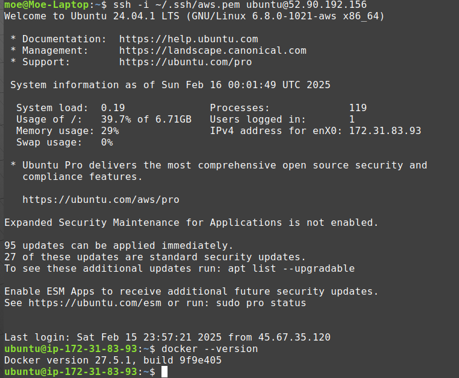
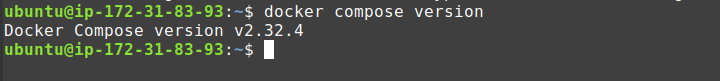
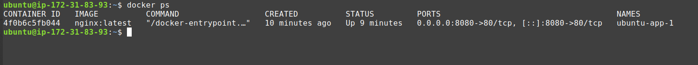
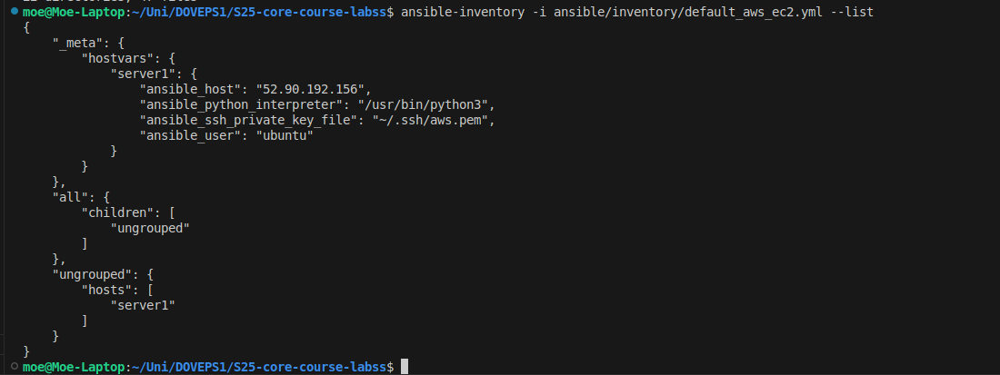
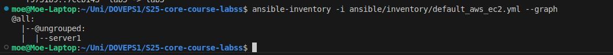
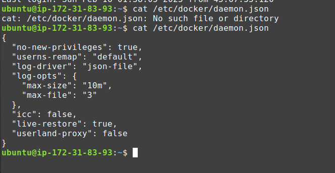

# Ansible Deployment - Lab 5

## Overview

This document outlines the deployment process for Docker using Ansible. The objective of this lab is to automate the installation of Docker and Docker Compose on a remote server using Ansible and ensure that a containerized web application is successfully deployed.

## Repository Structure

Ensure your repository follows this structure:

```sh
.
|-- ansible
|   |-- inventory
|   |   `-- default_aws_ec2.yml
|   |-- playbooks
|   |   `-- dev
|   |       `-- main.yaml
|   |-- roles
|   |   |-- docker
|   |   |   |-- defaults
|   |   |   |   `-- main.yml
|   |   |   |-- handlers
|   |   |   |   `-- main.yml
|   |   |   |-- tasks
|   |   |   |   |-- install_compose.yml
|   |   |   |   |-- install_docker.yml
|   |   |   |   `-- main.yml
|   |   |   `-- README.md
|   |   `-- web_app
|   |       |-- defaults
|   |       |   `-- main.yml
|   |       |-- handlers
|   |       |   `-- main.yml
|   |       |-- meta
|   |       |   `-- main.yml
|   |       |-- tasks
|   |       |   `-- main.yml
|   |       `-- templates
|   |           `-- docker-compose.yml.j2
|   `-- ansible.cfg
```

## Setup and Execution

### **Step 1: Install Dependencies**

Run the Ansible playbook to install Docker and deploy the application:

```sh
ansible-playbook -i ansible/inventory/default_aws_ec2.yml ansible/playbooks/dev/main.yaml
```

### **Step 2: Verify Docker Installation**

Check if Docker and Docker Compose are correctly installed:

```sh
docker --version
docker compose version
```

### **Step 3: Validate Deployment**

Verify that the application is running by checking active Docker containers:

```sh
docker ps
```

## Playbook Execution

The playbook executes the following steps:

1. Installs required dependencies such as `ca-certificates`, `curl`, and `gnupg`.
2. Adds the Docker GPG key and repository to the system.
3. Installs Docker and Docker Compose.
4. Ensures Docker is enabled and started on boot.
5. Copies the `docker-compose.yml` template to the remote server.
6. Starts the web application using Docker Compose.

- **Dry run (`--check` mode)**:

  ```sh
  ansible-playbook -i ansible/inventory/default_aws_ec2.yml ansible/playbooks/dev/main.yaml --check --diff
  ```

- **Last 50 lines of execution output**:

```sh

PLAY [all] ***********************************************************************************************************************************************************************************************

TASK [Gathering Facts] ***********************************************************************************************************************************************************************************
ok: [server1]

TASK [docker : include_tasks] ****************************************************************************************************************************************************************************
included: /home/moe/Uni/DOVEPS1/S25-core-course-labss/ansible/roles/docker/tasks/install_docker.yml for server1

TASK [docker : Install required dependencies] ************************************************************************************************************************************************************
ok: [server1]

TASK [docker : Ensure /etc/apt/keyrings directory exists] ************************************************************************************************************************************************
ok: [server1]

TASK [docker : Add Docker GPG key] ***********************************************************************************************************************************************************************
changed: [server1]

TASK [docker : Add Docker repository] ********************************************************************************************************************************************************************
changed: [server1]

TASK [docker : Update package cache] *********************************************************************************************************************************************************************
changed: [server1]

TASK [docker : Install Docker packages] ******************************************************************************************************************************************************************
ok: [server1]

TASK [docker : Ensure /etc/docker/ directory exists] *****************************************************************************************************************************************************
ok: [server1]

TASK [docker : Configure Docker daemon options (if any)] *************************************************************************************************************************************************
skipping: [server1]

TASK [docker : Ensure Docker is started and enabled at boot] *********************************************************************************************************************************************
ok: [server1]

TASK [docker : Flush handlers to restart Docker immediately] *********************************************************************************************************************************************

TASK [docker : include_tasks] ****************************************************************************************************************************************************************************
included: /home/moe/Uni/DOVEPS1/S25-core-course-labss/ansible/roles/docker/tasks/install_compose.yml for server1

TASK [docker : Check current docker-compose version] *****************************************************************************************************************************************************
ok: [server1]

TASK [docker : Extract current version of Docker Compose] ************************************************************************************************************************************************
ok: [server1]

TASK [docker : Delete existing Docker Compose version if outdated] ***************************************************************************************************************************************
ok: [server1]

TASK [docker : Install Docker Compose if not installed or outdated] **************************************************************************************************************************************
skipping: [server1]

TASK [docker : Install Docker Compose Plugin] ************************************************************************************************************************************************************
ok: [server1]

TASK [docker : include_tasks] ****************************************************************************************************************************************************************************
included: /home/moe/Uni/DOVEPS1/S25-core-course-labss/ansible/roles/docker/tasks/install_compose.yml for server1

TASK [docker : Check current docker-compose version] *****************************************************************************************************************************************************
ok: [server1]

TASK [docker : Extract current version of Docker Compose] ************************************************************************************************************************************************
ok: [server1]

TASK [docker : Delete existing Docker Compose version if outdated] ***************************************************************************************************************************************
ok: [server1]

TASK [docker : Install Docker Compose if not installed or outdated] **************************************************************************************************************************************
skipping: [server1]

TASK [docker : Install Docker Compose Plugin] ************************************************************************************************************************************************************
ok: [server1]

TASK [docker : Enable Docker to start on boot] ***********************************************************************************************************************************************************
ok: [server1]

TASK [docker : Add user to the Docker group] *************************************************************************************************************************************************************
changed: [server1]

TASK [web_app : Deploy Web Application] ******************************************************************************************************************************************************************
ok: [server1]

TASK [web_app : Start Application] ***********************************************************************************************************************************************************************
changed: [server1]

PLAY RECAP ***********************************************************************************************************************************************************************************************
server1                    : ok=24   changed=5    unreachable=0    failed=0    skipped=3    rescued=0    ignored=0
```

## Inventory Details

- Run the following to check the inventory:

  ```sh
  ansible-inventory -i ansible/inventory/default_aws_ec2.yml --list
  ```

- Validate the inventory structure:

  ```sh
  ansible-inventory -i ansible/inventory/default_aws_ec2.yml --graph
  ```

## Deployment Verification

After running the playbook, verify the following:

1: Check running Docker containers:

```sh
  ubuntu@ip-172-31-83-93:~$ docker ps
  CONTAINER ID   IMAGE          COMMAND                  CREATED          STATUS          PORTS                                     NAMES
  4f0b6c5fb044   nginx:latest   "/docker-entrypoint.…"   35 minutes ago   Up 35 minutes   0.0.0.0:8080->80/tcp, [::]:8080->80/tcp   ubuntu-app-1
```

   Ensure that a container is running with the expected image and port mapping.

2: Check Docker logs:

   ```sh
    ubuntu@ip-172-31-83-93:~$ docker logs 4f0b6c5fb044
    /docker-entrypoint.sh: /docker-entrypoint.d/ is not empty, will attempt to perform configuration
    /docker-entrypoint.sh: Looking for shell scripts in /docker-entrypoint.d/
    /docker-entrypoint.sh: Launching /docker-entrypoint.d/10-listen-on-ipv6-by-default.sh
    10-listen-on-ipv6-by-default.sh: info: Getting the checksum of /etc/nginx/conf.d/default.conf
    10-listen-on-ipv6-by-default.sh: info: Enabled listen on IPv6 in /etc/nginx/conf.d/default.conf
    /docker-entrypoint.sh: Sourcing /docker-entrypoint.d/15-local-resolvers.envsh
    /docker-entrypoint.sh: Launching /docker-entrypoint.d/20-envsubst-on-templates.sh
    /docker-entrypoint.sh: Launching /docker-entrypoint.d/30-tune-worker-processes.sh
    /docker-entrypoint.sh: Configuration complete; ready for start up
    2025/02/15 23:53:45 [notice] 1#1: using the "epoll" event method
    2025/02/15 23:53:45 [notice] 1#1: nginx/1.27.4
    2025/02/15 23:53:45 [notice] 1#1: built by gcc 12.2.0 (Debian 12.2.0-14) 
    2025/02/15 23:53:45 [notice] 1#1: OS: Linux 6.8.0-1021-aws
    2025/02/15 23:53:45 [notice] 1#1: getrlimit(RLIMIT_NOFILE): 1048576:1048576
    2025/02/15 23:53:45 [notice] 1#1: start worker processes
    2025/02/15 23:53:45 [notice] 1#1: start worker process 29
   ```

   This helps troubleshoot any issues if the application does not start as expected.

## Screenshots

To verify successful deployment, included the following screenshots:

- **Docker Installed:**

 

- **Docker Compose Installed:**

 

- **Running Containers:**

 

- **Ansible Inventory:**

 

- **Ansible Graph:**

 

## Conclusion

This setup successfully deploys Docker and a web application using Ansible. All deployment steps and verifications ensure that Docker and the web application are configured correctly for further development.

## Bonus Task: Dynamic Inventory for AWS

### Implement AWS EC2 Dynamic Inventory

I created a new dynamic inventory file has been created to dynamically fetch AWS EC2 instances instead of using a static inventory file.

**File:** `ansible/inventory/dynamic_inventory.yml`

```yaml
plugin: amazon.aws.aws_ec2
regions:
  - us-east-1
filters:
  tag:Name: "ExampleAppServerInstance"
  instance-state-name: running
hostnames:
  - tag:Name
  - public-ip-address
compose:
  ansible_host: public-ip-address
```

## Bonus Task: Secure Docker Configuration

### **Step 1: Secure Docker Daemon Configuration**

A new security configuration has been added to ensure Docker is hardened against privilege escalation and unnecessary risks. The configuration is applied using the `copy` module in Ansible.

**Task File:** `ansible/roles/docker/tasks/secure_docker_config.yml`

```yaml
- name: Secure Docker Daemon Configuration
  ansible.builtin.copy:
    content: |
      {
        "no-new-privileges": true,
        "userns-remap": "default",
        "log-driver": "json-file",
        "log-opts": {
          "max-size": "10m",
          "max-file": "3"
        },
        "icc": false,
        "live-restore": true,
        "userland-proxy": false
      }
    dest: /etc/docker/daemon.json
    owner: root
    group: root
    mode: '0644'
  notify: restart docker
```

### **Step 2: Ensure Docker Restarts After Applying Security Settings**

**Handler File:** `ansible/roles/docker/handlers/main.yml`

```yaml
- name: restart docker
  ansible.builtin.systemd:
    name: docker
    state: restarted
    enabled: yes
```

### **Step 3: Verify Docker Security Configuration**

After applying the playbook, confirm that the security settings are enforced.

Run the following command on the remote server:

```sh
cat /etc/docker/daemon.json
```

✅ Expected Output:

```json
{
  "no-new-privileges": true,
  "userns-remap": "default",
  "log-driver": "json-file",
  "log-opts": {
    "max-size": "10m",
    "max-file": "3"
  },
  "icc": false,
  "live-restore": true,
  "userland-proxy": false
}
```

### **Screenshots**

- **Secure Docker Configuration Applied:**



## Conclusion Of This Task

This setup successfully deploys Docker and a web application using Ansible while implementing additional security enhancements through `daemon.json`. All deployment steps and verifications ensure that Docker and the web application are configured correctly for further development.
