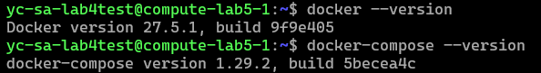

# Lab 5 Ansible and Docker Deployment | Mametov Eldar 

## Task 1 && Task 2

At the bottom you will see ansible run for lab5 task1, it is used to install docker and docker-compose. I've also added the output of the required data that was specified in the task itself. Currently the installation of docker and docker-compose goes locally on the computer, but this will be fixed in the bonus task. 

I used the standard approach to install these components that were specified in the documentation. A separate user is also created for docker. 

```
PLAY [Deploy Docker using Ansible] *******************************************************************************************************************************************

TASK [Gathering Facts] *******************************************************************************************************************************************************
[WARNING]: Platform linux on host localhost is using the discovered Python interpreter at /usr/bin/python3.10, but future installation of another Python interpreter could
change the meaning of that path. See https://docs.ansible.com/ansible-core/2.17/reference_appendices/interpreter_discovery.html for more information.
ok: [localhost]

TASK [docker : Docker installation] ******************************************************************************************************************************************
included: /mnt/c/Users/Honor/Desktop/S25-core-course-labs/ansible/roles/docker/tasks/install_docker.yaml for localhost

TASK [docker : Install packages] *********************************************************************************************************************************************
ok: [localhost] => (item=apt-transport-https)
ok: [localhost] => (item=ca-certificates)
ok: [localhost] => (item=curl)
ok: [localhost] => (item=gnupg)
ok: [localhost] => (item=lsb-release)
ok: [localhost] => (item=software-properties-common)

TASK [docker : Create keyrings] **********************************************************************************************************************************************
ok: [localhost]

TASK [docker : Download Docker GPG key] **************************************************************************************************************************************
ok: [localhost]

TASK [docker : Add Docker repository] ****************************************************************************************************************************************
ok: [localhost]

TASK [docker : Install Docker] ***********************************************************************************************************************************************
ok: [localhost]

TASK [docker : Adding user to Docker group] **********************************************************************************************************************************
ok: [localhost]

TASK [docker : Docker compose installation] **********************************************************************************************************************************
included: /mnt/c/Users/Honor/Desktop/S25-core-course-labs/ansible/roles/docker/tasks/install_compose.yaml for localhost

TASK [docker : Download Docker Compose] **************************************************************************************************************************************
ok: [localhost]

TASK [docker : Symbolic link for docker-compose] *****************************************************************************************************************************
ok: [localhost]

TASK [docker : Verify Docker Compose installation] ***************************************************************************************************************************
changed: [localhost]

TASK [docker : Display success message if Docker Compose is installed] *******************************************************************************************************
ok: [localhost] => {
    "msg": "docker-compose installed"
}

TASK [docker : Docker boot] **************************************************************************************************************************************************
ok: [localhost]

TASK [docker : User for docker] **********************************************************************************************************************************************
ok: [localhost]

PLAY RECAP *******************************************************************************************************************************************************************
localhost                  : ok=15   changed=1    unreachable=0    failed=0    skipped=0    rescued=0    ignored=0
```

```
lekski@LAPTOP-EA8M0FT5:/mnt/c/Users/Honor/Desktop/S25-core-course-labs$ ansible-inventory -i ansible/inventory/default_aws_ec2.yml --list
{
    "_meta": {
        "hostvars": {
            "localhost": {
                "ansible_connection": "local",
                "ansible_user": "eldar-cybersec"
            }
        }
    },
    "all": {
        "children": [
            "ungrouped"
        ]
    },
    "ungrouped": {
        "hosts": [
            "localhost"
        ]
    }
}
```

```
lekski@LAPTOP-EA8M0FT5:/mnt/c/Users/Honor/Desktop/S25-core-course-labs$ ansible-inventory -i ansible/inventory/default_aws_ec2.yml --graph
@all:
  |--@ungrouped:
  |  |--localhost
```

## Bonus Task

In order to connect to yandex cloud I needed to make changes to the inventory. To do this, I created a new server in yandex cloud that did not have docker and docker-compose yet. Yandex cli was already pre-installed on my local machine thanks to previous labs. A server account was created, given admin rights and a json file with keys to access the server terminal was created to manage it. 

A plugin for yacloud management was installed on the link specified in the task. According to the documentation written in yacloud_compute.py a new yandex_inventory was created.
```yaml
all:
  hosts:
    compute-lab5-1:
      ansible_host: 84.201.151.82
      ansible_user: ivangeliev 
      yacloud_token_file: ./inventory/authorized_key.json
      plugin: yacloud_compute
```
yacloud_token_file is the json file to access the VM terminal. ansible_host is the VM ip, and ansible_user is the user who owns the yc_cloud account on which this VM is running. 
compute-lab5-1 is the name of the VM machine created. 

Security settings were also added to disable root access in the docker daemon. The final result was to run the written code and check that docker and docker-compose were installed on the server. 



```
lekski@LAPTOP-EA8M0FT5:/mnt/c/Users/Honor/Desktop/S25-core-course-labs$ ansible-playbook -i ansible/inventory/yandex_inventory.yaml ansible/playbooks/dev/main.yaml --diff --ask-become-pass
BECOME password: 

PLAY [Deploy Docker using Ansible] *******************************************************************************************************************************************

TASK [Gathering Facts] *******************************************************************************************************************************************************
[WARNING]: Platform linux on host compute-lab5-1 is using the discovered Python interpreter at /usr/bin/python3.12, but future installation of another Python interpreter
could change the meaning of that path. See https://docs.ansible.com/ansible-core/2.17/reference_appendices/interpreter_discovery.html for more information.
ok: [compute-lab5-1]

TASK [docker : Docker installation] ******************************************************************************************************************************************
included: /mnt/c/Users/Honor/Desktop/S25-core-course-labs/ansible/roles/docker/tasks/install_docker.yaml for compute-lab5-1

TASK [docker : Install packages] *********************************************************************************************************************************************
ok: [compute-lab5-1] => (item=apt-transport-https)
ok: [compute-lab5-1] => (item=ca-certificates)
ok: [compute-lab5-1] => (item=curl)
ok: [compute-lab5-1] => (item=gnupg)
ok: [compute-lab5-1] => (item=lsb-release)
ok: [compute-lab5-1] => (item=software-properties-common)

TASK [docker : Add Docker GPG key] *******************************************************************************************************************************************
ok: [compute-lab5-1]

TASK [docker : Add Docker repository] ****************************************************************************************************************************************
ok: [compute-lab5-1]

TASK [docker : Install Docker] ***********************************************************************************************************************************************
ok: [compute-lab5-1]

TASK [docker : Adding user to Docker group] **********************************************************************************************************************************
ok: [compute-lab5-1]

TASK [docker : Docker compose installation] **********************************************************************************************************************************
included: /mnt/c/Users/Honor/Desktop/S25-core-course-labs/ansible/roles/docker/tasks/install_compose.yaml for compute-lab5-1

TASK [docker : Download Docker Compose] **************************************************************************************************************************************
ok: [compute-lab5-1]

TASK [docker : Symbolic link for docker-compose] *****************************************************************************************************************************
ok: [compute-lab5-1]

TASK [docker : Verify Docker Compose installation] ***************************************************************************************************************************
changed: [compute-lab5-1]

TASK [docker : Display success message if Docker Compose is installed] *******************************************************************************************************
ok: [compute-lab5-1] => {
    "msg": "docker-compose installed"
}

TASK [docker : Docker secure] ************************************************************************************************************************************************
included: /mnt/c/Users/Honor/Desktop/S25-core-course-labs/ansible/roles/docker/tasks/docker_secure.yaml for compute-lab5-1

TASK [docker : Docker_daemon] ************************************************************************************************************************************************
--- before
+++ after: /home/lekski/.ansible/tmp/ansible-local-5508e6grvjm3/tmp_3mn31ai/docker_daemon.json.j2
@@ -0,0 +1,4 @@
+{
+    "no-new-privileges": true,
+    "userns-remap": "default"
+}
\ No newline at end of file

changed: [compute-lab5-1]

TASK [docker : Docker boot] **************************************************************************************************************************************************
ok: [compute-lab5-1]

TASK [docker : User for docker] **********************************************************************************************************************************************
ok: [compute-lab5-1]

RUNNING HANDLER [docker : Restart Docker] ************************************************************************************************************************************
changed: [compute-lab5-1]

PLAY RECAP *******************************************************************************************************************************************************************
compute-lab5-1             : ok=17   changed=3    unreachable=0    failed=0    skipped=0    rescued=0    ignored=0
```

```
lekski@LAPTOP-EA8M0FT5:/mnt/c/Users/Honor/Desktop/S25-core-course-labs$ ansible-inventory -i ansible/inventory/yandex_inventory.yaml --list
{
    "_meta": {
        "hostvars": {
            "compute-lab5-1": {
                "ansible_host": "84.201.151.82",
                "ansible_user": "ivangeliev",
                "plugin": "yacloud_compute",
                "yacloud_token_file": "./inventory/authorized_key.json"
            }
        }
    },
    "all": {
        "children": [
            "ungrouped"
        ]
    },
    "ungrouped": {
        "hosts": [
            "compute-lab5-1"
        ]
    }
}
```

```
lekski@LAPTOP-EA8M0FT5:/mnt/c/Users/Honor/Desktop/S25-core-course-labs$ ansible-inventory -i ansible/inventory/yandex_inventory.yaml --graph
@all:
  |--@ungrouped:
  |  |--compute-lab5-1
```