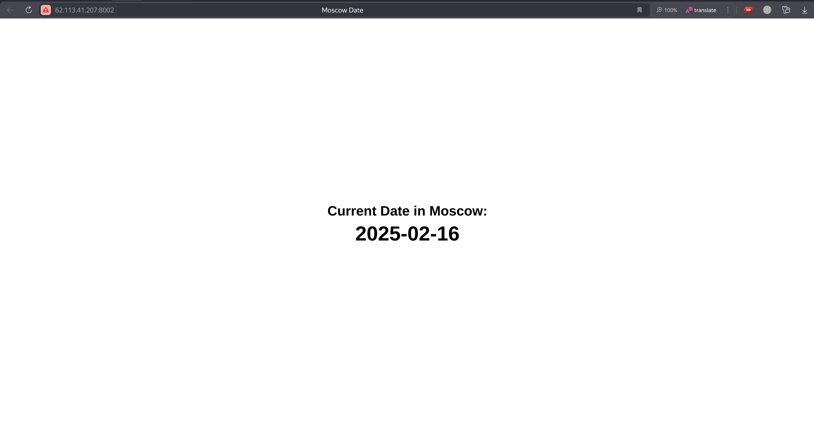

# Ansible

## geerlingguy.docker

I used the following command to install the docker role by geerlingguy.

```bash
ansible-galaxy role install geerlingguy.docker
Starting galaxy role install process
- downloading role 'docker', owned by geerlingguy
- downloading role from https://github.com/geerlingguy/ansible-role-docker/archive/7.4.5.tar.gz
- extracting geerlingguy.docker to /home/azamat/S25-core-course-labs/ansible/roles/geerlingguy.docker
- geerlingguy.docker (7.4.5) was installed successfully
```

I used the following command to run the playbook with the docker role by geerlingguy.

```
ansible-playbook playbooks/dev/main-geerlingguy.yaml

PLAY [Install and Configure Docker] ******************************************************************************************************************************

TASK [Gathering Facts] *******************************************************************************************************************************************
ok: [my_server]

TASK [geerlingguy.docker : Load OS-specific vars.] ***************************************************************************************************************
ok: [my_server]

TASK [geerlingguy.docker : include_tasks] ************************************************************************************************************************
skipping: [my_server]

TASK [geerlingguy.docker : include_tasks] ************************************************************************************************************************
included: /home/azamat/S25-core-course-labs/ansible/roles/geerlingguy.docker/tasks/setup-Debian.yml for my_server

TASK [geerlingguy.docker : Ensure apt key is not present in trusted.gpg.d] ***************************************************************************************
ok: [my_server]

TASK [geerlingguy.docker : Ensure old apt source list is not present in /etc/apt/sources.list.d] *****************************************************************
ok: [my_server]

TASK [geerlingguy.docker : Ensure the repo referencing the previous trusted.gpg.d key is not present] ************************************************************
ok: [my_server]

TASK [geerlingguy.docker : Ensure old versions of Docker are not installed.] *************************************************************************************
ok: [my_server]

TASK [geerlingguy.docker : Ensure dependencies are installed.] ***************************************************************************************************
ok: [my_server]

TASK [geerlingguy.docker : Ensure directory exists for /etc/apt/keyrings] ****************************************************************************************
ok: [my_server]

TASK [geerlingguy.docker : Add Docker apt key.] ******************************************************************************************************************
ok: [my_server]

TASK [geerlingguy.docker : Ensure curl is present (on older systems without SNI).] *******************************************************************************
skipping: [my_server]

TASK [geerlingguy.docker : Add Docker apt key (alternative for older systems without SNI).] **********************************************************************
skipping: [my_server]

TASK [geerlingguy.docker : Add Docker repository.] ***************************************************************************************************************
ok: [my_server]

TASK [geerlingguy.docker : Install Docker packages.] *************************************************************************************************************
skipping: [my_server]

TASK [geerlingguy.docker : Install Docker packages (with downgrade option).] *************************************************************************************
ok: [my_server]

TASK [geerlingguy.docker : Install docker-compose plugin.] *******************************************************************************************************
skipping: [my_server]

TASK [geerlingguy.docker : Install docker-compose-plugin (with downgrade option).] *******************************************************************************
ok: [my_server]

TASK [geerlingguy.docker : Ensure /etc/docker/ directory exists.] ************************************************************************************************
skipping: [my_server]

TASK [geerlingguy.docker : Configure Docker daemon options.] *****************************************************************************************************
skipping: [my_server]

TASK [geerlingguy.docker : Ensure Docker is started and enabled at boot.] ****************************************************************************************
ok: [my_server]

TASK [geerlingguy.docker : Ensure handlers are notified now to avoid firewall conflicts.] ************************************************************************

TASK [geerlingguy.docker : include_tasks] ************************************************************************************************************************
skipping: [my_server]

TASK [geerlingguy.docker : Get docker group info using getent.] **************************************************************************************************
skipping: [my_server]

TASK [geerlingguy.docker : Check if there are any users to add to the docker group.] *****************************************************************************
skipping: [my_server]

TASK [geerlingguy.docker : include_tasks] ************************************************************************************************************************
skipping: [my_server]

PLAY RECAP *******************************************************************************************************************************************************
my_server                      : ok=14   changed=0    unreachable=0    failed=0    skipped=11   rescued=0    ignored=0
```

I used the following command on server to check the docker version.

```bash
docker --version
Docker version 27.5.1, build 9f9e405
```

## My docker role

I used the following command to run the playbook with the docker role by docker.

```bash
ansible-playbook playbooks/dev/main.yaml

PLAY [Install Docker] ***********************************************************************************************************

TASK [Gathering Facts] **********************************************************************************************************
ok: [my_server]

TASK [docker : include_tasks] ***************************************************************************************************
included: /home/azamat/S25-core-course-labs/ansible/roles/docker/tasks/install_docker.yml for my_server

TASK [docker : Install Docker prerequisites] ************************************************************************************
ok: [my_server]

TASK [docker : Set up Docker GPG key] *******************************************************************************************
ok: [my_server]

TASK [docker : Set up Docker repository] ****************************************************************************************
ok: [my_server]

TASK [docker : Install Docker] **************************************************************************************************
ok: [my_server]

TASK [docker : include_tasks] ***************************************************************************************************
included: /home/azamat/S25-core-course-labs/ansible/roles/docker/tasks/install_compose.yml for my_server

TASK [docker : Download Docker Compose] *****************************************************************************************
ok: [my_server]

TASK [docker : include_tasks] ***************************************************************************************************
included: /home/azamat/S25-core-course-labs/ansible/roles/docker/tasks/configure_docker.yml for my_server

TASK [docker : Stop Docker service] *********************************************************************************************
ok: [my_server]

TASK [docker : Remove Docker socket if it exists] *******************************************************************************
ok: [my_server]

TASK [docker : Install dependencies for Docker Rootless] ************************************************************************
ok: [my_server]

TASK [docker : Add user to Docker group] ****************************************************************************************
ok: [my_server]

TASK [docker : Disable root access] *********************************************************************************************
ok: [my_server]

TASK [docker : Ensure Docker daemon runs in rootless mode] **********************************************************************
ok: [my_server]

TASK [docker : include_tasks] ***************************************************************************************************
included: /home/azamat/S25-core-course-labs/ansible/roles/docker/tasks/launch_docker.yml for my_server

TASK [docker : Enable Docker service] *******************************************************************************************
changed: [my_server]

PLAY RECAP **********************************************************************************************************************
my_server                  : ok=17   changed=1    unreachable=0    failed=0    skipped=0    rescued=0    ignored=0
```

I used the following command to check the docker version and compose version.

```bash
docker --version
Docker version 27.5.1, build 9f9e405
```

```bash
docker compose version
Docker Compose version v2.32.4
```

I used the following command to check the docker service status.

```bash
systemctl status docker.service 

● docker.service - Docker Application Container Engine
     Loaded: loaded (/usr/lib/systemd/system/docker.service; enabled; preset: enabled)
     Active: active (running) since Sun 2025-02-16 21:54:12 MSK; 16min ago
TriggeredBy: ● docker.socket
       Docs: https://docs.docker.com
   Main PID: 159322 (dockerd)
      Tasks: 8
     Memory: 19.0M (peak: 20.8M)
        CPU: 452ms
     CGroup: /system.slice/docker.service
             └─159322 /usr/bin/dockerd -H fd:// --containerd=/run/containerd/containerd.sock
```

I used the following command to check the groups.

```bash
groups

ubuntu users docker
```

I used the following command to perform a dry run.

```bash
ansible-playbook playbooks/dev/main.yaml --check

PLAY [Install Docker] ***********************************************************************************************************

TASK [Gathering Facts] **********************************************************************************************************
ok: [my_server]

TASK [docker : include_tasks] ***************************************************************************************************
included: /home/azamat/S25-core-course-labs/ansible/roles/docker/tasks/install_docker.yml for my_server

TASK [docker : Install Docker prerequisites] ************************************************************************************
ok: [my_server]

TASK [docker : Set up Docker GPG key] *******************************************************************************************
ok: [my_server]

TASK [docker : Set up Docker repository] ****************************************************************************************
ok: [my_server]

TASK [docker : Install Docker] **************************************************************************************************
ok: [my_server]

TASK [docker : include_tasks] ***************************************************************************************************
included: /home/azamat/S25-core-course-labs/ansible/roles/docker/tasks/install_compose.yml for my_server

TASK [docker : Download Docker Compose] *****************************************************************************************
ok: [my_server]

TASK [docker : include_tasks] ***************************************************************************************************
included: /home/azamat/S25-core-course-labs/ansible/roles/docker/tasks/configure_docker.yml for my_server

TASK [docker : Stop Docker service] *********************************************************************************************
changed: [my_server]

TASK [docker : Remove Docker socket if it exists] *******************************************************************************
ok: [my_server]

TASK [docker : Install dependencies for Docker Rootless] ************************************************************************
ok: [my_server]

TASK [docker : Add user to Docker group] ****************************************************************************************
ok: [my_server]

TASK [docker : Disable root access] *********************************************************************************************
ok: [my_server]

TASK [docker : Ensure Docker daemon runs in rootless mode] **********************************************************************
skipping: [my_server]

TASK [docker : include_tasks] ***************************************************************************************************
included: /home/azamat/S25-core-course-labs/ansible/roles/docker/tasks/launch_docker.yml for my_server

TASK [docker : Enable Docker service] *******************************************************************************************
ok: [my_server]

PLAY RECAP **********************************************************************************************************************
my_server                  : ok=16   changed=1    unreachable=0    failed=0    skipped=1    rescued=0    ignored=0
```

I used the following command to check the inventory.

```bash
ansible-inventory -i inventory/default_aws_ec2.yml --list

{
    "_meta": {
        "hostvars": {
            "my_server": {
                "ansible_host": "62.113.41.207",
                "ansible_python_interpreter": "/usr/bin/python3",
                "ansible_ssh_private_key_file": "~/.ssh/id_rsa",
                "ansible_user": "ubuntu"
            }
        }
    },
    "all": {
        "children": [
            "ungrouped"
        ]
    },
    "ungrouped": {
        "hosts": [
            "my_server"
        ]
    }
}
```

I used the following command to check the inventory graph.

```bash
ansible-inventory -i inventory/default_aws_ec2.yml --graph

@all:
  |--@ungrouped:
  |  |--my_server
```

## Dynamic inventory

I used the following command to run the playbook with the dynamic inventory.

```bash
ansible-playbook -i inventory/default_yacloud_compute.yml playbooks/dev/main.yaml

PLAY [Install Docker] ***********************************************************************************************************

TASK [Gathering Facts] **********************************************************************************************************
[WARNING]: Platform linux on host s25-devops-terraform-vm is using the discovered Python interpreter at
/usr/bin/python3.12, but future installation of another Python interpreter could change the meaning of
that path. See https://docs.ansible.com/ansible-core/2.17/reference_appendices/interpreter_discovery.html
for more information.
ok: [s25-devops-terraform-vm]

TASK [docker : include_tasks] ***************************************************************************************************
included: /home/azamat/S25-core-course-labs/ansible/roles/docker/tasks/install_docker.yml for s25-devops-terraform-vm

TASK [docker : Install Docker prerequisites] ************************************************************************************
ok: [s25-devops-terraform-vm]

TASK [docker : Set up Docker GPG key] *******************************************************************************************
ok: [s25-devops-terraform-vm]

TASK [docker : Set up Docker repository] ****************************************************************************************
ok: [s25-devops-terraform-vm]

TASK [docker : Install Docker] **************************************************************************************************
ok: [s25-devops-terraform-vm]

TASK [docker : include_tasks] ***************************************************************************************************
included: /home/azamat/S25-core-course-labs/ansible/roles/docker/tasks/install_compose.yml for s25-devops-terraform-vm

TASK [docker : Download Docker Compose] *****************************************************************************************
ok: [s25-devops-terraform-vm]

TASK [docker : include_tasks] ***************************************************************************************************
included: /home/azamat/S25-core-course-labs/ansible/roles/docker/tasks/configure_docker.yml for s25-devops-terraform-vm

TASK [docker : Stop Docker service] *********************************************************************************************
ok: [s25-devops-terraform-vm]

TASK [docker : Remove Docker socket if it exists] *******************************************************************************
ok: [s25-devops-terraform-vm]

TASK [docker : Install dependencies for Docker Rootless] ************************************************************************
ok: [s25-devops-terraform-vm]

TASK [docker : Add user to Docker group] ****************************************************************************************
ok: [s25-devops-terraform-vm]

TASK [docker : Disable root access] *********************************************************************************************
ok: [s25-devops-terraform-vm]

TASK [docker : Ensure Docker daemon runs in rootless mode] **********************************************************************
ok: [s25-devops-terraform-vm]

TASK [docker : include_tasks] ***************************************************************************************************
included: /home/azamat/S25-core-course-labs/ansible/roles/docker/tasks/launch_docker.yml for s25-devops-terraform-vm

TASK [docker : Enable Docker service] *******************************************************************************************
changed: [s25-devops-terraform-vm]

PLAY RECAP **********************************************************************************************************************
s25-devops-terraform-vm                  : ok=17   changed=1    unreachable=0    failed=0    skipped=0    rescued=0    ignored=0
```

I used the following command to check the inventory.

```bash
ansible-inventory -i inventory/default_yacloud_compute.yml --list

{
    "_meta": {
        "hostvars": {
            "s25-devops-terraform-vm": {
                "ansible_host": "158.160.155.175"
            }
        }
    },
    "all": {
        "children": [
            "ungrouped",
            "yacloud"
        ]
    },
    "yacloud": {
        "hosts": [
            "s25-devops-terraform-vm"
        ]
    }
}
```

I used the following command to check the inventory graph.

```bash
ansible-inventory -i inventory/default_yacloud_compute.yml --graph

@all:
  |--@ungrouped:
  |--@yacloud:
  |  |--s25-devops-terraform-vm
```

## Web App Role


I used the following command to run the playbook with the python app.

```bash
ansible-playbook playbooks/dev/app_python/main.yaml

PLAY [Deploy Python App] ************************************************************

TASK [Gathering Facts] **************************************************************
ok: [my_server]

TASK [docker : include_tasks] *******************************************************
included: /home/azamat/S25-core-course-labs/ansible/roles/docker/tasks/install_docker.yml for my_server

TASK [docker : Install Docker prerequisites] ****************************************
ok: [my_server]

TASK [docker : Set up Docker GPG key] ***********************************************
ok: [my_server]

TASK [docker : Set up Docker repository] ********************************************
ok: [my_server]

TASK [docker : Install Docker] ******************************************************
ok: [my_server]

TASK [docker : include_tasks] *******************************************************
included: /home/azamat/S25-core-course-labs/ansible/roles/docker/tasks/install_compose.yml for my_server

TASK [docker : Download Docker Compose] *********************************************
ok: [my_server]

TASK [docker : include_tasks] *******************************************************
included: /home/azamat/S25-core-course-labs/ansible/roles/docker/tasks/configure_docker.yml for my_server

TASK [docker : Stop Docker service] *************************************************
changed: [my_server]

TASK [docker : Remove Docker socket if it exists] ***********************************
ok: [my_server]

TASK [docker : Install dependencies for Docker Rootless] ****************************
ok: [my_server]

TASK [docker : Add user to Docker group] ********************************************
ok: [my_server]

TASK [docker : Disable root access] *************************************************
ok: [my_server]

TASK [docker : Ensure Docker daemon runs in rootless mode] **************************
ok: [my_server]

TASK [docker : include_tasks] *******************************************************
included: /home/azamat/S25-core-course-labs/ansible/roles/docker/tasks/launch_docker.yml for my_server

TASK [docker : Enable Docker service] ***********************************************
changed: [my_server]

TASK [web_app : Check if Application Directory exists] ******************************
ok: [my_server]

TASK [web_app : Check if Docker Compose File exists] ********************************
ok: [my_server]

TASK [web_app : Stop and Remove Application] ****************************************
changed: [my_server]

TASK [web_app : Remove Application Directory] ***************************************
changed: [my_server]

TASK [web_app : Create Application Directory] ***************************************
changed: [my_server]

TASK [web_app : Create Docker Compose File] *****************************************
changed: [my_server]

RUNNING HANDLER [web_app : Restart Docker Compose] **********************************
changed: [my_server]

PLAY RECAP **************************************************************************
my_server                  : ok=24   changed=7    unreachable=0    failed=0    skipped=0    rescued=0    ignored=0
```



I used the following command to run the playbook with the go app.

```bash
ansible-playbook playbooks/dev/app_go/main.yaml

PLAY [Deploy Go App] ****************************************************************

TASK [Gathering Facts] **************************************************************
ok: [my_server]

TASK [docker : include_tasks] *******************************************************
included: /home/azamat/S25-core-course-labs/ansible/roles/docker/tasks/install_docker.yml for my_server

TASK [docker : Install Docker prerequisites] ****************************************
ok: [my_server]

TASK [docker : Set up Docker GPG key] ***********************************************
ok: [my_server]

TASK [docker : Set up Docker repository] ********************************************
ok: [my_server]

TASK [docker : Install Docker] ******************************************************
ok: [my_server]

TASK [docker : include_tasks] *******************************************************
included: /home/azamat/S25-core-course-labs/ansible/roles/docker/tasks/install_compose.yml for my_server

TASK [docker : Download Docker Compose] *********************************************
ok: [my_server]

TASK [docker : include_tasks] *******************************************************
included: /home/azamat/S25-core-course-labs/ansible/roles/docker/tasks/configure_docker.yml for my_server

TASK [docker : Stop Docker service] *************************************************
changed: [my_server]

TASK [docker : Remove Docker socket if it exists] ***********************************
ok: [my_server]

TASK [docker : Install dependencies for Docker Rootless] ****************************
ok: [my_server]

TASK [docker : Add user to Docker group] ********************************************
ok: [my_server]

TASK [docker : Disable root access] *************************************************
ok: [my_server]

TASK [docker : Ensure Docker daemon runs in rootless mode] **************************
ok: [my_server]

TASK [docker : include_tasks] *******************************************************
included: /home/azamat/S25-core-course-labs/ansible/roles/docker/tasks/launch_docker.yml for my_server

TASK [docker : Enable Docker service] ***********************************************
changed: [my_server]

TASK [web_app : Check if Application Directory exists] ******************************
ok: [my_server]

TASK [web_app : Check if Docker Compose File exists] ********************************
ok: [my_server]

TASK [web_app : Stop and Remove Application] ****************************************
changed: [my_server]

TASK [web_app : Remove Application Directory] ***************************************
changed: [my_server]

TASK [web_app : Create Application Directory] ***************************************
changed: [my_server]

TASK [web_app : Create Docker Compose File] *****************************************
changed: [my_server]

RUNNING HANDLER [web_app : Restart Docker Compose] **********************************
changed: [my_server]

PLAY RECAP **************************************************************************
my_server                  : ok=24   changed=7    unreachable=0    failed=0    skipped=0    rescued=0    ignored=0
```

I used the following command to stop the app.

```bash
ansible-playbook playbooks/dev/app_go/main.yaml --tags wipe

PLAY [Deploy Go App] ****************************************************************

TASK [Gathering Facts] **************************************************************
ok: [my_server]

TASK [web_app : Check if Application Directory exists] ******************************
ok: [my_server]

TASK [web_app : Check if Docker Compose File exists] ********************************
ok: [my_server]

TASK [web_app : Stop and Remove Application] ****************************************
changed: [my_server]

TASK [web_app : Remove Application Directory] ***************************************
changed: [my_server]

PLAY RECAP **************************************************************************
my_server                  : ok=5    changed=2    unreachable=0    failed=0    skipped=0    rescued=0    ignored=0
```
