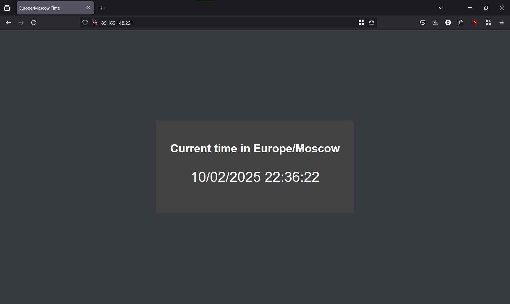

# Existing Ansible role for Docker

```bash
> ansible-galaxy role install geerlingguy.docker
```
```bash
Starting galaxy role install process
- downloading role 'docker', owned by geerlingguy
- downloading role from https://github.com/geerlingguy/ansible-role-docker/archive/7.4.5.tar.gz
- extracting geerlingguy.docker to /home/wellnotwell/.ansible/roles/geerlingguy.docker
- geerlingguy.docker (7.4.5) was installed successfully
```

## Create a Playbook

```bash
> ansible-playbook -i ansible/inventory/default_aws_ec2.yml ansible/playbooks/dev/main.yaml
```
```bash
PLAY [Install Docker] **********************************************************

TASK [Gathering Facts] *********************************************************
ok: [cloud_vm]

TASK [geerlingguy.docker : Load OS-specific vars.] *****************************
ok: [cloud_vm]

TASK [geerlingguy.docker : include_tasks] **************************************
skipping: [cloud_vm]

TASK [geerlingguy.docker : include_tasks] **************************************
included: /home/wellnotwell/.ansible/roles/geerlingguy.docker/tasks/setup-Debian.yml for cloud_vm

TASK [geerlingguy.docker : Ensure apt key is not present in trusted.gpg.d] *****
ok: [cloud_vm]

TASK [geerlingguy.docker : Ensure old apt source list is not present in /etc/apt/sources.list.d] ***
ok: [cloud_vm]

TASK [geerlingguy.docker : Ensure the repo referencing the previous trusted.gpg.d key is not present] ***
ok: [cloud_vm]

TASK [geerlingguy.docker : Ensure old versions of Docker are not installed.] ***
ok: [cloud_vm]

TASK [geerlingguy.docker : Ensure dependencies are installed.] *****************
changed: [cloud_vm]

TASK [geerlingguy.docker : Ensure directory exists for /etc/apt/keyrings] ******
ok: [cloud_vm]

TASK [geerlingguy.docker : Add Docker apt key.] ********************************
changed: [cloud_vm]

TASK [geerlingguy.docker : Ensure curl is present (on older systems without SNI).] ***
skipping: [cloud_vm]

TASK [geerlingguy.docker : Add Docker apt key (alternative for older systems without SNI).] ***
skipping: [cloud_vm]

TASK [geerlingguy.docker : Add Docker repository.] *****************************
changed: [cloud_vm]

TASK [geerlingguy.docker : Install Docker packages.] ***************************
skipping: [cloud_vm]

TASK [geerlingguy.docker : Install Docker packages (with downgrade option).] ***
changed: [cloud_vm]

TASK [geerlingguy.docker : Install docker-compose plugin.] *********************
skipping: [cloud_vm]

TASK [geerlingguy.docker : Install docker-compose-plugin (with downgrade option).] ***
ok: [cloud_vm]

TASK [geerlingguy.docker : Ensure /etc/docker/ directory exists.] **************
skipping: [cloud_vm]

TASK [geerlingguy.docker : Configure Docker daemon options.] *******************
skipping: [cloud_vm]

TASK [geerlingguy.docker : Ensure Docker is started and enabled at boot.] ******
ok: [cloud_vm]

TASK [geerlingguy.docker : Ensure handlers are notified now to avoid firewall conflicts.] ***

RUNNING HANDLER [geerlingguy.docker : restart docker] **************************
changed: [cloud_vm]

TASK [geerlingguy.docker : include_tasks] **************************************
skipping: [cloud_vm]

TASK [geerlingguy.docker : Get docker group info using getent.] ****************
skipping: [cloud_vm]

TASK [geerlingguy.docker : Check if there are any users to add to the docker group.] ***
skipping: [cloud_vm]

TASK [geerlingguy.docker : include_tasks] **************************************
skipping: [cloud_vm]

PLAY RECAP *********************************************************************
cloud_vm                   : ok=15   changed=5    unreachable=0    failed=0    skipped=11   rescued=0    ignored=0   
```

## Testing

```bash
> wellnotwell@ubuntu:~$ docker --version
```
```bash
Docker version 27.5.1, build 9f9e405
```

# Custom Docker Role

```bash
> ansible-playbook -i ansible/inventory/default_aws_ec2.yml ansible/playbooks/dev/main.yaml
```
```bash
PLAY [Install Docker] *********************************************************************************************************************************************************************************************

TASK [Gathering Facts] ********************************************************************************************************************************************************************************************
ok: [cloud_vm]

TASK [docker : include_tasks] *************************************************************************************************************************************************************************************
included: /mnt/d/Python projects/DevOps/ansible/roles/docker/tasks/install_docker.yml for cloud_vm

TASK [docker : Install prerequisites] *****************************************************************************************************************************************************************************
ok: [cloud_vm]

TASK [docker : Add Docker GPG key] ********************************************************************************************************************************************************************************
changed: [cloud_vm]

TASK [docker : Add Docker repository to package sources] **********************************************************************************************************************************************************
ok: [cloud_vm]

TASK [docker : Install Docker and its dependencies] ***************************************************************************************************************************************************************
ok: [cloud_vm]

TASK [docker : include_tasks] *************************************************************************************************************************************************************************************
included: /mnt/d/Python projects/DevOps/ansible/roles/docker/tasks/install_compose.yml for cloud_vm

TASK [docker : Download Docker Compose] ***************************************************************************************************************************************************************************
changed: [cloud_vm]

TASK [docker : include_tasks] *************************************************************************************************************************************************************************************
included: /mnt/d/Python projects/DevOps/ansible/roles/docker/tasks/add_user_to_docker_group.yml for cloud_vm

TASK [docker : Add user to Docker group for access] ***************************************************************************************************************************************************************
changed: [cloud_vm]

TASK [docker : Configure Docker to disable root access] ***********************************************************************************************************************************************************
changed: [cloud_vm]

TASK [docker : Enable Docker service] *****************************************************************************************************************************************************************************
ok: [cloud_vm]

RUNNING HANDLER [docker : Docker Restart] *************************************************************************************************************************************************************************
changed: [cloud_vm]

PLAY RECAP ********************************************************************************************************************************************************************************************************
cloud_vm                   : ok=13   changed=5    unreachable=0    failed=0    skipped=0    rescued=0    ignored=0
```

## Testing:

```bash
> wellnotwell@ubuntu:~$ docker --version
```
```bash
Docker version 27.5.1, build 9f9e405
```
```bash
> wellnotwell@ubuntu:~$ docker compose version
```
```bash
Docker Compose version v2.32.4
```
```bash
> wellnotwell@ubuntu:~$ systemctl status docker
```
```bash
● docker.service - Docker Application Container Engine
     Loaded: loaded (/usr/lib/systemd/system/docker.service; enabled; preset: enabled)
     Active: active (running) since Sun 2025-02-16 00:14:06 UTC; 9min ago
TriggeredBy: ● docker.socket
       Docs: https://docs.docker.com
   Main PID: 4532 (dockerd)
      Tasks: 9
     Memory: 20.6M (peak: 23.5M)
        CPU: 409ms
     CGroup: /system.slice/docker.service
             └─4532 /usr/bin/dockerd -H fd:// --containerd=/run/containerd/containerd.sock
```
```bash
> wellnotwell@ubuntu:~$ groups
```
```bash
wellnotwell docker google-sudoers
```

## Deployment Output

```bash
> ansible-playbook ansible/playbooks/dev/main.yaml --check
```
```bash
PLAY [Install Docker] *********************************************************************************************************************************************************************************************

TASK [Gathering Facts] ********************************************************************************************************************************************************************************************
ok: [cloud_vm]

TASK [docker : include_tasks] *************************************************************************************************************************************************************************************
included: /mnt/d/Python projects/DevOps/ansible/roles/docker/tasks/install_docker.yml for cloud_vm

TASK [docker : Install prerequisites] *****************************************************************************************************************************************************************************
ok: [cloud_vm]

TASK [docker : Add Docker GPG key] ********************************************************************************************************************************************************************************
ok: [cloud_vm]

TASK [docker : Add Docker repository to package sources] **********************************************************************************************************************************************************
ok: [cloud_vm]

TASK [docker : Install Docker and its dependencies] ***************************************************************************************************************************************************************
ok: [cloud_vm]

TASK [docker : include_tasks] *************************************************************************************************************************************************************************************
included: /mnt/d/Python projects/DevOps/ansible/roles/docker/tasks/install_compose.yml for cloud_vm

TASK [docker : Download Docker Compose] ***************************************************************************************************************************************************************************
ok: [cloud_vm]

TASK [docker : include_tasks] *************************************************************************************************************************************************************************************
included: /mnt/d/Python projects/DevOps/ansible/roles/docker/tasks/add_user_to_docker_group.yml for cloud_vm

TASK [docker : Add user to Docker group for access] ***************************************************************************************************************************************************************
ok: [cloud_vm]

TASK [docker : Configure Docker to disable root access] ***********************************************************************************************************************************************************
ok: [cloud_vm]

TASK [docker : Enable Docker service] *****************************************************************************************************************************************************************************
ok: [cloud_vm]

PLAY RECAP ********************************************************************************************************************************************************************************************************
cloud_vm                   : ok=12   changed=0    unreachable=0    failed=0    skipped=0    rescued=0    ignored=0
```
```bash
> ansible-playbook ansible/playbooks/dev/main.yaml --diff
```
```bash
PLAY [Install Docker] *********************************************************************************************************************************************************************************************

TASK [Gathering Facts] ********************************************************************************************************************************************************************************************
ok: [cloud_vm]

TASK [docker : include_tasks] *************************************************************************************************************************************************************************************
included: /mnt/d/Python projects/DevOps/ansible/roles/docker/tasks/install_docker.yml for cloud_vm

TASK [docker : Install prerequisites] *****************************************************************************************************************************************************************************
ok: [cloud_vm]

TASK [docker : Add Docker GPG key] ********************************************************************************************************************************************************************************
ok: [cloud_vm]

TASK [docker : Add Docker repository to package sources] **********************************************************************************************************************************************************
ok: [cloud_vm]

TASK [docker : Install Docker and its dependencies] ***************************************************************************************************************************************************************
ok: [cloud_vm]

TASK [docker : include_tasks] *************************************************************************************************************************************************************************************
included: /mnt/d/Python projects/DevOps/ansible/roles/docker/tasks/install_compose.yml for cloud_vm

TASK [docker : Download Docker Compose] ***************************************************************************************************************************************************************************
ok: [cloud_vm]

TASK [docker : include_tasks] *************************************************************************************************************************************************************************************
included: /mnt/d/Python projects/DevOps/ansible/roles/docker/tasks/add_user_to_docker_group.yml for cloud_vm

TASK [docker : Add user to Docker group for access] ***************************************************************************************************************************************************************
ok: [cloud_vm]

TASK [docker : Configure Docker to disable root access] ***********************************************************************************************************************************************************
ok: [cloud_vm]

TASK [docker : Enable Docker service] *****************************************************************************************************************************************************************************
ok: [cloud_vm]

PLAY RECAP ********************************************************************************************************************************************************************************************************
cloud_vm                   : ok=12   changed=0    unreachable=0    failed=0    skipped=0    rescued=0    ignored=0
```

## Inventory Details

```bash
> ansible-inventory -i ansible/inventory/default_aws_ec2.yml --list
```
```bash
{
    "_meta": {
        "hostvars": {
            "cloud_vm": {
                "ansible_host": "51.250.46.30",
                "ansible_python_interpreter": "/usr/bin/python3",
                "ansible_ssh_private_key_file": "~/.ssh/cloud",
                "ansible_user": "wellnotwell"
            }
        }
    },
    "all": {
        "children": [
            "ungrouped"
        ]
    },
    "ungrouped": {
        "hosts": [
            "cloud_vm"
        ]
    }
}
```
```bash
> ansible-inventory -i ansible/inventory/default_aws_ec2.yml --graph
```
```bash
@all:
  |--@ungrouped:
  |  |--cloud_vm
```

# Python Web Application

```bash
> ansible-playbook -i ansible/inventory/default_aws_ec2.yml ansible/playbooks/dev/app_python/main.yaml
```
```bash
PLAY [Deploy Python Web App] *******************************************************************************************

TASK [Gathering Facts] *************************************************************************************************
ok: [cloud_vm]

TASK [docker : include_tasks] ******************************************************************************************
included: /mnt/d/Python projects/DevOps/ansible/roles/docker/tasks/install_docker.yml for cloud_vm

TASK [docker : Install prerequisites] **********************************************************************************
ok: [cloud_vm]

TASK [docker : Add Docker GPG key] *************************************************************************************
ok: [cloud_vm]

TASK [docker : Add Docker repository to package sources] ***************************************************************
ok: [cloud_vm]

TASK [docker : Install Docker and its dependencies] ********************************************************************
ok: [cloud_vm]

TASK [docker : include_tasks] ******************************************************************************************
included: /mnt/d/Python projects/DevOps/ansible/roles/docker/tasks/install_compose.yml for cloud_vm

TASK [docker : Download Docker Compose] ********************************************************************************
ok: [cloud_vm]

TASK [docker : include_tasks] ******************************************************************************************
included: /mnt/d/Python projects/DevOps/ansible/roles/docker/tasks/add_user_to_docker_group.yml for cloud_vm

TASK [docker : Add user to Docker group for access] ********************************************************************
ok: [cloud_vm]

TASK [docker : Configure Docker to disable root access] ****************************************************************
ok: [cloud_vm]

TASK [docker : Enable Docker service] **********************************************************************************
ok: [cloud_vm]

TASK [web_app : App directory existence] *******************************************************************************
ok: [cloud_vm]

TASK [web_app : Docker Compose existence] ******************************************************************************
ok: [cloud_vm]

TASK [web_app : Remove Docker Compose] *********************************************************************************
skipping: [cloud_vm]

TASK [web_app : Remove web app directory] ******************************************************************************
skipping: [cloud_vm]

TASK [web_app : Create web app directory] ******************************************************************************
changed: [cloud_vm]

TASK [web_app : Copy Docker Compose] ***********************************************************************************
changed: [cloud_vm]

RUNNING HANDLER [web_app : Restart Docker Compose] *********************************************************************
changed: [cloud_vm]

PLAY RECAP *************************************************************************************************************
cloud_vm                   : ok=17   changed=3    unreachable=0    failed=0    skipped=2    rescued=0    ignored=0
```

## Testing

```bash
wellnotwell@ubuntu:~$ docker ps
```
```bash
CONTAINER ID   IMAGE                     COMMAND           CREATED         STATUS         PORTS                                     NAMES
9f4d768dafd0   wellnotwell/lab2:latest   "python app.py"   3 minutes ago   Up 3 minutes   0.0.0.0:80->5000/tcp, [::]:80->5000/tcp   python-web-app
```



## Remove Deployed Application

```bash
> ansible-playbook -i ansible/inventory/default_aws_ec2.yml ansible/playbooks/dev/app_python/main.yaml --tags wipe
```
```bash
PLAY [Deploy Python Web App] *******************************************************************************************

TASK [Gathering Facts] *************************************************************************************************
ok: [cloud_vm]

TASK [web_app : App directory existence] *******************************************************************************
ok: [cloud_vm]

TASK [web_app : Docker Compose existence] ******************************************************************************
ok: [cloud_vm]

TASK [web_app : Remove Docker Compose] *********************************************************************************
changed: [cloud_vm]

TASK [web_app : Remove web app directory] ******************************************************************************
changed: [cloud_vm]

PLAY RECAP *************************************************************************************************************
cloud_vm                   : ok=5    changed=2    unreachable=0    failed=0    skipped=0    rescued=0    ignored=0
```

## Testing

```bash
wellnotwell@ubuntu:~$ docker ps
```
```bash
CONTAINER ID   IMAGE     COMMAND   CREATED   STATUS    PORTS     NAMES
```
