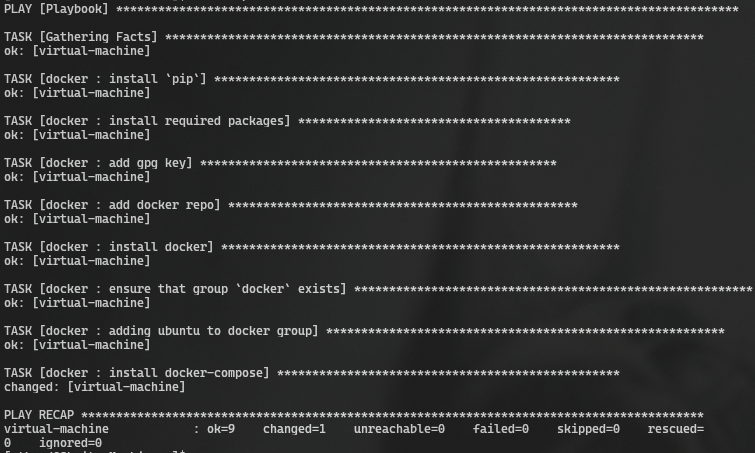

```
lekski@LAPTOP-EA8M0FT5:/mnt/c/Users/Honor/Desktop/S25-core-course-labs$ ansible-playbook -i ansible/inventory/default_aws_ec2.yml ansible/playbooks/dev/main.yaml --diff --ask-become-pass
BECOME password: 

PLAY [Deploy Docker using Ansible] *******************************************************************************************************************************************

TASK [Gathering Facts] *******************************************************************************************************************************************************
[WARNING]: Platform linux on host localhost is using the discovered Python interpreter at /usr/bin/python3.10, but future installation of another Python interpreter could
change the meaning of that path. See https://docs.ansible.com/ansible-core/2.17/reference_appendices/interpreter_discovery.html for more information.
ok: [localhost]

TASK [docker : Docker installation] ******************************************************************************************************************************************
included: /mnt/c/Users/Honor/Desktop/S25-core-course-labs/ansible/roles/docker/tasks/install_docker.yaml for localhost

TASK [docker : Install packages] *********************************************************************************************************************************************
ok: [localhost] => (item=apt-transport-https)
ok: [localhost] => (item=ca-certificates)
ok: [localhost] => (item=curl)
ok: [localhost] => (item=gnupg)
ok: [localhost] => (item=lsb-release)
ok: [localhost] => (item=software-properties-common)

TASK [docker : Create keyrings] **********************************************************************************************************************************************
ok: [localhost]

TASK [docker : Download Docker GPG key] **************************************************************************************************************************************
ok: [localhost]

TASK [docker : Add Docker repository] ****************************************************************************************************************************************
ok: [localhost]

TASK [docker : Install Docker] ***********************************************************************************************************************************************
ok: [localhost]

TASK [docker : Adding user to Docker group] **********************************************************************************************************************************
ok: [localhost]

TASK [docker : Docker compose installation] **********************************************************************************************************************************
included: /mnt/c/Users/Honor/Desktop/S25-core-course-labs/ansible/roles/docker/tasks/install_compose.yaml for localhost

TASK [docker : Download Docker Compose] **************************************************************************************************************************************
ok: [localhost]

TASK [docker : Symbolic link for docker-compose] *****************************************************************************************************************************
ok: [localhost]

TASK [docker : Verify Docker Compose installation] ***************************************************************************************************************************
changed: [localhost]

TASK [docker : Display success message if Docker Compose is installed] *******************************************************************************************************
ok: [localhost] => {
    "msg": "docker-compose installed"
}

TASK [docker : Docker boot] **************************************************************************************************************************************************
ok: [localhost]

TASK [docker : User for docker] **********************************************************************************************************************************************
ok: [localhost]

PLAY RECAP *******************************************************************************************************************************************************************
localhost                  : ok=15   changed=1    unreachable=0    failed=0    skipped=0    rescued=0    ignored=0
```

```
lekski@LAPTOP-EA8M0FT5:/mnt/c/Users/Honor/Desktop/S25-core-course-labs$ ansible-inventory -i ansible/inventory/default_aws_ec2.yml --list
{
    "_meta": {
        "hostvars": {
            "localhost": {
                "ansible_connection": "local",
                "ansible_user": "eldar-cybersec"
            }
        }
    },
    "all": {
        "children": [
            "ungrouped"
        ]
    },
    "ungrouped": {
        "hosts": [
            "localhost"
        ]
    }
}
```

```
lekski@LAPTOP-EA8M0FT5:/mnt/c/Users/Honor/Desktop/S25-core-course-labs$ ansible-inventory -i ansible/inventory/default_aws_ec2.yml --graph
@all:
  |--@ungrouped:
  |  |--localhost
```

```
lekski@LAPTOP-EA8M0FT5:/mnt/c/Users/Honor/Desktop/S25-core-course-labs$ ansible-playbook -i ansible/inventory/yandex_inventory.yaml ansible/playbooks/dev/main.yaml --diff --ask-become-pass
BECOME password: 

PLAY [Deploy Docker using Ansible] *******************************************************************************************************************************************

TASK [Gathering Facts] *******************************************************************************************************************************************************
[WARNING]: Platform linux on host compute-lab5-1 is using the discovered Python interpreter at /usr/bin/python3.12, but future installation of another Python interpreter
could change the meaning of that path. See https://docs.ansible.com/ansible-core/2.17/reference_appendices/interpreter_discovery.html for more information.
ok: [compute-lab5-1]

TASK [docker : Docker installation] ******************************************************************************************************************************************
included: /mnt/c/Users/Honor/Desktop/S25-core-course-labs/ansible/roles/docker/tasks/install_docker.yaml for compute-lab5-1

TASK [docker : Install packages] *********************************************************************************************************************************************
ok: [compute-lab5-1] => (item=apt-transport-https)
ok: [compute-lab5-1] => (item=ca-certificates)
ok: [compute-lab5-1] => (item=curl)
ok: [compute-lab5-1] => (item=gnupg)
ok: [compute-lab5-1] => (item=lsb-release)
ok: [compute-lab5-1] => (item=software-properties-common)

TASK [docker : Add Docker GPG key] *******************************************************************************************************************************************
ok: [compute-lab5-1]

TASK [docker : Add Docker repository] ****************************************************************************************************************************************
ok: [compute-lab5-1]

TASK [docker : Install Docker] ***********************************************************************************************************************************************
ok: [compute-lab5-1]

TASK [docker : Adding user to Docker group] **********************************************************************************************************************************
ok: [compute-lab5-1]

TASK [docker : Docker compose installation] **********************************************************************************************************************************
included: /mnt/c/Users/Honor/Desktop/S25-core-course-labs/ansible/roles/docker/tasks/install_compose.yaml for compute-lab5-1

TASK [docker : Download Docker Compose] **************************************************************************************************************************************
ok: [compute-lab5-1]

TASK [docker : Symbolic link for docker-compose] *****************************************************************************************************************************
ok: [compute-lab5-1]

TASK [docker : Verify Docker Compose installation] ***************************************************************************************************************************
changed: [compute-lab5-1]

TASK [docker : Display success message if Docker Compose is installed] *******************************************************************************************************
ok: [compute-lab5-1] => {
    "msg": "docker-compose installed"
}

TASK [docker : Docker secure] ************************************************************************************************************************************************
included: /mnt/c/Users/Honor/Desktop/S25-core-course-labs/ansible/roles/docker/tasks/docker_secure.yaml for compute-lab5-1

TASK [docker : Docker_daemon] ************************************************************************************************************************************************
--- before
+++ after: /home/lekski/.ansible/tmp/ansible-local-5508e6grvjm3/tmp_3mn31ai/docker_daemon.json.j2
@@ -0,0 +1,4 @@
+{
+    "no-new-privileges": true,
+    "userns-remap": "default"
+}
\ No newline at end of file

changed: [compute-lab5-1]

TASK [docker : Docker boot] **************************************************************************************************************************************************
ok: [compute-lab5-1]

TASK [docker : User for docker] **********************************************************************************************************************************************
ok: [compute-lab5-1]

RUNNING HANDLER [docker : Restart Docker] ************************************************************************************************************************************
changed: [compute-lab5-1]

PLAY RECAP *******************************************************************************************************************************************************************
compute-lab5-1             : ok=17   changed=3    unreachable=0    failed=0    skipped=0    rescued=0    ignored=0
```



```
lekski@LAPTOP-EA8M0FT5:/mnt/c/Users/Honor/Desktop/S25-core-course-labs$ ansible-inventory -i ansible/inventory/yandex_inventory.yaml --list
{
    "_meta": {
        "hostvars": {
            "compute-lab5-1": {
                "ansible_host": "84.201.151.82",
                "ansible_user": "ivangeliev",
                "plugin": "yacloud_compute",
                "yacloud_token_file": "./inventory/authorized_key.json"
            }
        }
    },
    "all": {
        "children": [
            "ungrouped"
        ]
    },
    "ungrouped": {
        "hosts": [
            "compute-lab5-1"
        ]
    }
}
```

```
lekski@LAPTOP-EA8M0FT5:/mnt/c/Users/Honor/Desktop/S25-core-course-labs$ ansible-inventory -i ansible/inventory/yandex_inventory.yaml --graph
@all:
  |--@ungrouped:
  |  |--compute-lab5-1
```


bonus golang: 
```
lekski@LAPTOP-EA8M0FT5:/mnt/c/Users/Honor/Desktop/S25-core-course-labs/ansible$ ansible-playbook -i inventory/yandex_inventory.yaml playbooks/dev/python_main.yaml --tags docker -K
[WARNING]: Ansible is being run in a world writable directory (/mnt/c/Users/Honor/Desktop/S25-core-course-labs/ansible), ignoring it as an ansible.cfg source. For more       
information see https://docs.ansible.com/ansible/devel/reference_appendices/config.html#cfg-in-world-writable-dir
BECOME password:

PLAY [Deploy Docker using Ansible] *******************************************************************************************************************************************

TASK [Gathering Facts] *******************************************************************************************************************************************************[WARNING]: Platform linux on host compute-lab5-1 is using the discovered Python interpreter at /usr/bin/python3.12, but future installation of another Python interpreter     
could change the meaning of that path. See https://docs.ansible.com/ansible-core/2.17/reference_appendices/interpreter_discovery.html for more information.
ok: [compute-lab5-1]
[WARNING]: Platform linux on host compute-lab5-1 is using the discovered Python interpreter at /usr/bin/python3.12, but future installation of another Python interpreter     
could change the meaning of that path. See https://docs.ansible.com/ansible-core/2.17/reference_appendices/interpreter_discovery.html for more information.
ok: [compute-lab5-1]
ok: [compute-lab5-1]

TASK [web_app : Pull Docker image] *******************************************************************************************************************************************changed: [compute-lab5-1]

TASK [web_app : Create directory for Docker Compose] *************************************************************************************************************************ok: [compute-lab5-1]

TASK [web_app : Docker Compose File] *****************************************************************************************************************************************changed: [compute-lab5-1]

TASK [web_app : Start Docker Compose] ****************************************************************************************************************************************changed: [compute-lab5-1]

PLAY RECAP *******************************************************************************************************************************************************************compute-lab5-1             : ok=5    changed=3    unreachable=0    failed=0    skipped=0    rescued=0    ignored=0
```


```
lekski@LAPTOP-EA8M0FT5:/mnt/c/Users/Honor/Desktop/S25-core-course-labs/ansible$ ansible-playbook -i inventory/yandex_inventory.yaml playbooks/dev/python_main.yaml --tags wipe -K
[WARNING]: Ansible is being run in a world writable directory (/mnt/c/Users/Honor/Desktop/S25-core-course-labs/ansible), ignoring it as an ansible.cfg source. For more
information see https://docs.ansible.com/ansible/devel/reference_appendices/config.html#cfg-in-world-writable-dir
BECOME password: 

PLAY [Deploy Docker using Ansible] *******************************************************************************************************************************************

TASK [Gathering Facts] *******************************************************************************************************************************************************
[WARNING]: Platform linux on host compute-lab5-1 is using the discovered Python interpreter at /usr/bin/python3.12, but future installation of another Python interpreter
could change the meaning of that path. See https://docs.ansible.com/ansible-core/2.17/reference_appendices/interpreter_discovery.html for more information.
ok: [compute-lab5-1]

TASK [web_app : Wipe Docker container] ***************************************************************************************************************************************
changed: [compute-lab5-1]

TASK [web_app : Remove docker-compose file] **********************************************************************************************************************************
changed: [compute-lab5-1]

PLAY RECAP *******************************************************************************************************************************************************************
compute-lab5-1             : ok=3    changed=2    unreachable=0    failed=0    skipped=0    rescued=0    ignored=0
```

