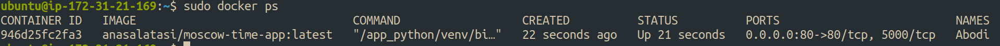

# Ansible
## playbook output:
```bash
$ ansible-playbook playbooks/dev/web-app.yaml

PLAY [Install web_app] ****************************************************************************************************************************************************************

TASK [Gathering Facts] ****************************************************************************************************************************************************************
[WARNING]: Platform linux on host 52.91.173.229 is using the discovered Python interpreter at /usr/bin/python3.12, but future installation of another Python interpreter could change
the meaning of that path. See https://docs.ansible.com/ansible-core/2.17/reference_appendices/interpreter_discovery.html for more information.
ok: [52.91.173.229]

TASK [web_app : Pull an image] ********************************************************************************************************************************************************
ok: [52.91.173.229]

TASK [web_app : Create a data container] **********************************************************************************************************************************************
ok: [52.91.173.229]

TASK [web_app : Stop a container] *****************************************************************************************************************************************************
changed: [52.91.173.229]

TASK [web_app : Remove container] *****************************************************************************************************************************************************
changed: [52.91.173.229]

PLAY RECAP ****************************************************************************************************************************************************************************
52.91.173.229              : ok=5    changed=2    unreachable=0    failed=0    skipped=0    rescued=0    ignored=0   

```


we can use tags to run only `deploy` or `wipe`:
```bash
$ ansible-playbook playbooks/dev/web-app.yaml --tags web_app_wipe
```

without the wipe we can see the container on the server:
