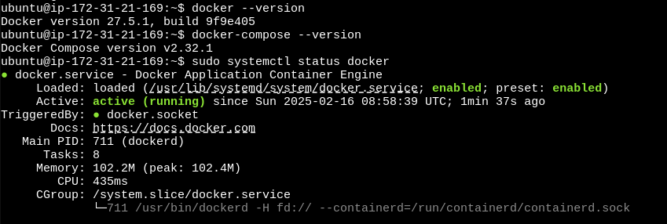

# 🚀 Docker Role

This Ansible role installs and configures **Docker** and **Docker Compose** on Ubuntu-based systems.

## 📌 Requirements

- **Ansible** 2.9+ (Recommended: Latest Stable Version)
- **Supported OS**: Ubuntu 20.04 / 22.04
- **Root or Sudo Access** to manage system services

## 🔧 Role Variables

| Variable                      | Default Value    | Description |
|--------------------------------|----------------|-------------|
| `docker_edition`              | `'ce'`         | Docker edition to install (Community Edition) |
| `docker_packages_state`       | `present`      | State of the Docker packages (`present` or `latest`) |
| `docker_service_manage`       | `true`         | Whether to manage the Docker service |
| `docker_service_state`        | `started`      | Docker service state (`started`, `stopped`, etc.) |
| `docker_service_enabled`      | `true`         | Enable Docker to start on boot |
| `docker_install_compose`      | `false`        | Whether to install Docker Compose (v2) |
| `docker_compose_version`      | `"v2.32.1"`    | Docker Compose version to install |
| `docker_compose_path`         | `"/usr/local/bin/docker-compose"` | Path to Docker Compose binary |

## 📜 Playbook

```yaml
- name: setup docker
  hosts: all
  become: true
  roles:
    - roles/docker
```

## 📦 Installed Packages

This role ensures the following packages are installed:

- Docker Engine
- Docker CLI
- Containerd
- Docker Compose 

## 🔄 Handlers

- `Restart Docker`: Restarts the Docker service when configuration changes.

## 📎 Dependencies

None. This role is self-contained.

## 🛠️ Usage

### **1. Add Role to Your Playbook**
Ensure the role is included in your Ansible playbook:

```yaml
- hosts: all
  become: true
  roles:
    - docker
```

### **2. Run the Playbook**
Execute the following command to deploy Docker:

```bash
ansible-playbook -i ansible/inventory/default_aws_ec2.yml ansible/playbooks/dev/main.yaml
```

### **3. Verify Installation**
After deployment, check Docker status:

```bash
docker --version
docker-compose --version
sudo systemctl status docker
```

Example on my server:
