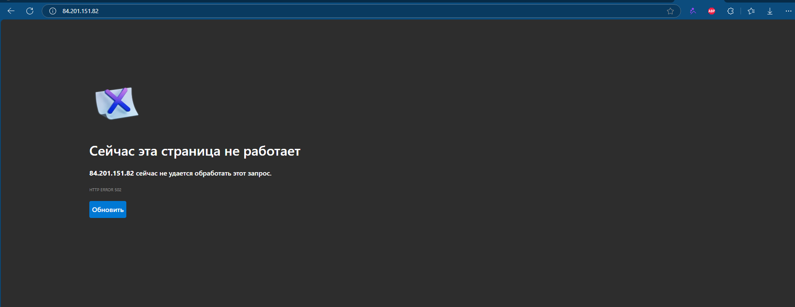

```
lekski@LAPTOP-EA8M0FT5:/mnt/c/Users/Honor/Desktop/S25-core-course-labs/ansible$ ansible-playbook -i inventory/yandex_inventory.yaml playbooks/dev/python_main.yaml --tags docker -K
[WARNING]: Ansible is being run in a world writable directory (/mnt/c/Users/Honor/Desktop/S25-core-course-labs/ansible), ignoring it as an ansible.cfg    
source. For more information see https://docs.ansible.com/ansible/devel/reference_appendices/config.html#cfg-in-world-writable-dir
BECOME password:

PLAY [Deploy Docker using Ansible] ***********************************************************************************************************************

TASK [Gathering Facts] ***********************************************************************************************************************************
[WARNING]: Platform linux on host compute-lab5-1 is using the discovered Python interpreter at /usr/bin/python3.12, but future installation of another
Python interpreter could change the meaning of that path. See https://docs.ansible.com/ansible-core/2.17/reference_appendices/interpreter_discovery.html
for more information.
ok: [compute-lab5-1]

TASK [web_app : Pull Docker image] ***********************************************************************************************************************
ok: [compute-lab5-1]

TASK [web_app : Create directory for Docker Compose] *****************************************************************************************************
ok: [compute-lab5-1]

TASK [web_app : Docker Compose File] *********************************************************************************************************************
changed: [compute-lab5-1]

TASK [web_app : Start Docker Compose] ********************************************************************************************************************
changed: [compute-lab5-1]

PLAY RECAP ***********************************************************************************************************************************************
compute-lab5-1             : ok=5    changed=2    unreachable=0    failed=0    skipped=0    rescued=0    ignored=0
```


```
lekski@LAPTOP-EA8M0FT5:/mnt/c/Users/Honor/Desktop/S25-core-course-labs/ansible$ ansible-playbook -i inventory/yandex_inventory.yaml playbooks/dev/python_main.yaml --tags wipe -K
[WARNING]: Ansible is being run in a world writable directory (/mnt/c/Users/Honor/Desktop/S25-core-course-labs/ansible), ignoring it as an ansible.cfg
source. For more information see https://docs.ansible.com/ansible/devel/reference_appendices/config.html#cfg-in-world-writable-dir
BECOME password: 

PLAY [Deploy Docker using Ansible] ***********************************************************************************************************************

TASK [Gathering Facts] ***********************************************************************************************************************************
[WARNING]: Platform linux on host compute-lab5-1 is using the discovered Python interpreter at /usr/bin/python3.12, but future installation of another
Python interpreter could change the meaning of that path. See https://docs.ansible.com/ansible-core/2.17/reference_appendices/interpreter_discovery.html  
for more information.
ok: [compute-lab5-1]

TASK [web_app : Wipe Docker container] *******************************************************************************************************************
changed: [compute-lab5-1]

TASK [web_app : Remove docker-compose file] **************************************************************************************************************
changed: [compute-lab5-1]

PLAY RECAP ***********************************************************************************************************************************************
compute-lab5-1             : ok=3    changed=2    unreachable=0    failed=0    skipped=0    rescued=0    ignored=0
```

