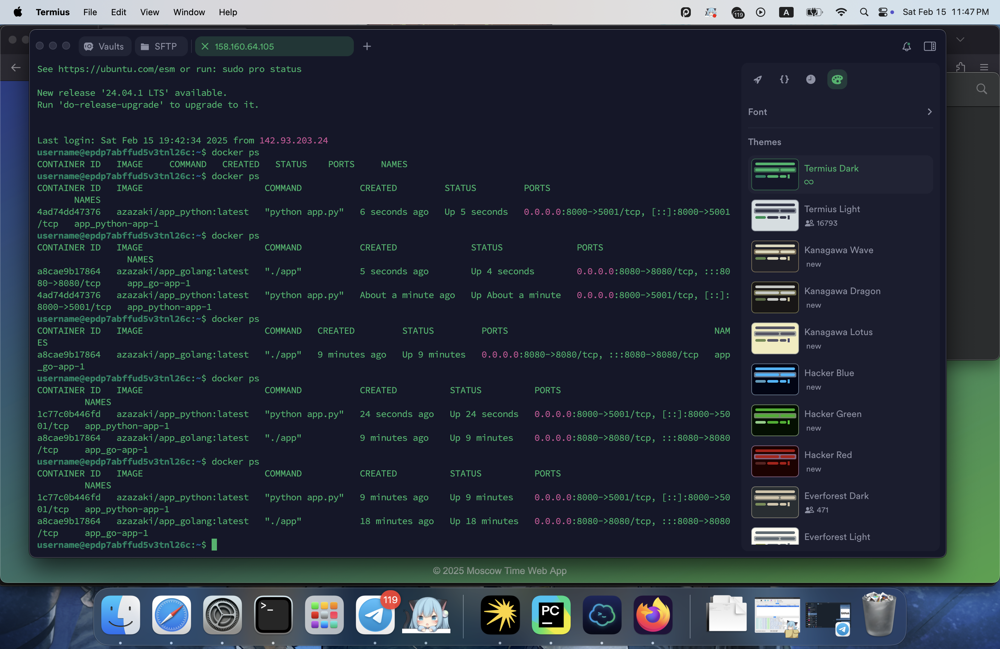
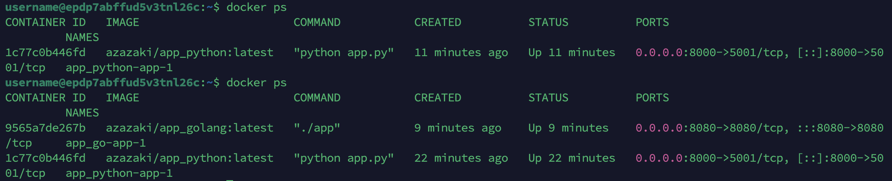

# Web App Role and CD Improvement

This repository contains an Ansible configuration that deploys your web applications using Docker Compose. It supports both a Python-based application and a Go-based application deployed on the same hosts, each in its own directory with distinct variables.

## Overview

- **Role:** `web_app`  
  Deploys your application container using Docker Compose.  
  - Renders a Docker Compose file from a Jinja2 template.
  - Pulls the specified Docker image.
  - Starts the container using Docker Compose.
  - Includes wipe logic to remove previous deployments if enabled.
- **Bonus CD Improvement:**  
  Two extra playbooks are provided:
  - `app_python/main.yaml` for the Python application.
  - `app_go/main.yaml` for the Go application.

## Role Variables

- `docker_image`: Docker image to deploy (e.g., `"azazaki/app_python:latest"` or `"azazaki/app_golang:latest"`).
- `app_port`: Host port to map to the container's port (e.g., `"8000"` or `"8080"`).
- `container_port`: Container's port of deployable application
- `web_app_deploy_dir`: Directory on the host for deployment (e.g., `/opt/app_python` or `/opt/app_go`).
- `web_app_full_wipe`: Boolean flag to control wiping the existing deployment before redeploying. Set to `true` to remove existing containers and files.

## Playbook Usage

### Deploy the Python Application

```bash
ansible-playbook playbooks/dev/app_python/main.yaml --tags deploy,wipe
```
**Output:**
```
andrew@Andrews-MacBook-Pro ansible % ansible-playbook playbooks/dev/app_python/main.yaml --tags deploy,wipe

PLAY [Deploy Python Application using Docker Compose] **************************************************************************************************************************

TASK [Gathering Facts] *********************************************************************************************************************************************************
[WARNING]: Platform linux on host my-cloud-vm is using the discovered Python interpreter at /usr/bin/python3.10, but future installation of another Python interpreter could
change the meaning of that path. See https://docs.ansible.com/ansible-core/2.18/reference_appendices/interpreter_discovery.html for more information.
ok: [my-cloud-vm]

TASK [web_app : Stop and remove Docker Compose deployment] *********************************************************************************************************************
changed: [my-cloud-vm]

TASK [web_app : Remove deployment directory and all its contents] **************************************************************************************************************
changed: [my-cloud-vm]

TASK [web_app : Create deployment directory for web_app] ***********************************************************************************************************************
changed: [my-cloud-vm]

TASK [web_app : Render Docker Compose template for the application] ************************************************************************************************************
changed: [my-cloud-vm]

TASK [web_app : Pull Docker image for the application] *************************************************************************************************************************
ok: [my-cloud-vm]

TASK [web_app : Start the application container using Docker Compose] **********************************************************************************************************
changed: [my-cloud-vm]

PLAY RECAP *********************************************************************************************************************************************************************
my-cloud-vm                : ok=7    changed=5    unreachable=0    failed=0    skipped=0    rescued=0    ignored=0   
```
**Screenshot of deployed application:**
")
**Output from `docker ps`**


### Deploy the Go Application
```bash
ansible-playbook playbooks/dev/app_golang/main.yaml --tags deploy,wipe
```
**Output:**
```
andrew@Andrews-MacBook-Pro ansible % ansible-playbook playbooks/dev/app_golang/main.yaml --tags deploy,wipe

PLAY [Deploy Go Application using Docker Compose] ******************************************************************************************************************************

TASK [Gathering Facts] *********************************************************************************************************************************************************
[WARNING]: Platform linux on host my-cloud-vm is using the discovered Python interpreter at /usr/bin/python3.10, but future installation of another Python interpreter could
change the meaning of that path. See https://docs.ansible.com/ansible-core/2.18/reference_appendices/interpreter_discovery.html for more information.
ok: [my-cloud-vm]

TASK [web_app : Stop and remove Docker Compose deployment] *********************************************************************************************************************
changed: [my-cloud-vm]

TASK [web_app : Remove deployment directory and all its contents] **************************************************************************************************************
changed: [my-cloud-vm]

TASK [web_app : Create deployment directory for web_app] ***********************************************************************************************************************
changed: [my-cloud-vm]

TASK [web_app : Render Docker Compose template for the application] ************************************************************************************************************
changed: [my-cloud-vm]

TASK [web_app : Pull Docker image for the application] *************************************************************************************************************************
ok: [my-cloud-vm]

TASK [web_app : Start the application container using Docker Compose] **********************************************************************************************************
changed: [my-cloud-vm]

PLAY RECAP *********************************************************************************************************************************************************************
my-cloud-vm                : ok=7    changed=5    unreachable=0    failed=0    skipped=0    rescued=0    ignored=0 
```

**Screenshot of deployed application:**
")
**Output from `docker ps`**


## Additional Information
- **Secure Docker Configuration:**  
  Docker is secured by enabling user namespace remapping and validated via inline JSON configuration.

- **Best Practices:**  
  - Tasks are grouped using blocks.
  - Role dependencies ensure Docker is installed before deploying the application.
  - Tags are used to allow selective execution (e.g., `deploy`, `wipe`, `web_app`).

## Troubleshooting

- Be careful with wiping job. If it is not deployed, then task will be failed for now.
  ```
  TASK [web_app : Stop and remove Docker Compose deployment] *********************************************************************************************************************
  fatal: [my-cloud-vm]: FAILED! => {"changed": false, "cmd": ["docker-compose", "-f", "docker-compose.yml", "down"], "delta": null, "end": null, "msg": "Unable to change directory before execution: [Errno 2] No such file or directory: b'/opt/app_python'", "rc": null, "start": null, "stderr": "", "stderr_lines": [], "stdout": "", "stdout_lines": []}
  ...ignoring
  ```
