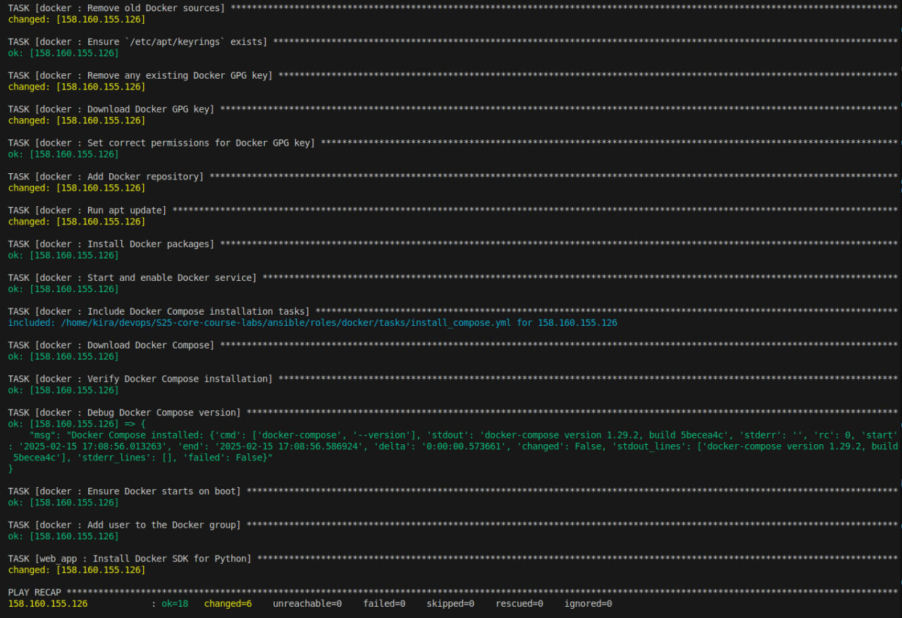
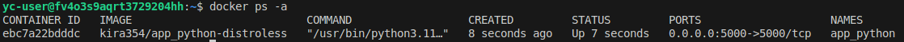
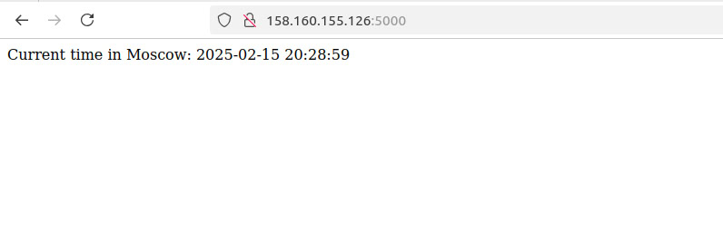
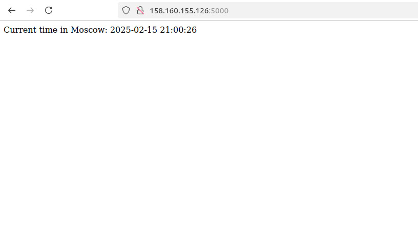
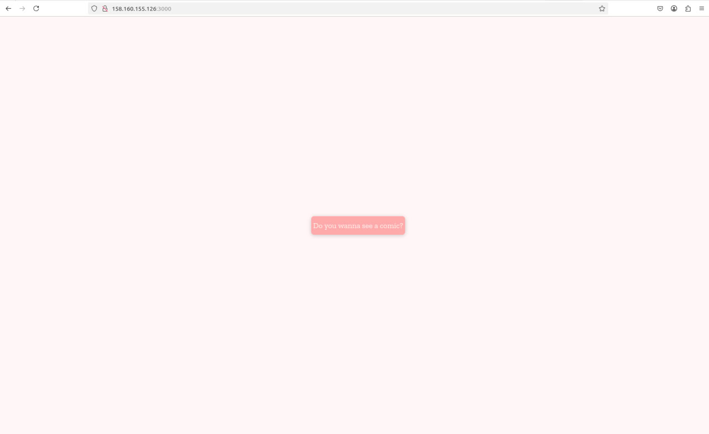
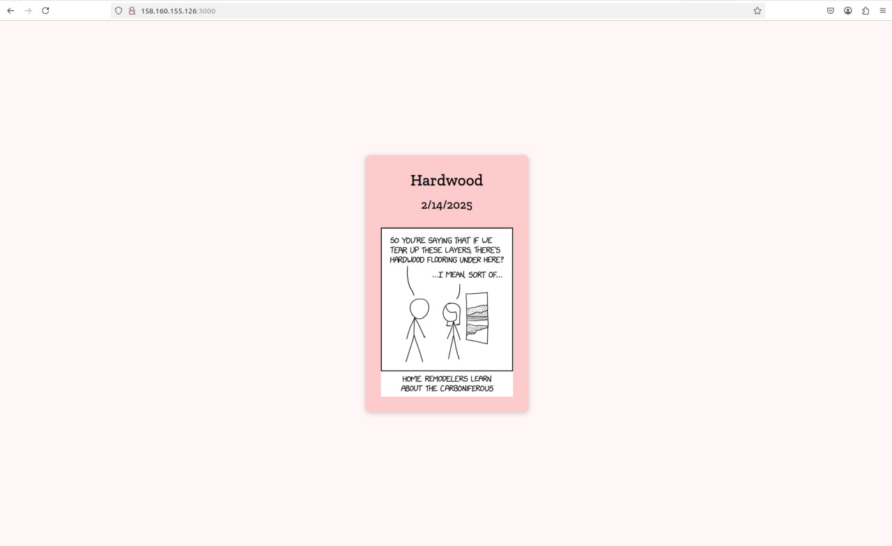

# Ansible Role: web_app

## Overview

This Ansible role deploys a web application inside a Docker container. It pulls the specified Docker image, sets up the necessary environment, and ensures the application is running.

## Requirements

- Ansible 2.9+
- Docker installed on the target machine
- Python Docker SDK (`docker` module)

## Role Variables

| Variable          | Default Value | Description |
|------------------|--------------|-------------|
| `docker_image`  | `"kira354/app_python-distroless"` | Docker image to deploy |
| `container_name` | `"web_app"` | Name of the running container |
| `app_port`      | `5000` | Port on the host machine |
| `web_app_full_wipe` | `false` | If `true`, deletes all related files and containers |

## Dependencies

This role depends on the `docker` role for ensuring Docker is installed and running.

## Installation

To use this role, include it in your playbook (ansible/syte.yml):

```yaml
- name: Deploy app_python
  hosts: all
  become: yes
  roles:
    - web_app
```

## Usage

### Setup Docker and Dependencies

```bash
ansible-playbook site.yml --tags setup
```



### Deploy the Web Application

```bash
ansible-playbook -i inventory/yc_inventory.py site.yml --tags deploy 
```




### Wipe the Web Application

```bash
ansible-playbook -i inventory/yc_inventory.py site.yml --tags wipe -e web_app_full_wipe=true
```


### Bonus part

### Deploy the Python Web Application

```bash
ansible-playbook playbooks/dev/app_python/main.yml -i inventory/yc_inventory.py --ask-become-pass
```




### Deploy the javascript Web Application

```bash
ansible-playbook playbooks/dev/app_javascript/main.yml -i inventory/yc_inventory.py --ask-become-pass
```




