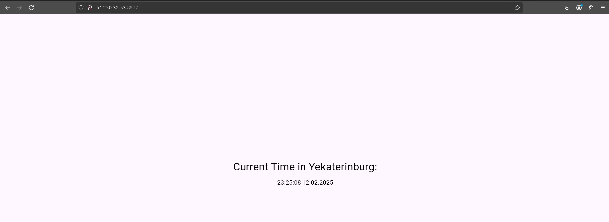

# Web App role for Ansible Setup

## Deployment

> ansible-playbook -i inventory/yacloud_compute.yml playbooks/dev/app_flutter/main.yaml

```
PLAY [Deploy Web App] ***************************************************************************************************************************************************

TASK [Gathering Facts] **************************************************************************************************************************************************
ok: [compute-vm-2-1-10-hdd-1739211309397]

TASK [docker : include_tasks] *******************************************************************************************************************************************
included: /home/skabbard2/PROGRAMMING/devops/real/paranid5-devops-devops/ansible/roles/docker/tasks/install_docker.yml for compute-vm-2-1-10-hdd-1739211309397

TASK [docker : Update apt package index] ********************************************************************************************************************************
changed: [compute-vm-2-1-10-hdd-1739211309397]

TASK [docker : Add dependencies] ****************************************************************************************************************************************
ok: [compute-vm-2-1-10-hdd-1739211309397]

TASK [docker : Add Docker GPG key] **************************************************************************************************************************************
ok: [compute-vm-2-1-10-hdd-1739211309397]

TASK [docker : Add Docker apt repository] *******************************************************************************************************************************
ok: [compute-vm-2-1-10-hdd-1739211309397]

TASK [docker : Install Docker] ******************************************************************************************************************************************
ok: [compute-vm-2-1-10-hdd-1739211309397]

TASK [docker : include_tasks] *******************************************************************************************************************************************
included: /home/skabbard2/PROGRAMMING/devops/real/paranid5-devops-devops/ansible/roles/docker/tasks/install_compose.yml for compute-vm-2-1-10-hdd-1739211309397

TASK [docker : Install Docker Compose] **********************************************************************************************************************************
ok: [compute-vm-2-1-10-hdd-1739211309397]

TASK [docker : Verify Docker Compose installation] **********************************************************************************************************************
changed: [compute-vm-2-1-10-hdd-1739211309397]

TASK [docker : include_tasks] *******************************************************************************************************************************************
included: /home/skabbard2/PROGRAMMING/devops/real/paranid5-devops-devops/ansible/roles/docker/tasks/start_docker_on_boot.yml for compute-vm-2-1-10-hdd-1739211309397

TASK [docker : Start Docker service on boot] ****************************************************************************************************************************
ok: [compute-vm-2-1-10-hdd-1739211309397]

TASK [docker : include_tasks] *******************************************************************************************************************************************
included: /home/skabbard2/PROGRAMMING/devops/real/paranid5-devops-devops/ansible/roles/docker/tasks/add_user_to_docker_group.yml for compute-vm-2-1-10-hdd-1739211309397

TASK [docker : Add current user to the docker group] ********************************************************************************************************************
ok: [compute-vm-2-1-10-hdd-1739211309397]

TASK [docker : include_tasks] *******************************************************************************************************************************************
included: /home/skabbard2/PROGRAMMING/devops/real/paranid5-devops-devops/ansible/roles/docker/tasks/disable_docker_root.yml for compute-vm-2-1-10-hdd-1739211309397

TASK [docker : Secure Docker Configuration - Disable Root Access] *******************************************************************************************************
ok: [compute-vm-2-1-10-hdd-1739211309397]

TASK [web_app : Wipe app image with content] ****************************************************************************************************************************
skipping: [compute-vm-2-1-10-hdd-1739211309397]

TASK [web_app : Delete app directory] ***********************************************************************************************************************************
skipping: [compute-vm-2-1-10-hdd-1739211309397]

TASK [web_app : Create app dir if not exists] ***************************************************************************************************************************
ok: [compute-vm-2-1-10-hdd-1739211309397]

TASK [web_app : Generate docker-compose.yml from template] **************************************************************************************************************
ok: [compute-vm-2-1-10-hdd-1739211309397]

TASK [web_app : Pull docker image] **************************************************************************************************************************************
ok: [compute-vm-2-1-10-hdd-1739211309397]

TASK [web_app : Ensure docker is active] ********************************************************************************************************************************
ok: [compute-vm-2-1-10-hdd-1739211309397]

TASK [web_app : Start docker application] *******************************************************************************************************************************
changed: [compute-vm-2-1-10-hdd-1739211309397]

PLAY RECAP **************************************************************************************************************************************************************
compute-vm-2-1-10-hdd-1739211309397 : ok=21   changed=3    unreachable=0    failed=0    skipped=2    rescued=0    ignored=0
```

## Inventory

> ansible-inventory -i inventory/yacloud_compute.yml --list

```
{
    "_meta": {
        "hostvars": {
            "compute-vm-2-1-10-hdd-1739211309397": {
                "ansible_host": "51.250.32.53"
            }
        }
    },
    "all": {
        "children": [
            "ungrouped",
            "yacloud"
        ]
    },
    "yacloud": {
        "hosts": [
            "compute-vm-2-1-10-hdd-1739211309397"
        ]
    }
}
```

## Inventory Graph

> ansible-inventory -i inventory/yacloud_compute.yml --graph

```
@all:
  |--@ungrouped:
  |--@yacloud:
  |  |--compute-vm-2-1-10-hdd-1739211309397
```

## Preview

