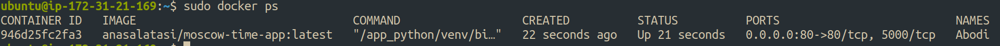

# 🌐 Web App Role

This Ansible role is used to deploy and configure a **web application** using Docker.

## 📌 Requirements

- **Ansible** 2.9+ (Recommended: Latest Stable Version)
- **Docker** must be installed on the target machine
- **Ubuntu 20.04 / 22.04** (recommended OS)

## 🔧 Role Variables

| Variable               | Default Value           | Description |
|------------------------|------------------------|-------------|
| `web_app_full_wipe`   | `true`                 | Whether to fully wipe and redeploy the web app |
| `base_path`           | `"app_python"`         | The base directory where the app is stored |
| `web_app_service`     | `"web_app"`            | The service name for the web application |
| `ports.int`          | `80`                   | Internal port of the container |
| `ports.ext`          | `80`                   | External port exposed to users |
| `docker.user`        | `"anasalatasi"`        | DockerHub username for pulling images |
| `docker.image_name`  | `"moscow-time-app"`    | Name of the Docker image to pull |
| `docker.tag`         | `"latest"`             | Tag/version of the Docker image |
| `container_name`     | `"Abodi"`              | Name of the running container |

## 📜 Playbook

```yaml
- name: Install web_app
  hosts: all
  become: true
  roles:
    - role: roles/web_app
      vars:
        web_app_full_wipe: true
```

## 🛠️ Usage

### **1. Add Role to Your Playbook**
Ensure the role is included in your Ansible playbook:

```yaml
- hosts: all
  become: true
  roles:
    - web_app
```

### **2. Run the Playbook**
Execute the following command to deploy the web app:

```bash
ansible-playbook -i ansible/inventory/default_aws_ec2.yml ansible/playbooks/dev/main.yaml
```

### **3. Verify Deployment**
After deployment, check if the container is running:

```bash
docker ps
```
Example on my server:
