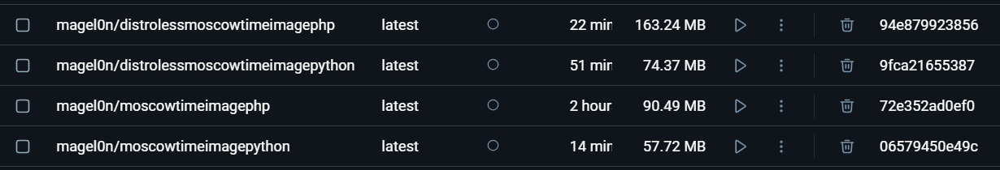

# Best Docker Practices
## Choose the right base image
``php:fpm-alpine3.20`` is an image from a trusted source that has all the necessary elements, but nothing else.
## Pin base image versions
``php:fpm-alpine3.20@sha256:5f6c116c7f4ac2cd8e23c2f94bcff487351e0591d1813e4c6d38bff2c0563c5a`` 
was used precisely for this purpose.
## Exclude with .dockerignore
You may see, I have a .dockerignore file that excludes all unnecessary files.
## Don't install unnecessary packages
I do not add any unnecessary system packages and only download the python packages that are mandatory for the application.
## Leverage build cache and Dockerfile instructions
I have separated the steps of my build to: 
1. Change the working directory
2. `COPY` the templates and the necessary application file
3. `COPY` the requirements and install them
4. `EXPOSE` the port
5. Add and change to a different User
6. `CMD` the application
## Create ephemeral containers
My container is easily rebuild, I tried it when testing.

# Additional:
## Create reusable stages
Not needed in this project
## Rebuild your images often
I do, but I can not prove, can I?
## Decouple applications
Nothing to decouple
## Sort multi-line arguments
There is no sorting
## Build and test your images in CI
I believe I will get to do that in the future labs

# Distroless

The Distroless images are slower to load, since they require something else to load their dependencies, 
but that is the only downside.
On the other hand, Distroless images are more lightweight (since there is now literally nothing but the application in them),
have little ways of being attacked (there is no interface for your general user, there is just the program) and 
they are a little easier to manage, since they limit you in your abilities, so the lack of options makes programming surprisingly straightforward.

I must admit, whilst the images themselves have much lower weight, I do not see another metric in `Docker Desktop` and 
I suppose that this is not the weight of the final image, but rather the entire process with the in-between image. 
After countless tries, I admit that I need help finding the other ways of weights, but I must show some picture, so here it is:
