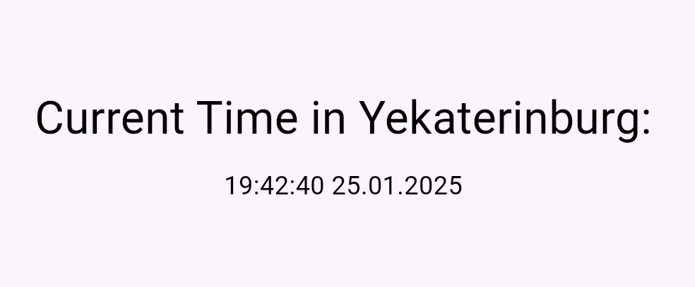

# Flutter Yekaterinburg Time Web App

### Developer

[Arseny Savchenko](https://github.com/dinaraparanid)

### About App

Sample Flutter application that shows current time in Yekaterinburg

### Preview

### Setup

* **Manual**

Build application with Flutter CLI:

1. Install Flutter for [your platform](https://docs.flutter.dev/get-started/install).

2. Install all necessary dependencies:
   > flutter pub get

3. Run application with Chrome:
   > flutter run -d chrome

4. Launch widget tests:
   > flutter test --platform chrome

* **Docker (Base Image)**

Build application with Docker:

1. Pull image from DockerHub:
   > docker pull paranid5/app_flutter

2. Run docker container:
   > docker run --rm -it -p <YOUR_PORT>:80 paranid5/app_flutter

3. Access web page:
   > curl http://127.0.0.1:<YOUR_PORT>

4. Optional: build image with Dockerfile:
   > docker build -t app_flutter

### Stack

<ul>
   <li>Flutter 3.27.1</li>
   <li>Dart 3.6.0</li>
   <li>Timezone 0.10.0</li>
</ul>
