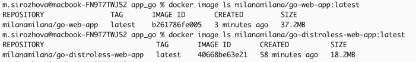

# Best practices

## Elaborate on the best practices you employed within your Dockerfile

### Chose the right base image

The base image golang:1.23.5-bullseye is minimal and officially maintained, which reduces the image size.

### Used non-root user

The Dockerfile follows the principle of running applications as a non-root user, which improves security by minimizing the impact of potential vulnerabilities.

### Layer sanity

The things that changes rarely are upper in the Dockerfile and the things that changes frequently are lower.

### Excluded with .dockerignore

To exclude files not relevant to the build, without restructuring your source repository, used a .dockerignore file.

## Differences between the Distroless images and previous images

The traditional Go image (37.2MB) is larger because it includes additional tools and utilities, such as shells and debugging tools, that are unnecessary for running the application.
The Distroless image (18.2MB) is nearly half the size, as it contains only the minimal runtime dependencies needed to execute the application.
