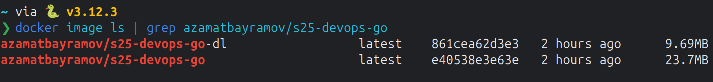

# Docker Best Practices Implemented

## Multi-stage build with right base images

### Regular Docker Image

I used a multi-stage build to compile the Go application.
First stage is used to build the application and
the second stage is used to run the application.
First stage uses `golang:1.23.5-alpine3.21` as the base image.
Second stage uses `alpine:3.21.2` as the base image.
Alpine images are used to keep the image size small.

### Distroless Docker Image

I used `golang:1.23.5-alpine3.21` as the base build image.
For the final distroless image, I used `gcr.io/distroless/static-debian12:nonroot`.
It is a minimal image that contains only the necessary packages.

## Usage of `.dockerignore`

I used a `.dockerignore` file to exclude unnecessary files and directories
from the build context, improving the build performance.

## Creation of ephemeral container

Container needs no configuration to run. It is ready to run as soon as it is created.

## Installation of only necessary packages

Application uses only the standard library of Go, so no additional packages are installed.

## Right order of instructions

The instructions are ordered in such a way that
the layers that change the least are placed at the top.
This way, the cache can be used more effectively.

## Pin base image version

I pinned the version of the base image to the following specific version:

### Regular Docker Image

```
golang:1.23.5-alpine3.21@sha256:47d337594bd9e667d35514b241569f95fb6d95727c24b19468813d596d5ae596
```

```
alpine:3.21.2@sha256:56fa17d2a7e7f168a043a2712e63aed1f8543aeafdcee47c58dcffe38ed51099
```

### Distroless Docker Image

```
golang:1.23.5-alpine3.21@sha256:47d337594bd9e667d35514b241569f95fb6d95727c24b19468813d596d5ae596
```

```
gcr.io/distroless/static-debian12:nonroot@sha256:6ec5aa99dc335666e79dc64e4a6c8b89c33a543a1967f20d360922a80dd21f02
```

This way, the base image will not change unexpectedly.

## Usage of non-root user

### Regular Docker Image

I created a non-root user to run the application.

### Distroless Docker Image

I used the `nonroot` tag to ensure the image runs with non-root privileges.

## Writing maintainer label

I wrote the maintainer label in the Dockerfile.

## Dockerfile linting

I linted the Dockerfiles using the [hadolint](https://hadolint.github.io/hadolint/).

## Distroless Image Version

I created a distroless image for the Go app.
The distroless image size is smaller than the regular image.
It is because final distroless base image is smaller than the final regular base image.
Also, distroless image has less attack surface than the regular image.
It is because distroless image contains almost no packages in comparison to the regular image.


