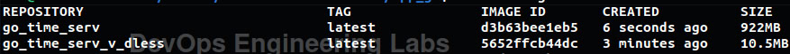

# Practices

- hadolint was used to lint the Dockerfiles
- .dockerignore file
-

# Distroless vs Common | Comparison

| Image                 | Size    |
|-----------------------|---------|
| golang:1.23 (build)   | 922MB   |
| Distroless Go Image   | 10.5MB  |

The difference between these two is that distroless has the most minimal set of libraries and binaries onboard. It contains nothing but stuff necessary to run the application.

This greatly reduces the size of image and reduces surface of attack, as there is less things to compromise.

