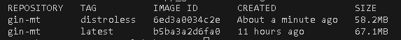

# Docker Best Practices

## 1. Rootless Container
- A non-root user (`webuser`) is created and used.

## 2. Minimization
- Utilizes multi-stage builds to separate the build environment from the runtime environment, excluding unnecessary build tools and dependencies.

## 3. Using a Precise Base Image
- Builder Stage: golang:1.20-alpine3.18 is used to ensure a stable environment for building the Go binary.
- Final Stage: alpine:3.18 used as the minimal base image for running the compiled binary, reducing the image size.

## 4. Using `.dockerignore`
- Unnecessary files (`*.md`, `.git/` etc.) are excluded to reduce image size.

## 5. Optimized Copying
- `COPY` is used twice:
  - Only go.mod and go.sum are copied initially to leverage Docker’s layer caching for dependencies.
  - The rest of the application source code is copied afterward, preventing unnecessary invalidation of the dependency layer.

## 6. Layer Sanity
- Used `COPY --chown` to set file ownership during the copy process, eliminating the need for separate RUN chown commands and reducing layers.
- Merged related commands into single RUN statements to minimize the total number of layers.

## 7. Health Checks
- Implemented a `HEALTHCHECK` directive to periodically verify that the application is running correctly.

## 8. Environment Variables
- Set environment variables to optimize Go's build and runtime behavior within the container.

## 9. Static Binary
- Go application is compiled as a static binary (CGO_ENABLED=0), which eliminates dependencies on shared libraries.

# Distroless Image

## Key Differences
- Size: 67.1MB for Latest image tag VS 58.2MB for Distroless version of image.
- Base OS: Alpine VS No traditional OS for distroless image.
- Security: More dependencies, larger attack surface VS reduced attack surface for distroless image.
- Shell Acceess: Shell VS No /bin/sh or /bash for distroless image.
- Package Manager: apk/apt VS nothing.

## Explanations
- Distroless images strip away unnecessary OS-level utilities, reducing the final image size.
- Since Distroless images do not include package managers, shells, or debugging tools, they minimize potential security vulnerabilities.
- Distroless images follow best security practices by only including the runtime environment needed for the application.

## Screenshot
