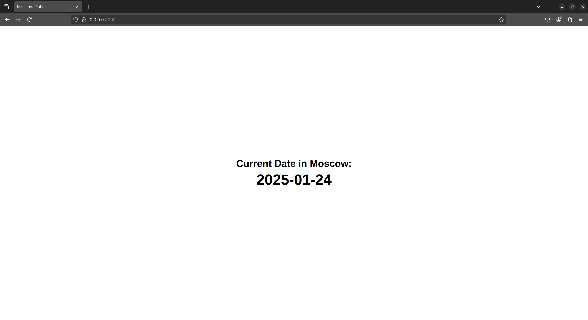

# Moscow Date Web-Application

## Technological Stack

For this application I have used [Go](https://go.dev/) with the standard library [net/http](https://pkg.go.dev/net/http).
Go is a statically typed, compiled language that is fast and easy to use.
It is appropriate for this application because it is easy and fast to develop with it.

## Best Practices

- Models for response validation and serialization.
- Code documentation and comments.
- Proper code naming.
- Clean code structure.
- Clean code formatting.

## Coding Standards and Code Quality

- I used [gofmt](https://pkg.go.dev/cmd/gofmt) to format the code and check the code style.

## Testing

- I tested the application by running it and checking the displayed date in Moscow using the browser.
- Then I tested the application next day by refreshing the page and checking if the displayed date updates.

## Unit Testing

### Technologies

For the unit tests, I used the following technologies:

- `testing` - Go's built-in testing framework.
- `net/http` - Standard library package for HTTP handling.
- `net/http/httptest` - Utilities for HTTP testing.
- `encoding/json` - JSON handling for response parsing.
- `time` - Working with time and timezones.

### Description

#### Unit test `TestGetCurrentDate()`

This test verifies that the `/api/date` endpoint:

- Returns a `200` status code.
- Has a valid JSON response.
- Contains a `Date` field in the response.
- Ensures the `Date` field is correctly formatted.
- Compares the returned date with the actual date in the specified timezone.

#### Unit test `TestGetCurrentDateHTML()`

This test verifies that the root (`/`) endpoint:

- Returns a `200` status code.
- Has the correct `HTML` content type.

### Best Practices

- **Constants for readability** – defined `dateFormat` and `timezone`.
- **Clear assertions with messages** – helps debugging.
- **Error handling for JSON parsing** – ensures proper response structure.
- **Strict date validation** – ensures the returned date matches the expected format.
- **Content-Type checks** – confirms correct response format.
