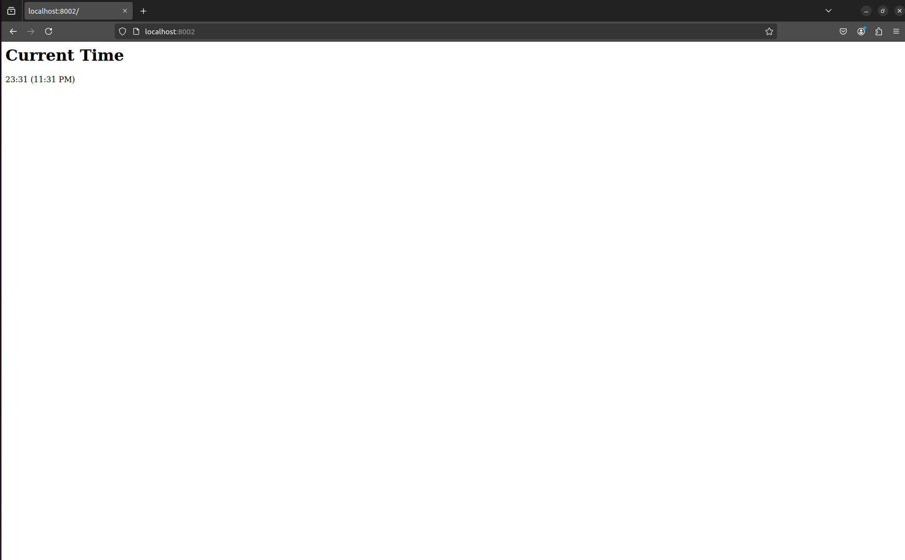

# Moscow Time Web-Application

## Framework Selection

I used Go for its simplicity, performance, and easy to use.

## Best Practices Followed

- App route and logic is kept in separate files so that making changes get better.
- Clean code structure.
- Clean code formatting.
- Proper code naming.
- Code documentation and comments.

## Coding Standards and Code Quality

- To have an unified coding styles and format, `gofmt` was used

## Testing

- I tested the application by running it and verifying that the displayed time in Moscow was shown correctly in the browser.

- Then, I refreshed the page to ensure that the time updated properly.

## Unit Tests

The unit tests are currently maintained in a single `app_service_test.py` file. While it is typically recommended to organize tests into separate directories, this approach was chosen due to the small number of functions being tested. Tests for `app.py` were not written, as it simply wraps the `show_time` function, which is already tested. Additionally, testing `app.py` would be considered part of `integration testing` rather than `unit testing`. Several best practices were followed while writing the tests.

- Tests are fast and simple
- Each test works for individual functions
- All tests are deterministic
- Both positive and negative tests are maintained
