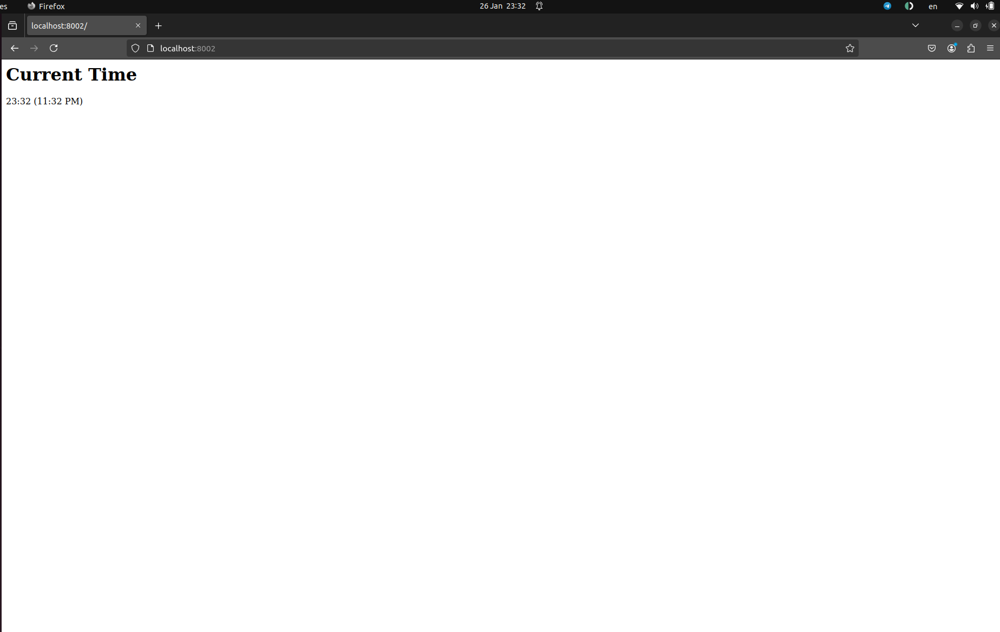
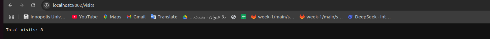

# Moscow Time Web-Application

This is a simple web application that displays the current time in Moscow. The application is developed using Go.

## Table of Contents

- [Table of Contents](#table-of-contents)
  - [Installation](#installation)
    - [Requirements](#requirements)
    - [Manual](#manual)
    - [Docker](#docker)
    - [Distroless Image Version](#distroless-image-version)

## Installation

### Requirements

- [Go installation](https://go.dev/doc/install)

### Manual

- Clone this branch to your local machine

```bash
git clone git@github.com:saleemasekrea000/S25-core-course-labs.git -b lab1
```

- Navigate to the `app_go` folder

```bash
cd app_go
```

- Run the application

```bash
go run .
```

The application will be available at [localhost:8002](http://localhost:8000/)



## Docker

- To build the image, use the following command:

```bash
docker build -t saleemasekrea/app_go .
```

- To pull the image from the Docker Hub, use the following command:

```bash
docker pull saleemasekrea/app_go:latest
```

- After building or pulling the image, the container can be run with the following command:

```bash
docker run -p 8002:8002 saleemasekrea/app_go
```

The application will be available at [localhost:8002](http://localhost:8002/)

## Distroless Image Version

- To build the image, use the following command:

```bash
docker build -f distroless.Dockerfile -t saleemasekrea/distroless_go_app .
```

- To pull the image from the Docker Hub, use the following command:

```bash
docker pull saleemasekrea/distroless_go_app:latest
```

- After building or pulling the image, the container can be run with the following command:

```bash
docker run -p 8002:8002 saleemasekrea/distroless_go_app 
```

## visits 
-  Each time a user accesses the application (/ endpoint), the visit counter is incremented.
The total visit count can be viewed by accessing the /visits endpoint.
The count is stored in the data/visits file, ensuring persistence across restarts.

- 