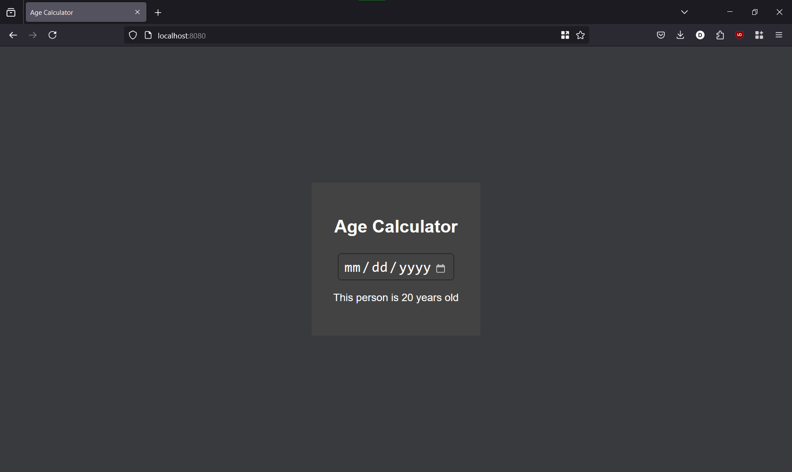

# Go Web Application

## 📘 Overview

This is a simple web application that is built using Go and Gin to calculate person's age by their date of birth!



---

## 💻 Local Installation

### Prerequisites

The project requires you to have:

- go 1.23.5
- make (optional, just directly run the commands inside `Makefile`, if it is not available)

### Installation Steps

1. Clone the repository:

   ```bash
   git clone https://github.com/MagicWinnie/S25-core-course-labs
   git checkout lab1
   cd S25-core-course-labs/app_go
   ```

2. Install the dependencies:

   ```bash
   go mod download
   ```

3. Run the application:

   ```bash
   make run
   ```

4. Navigate to <http://127.0.0.1:8080>.

---

## 🛠️ Development

- These tools are required:

  - [golangci-lint](https://golangci-lint.run/welcome/install/)
  - [gofumpt](https://github.com/mvdan/gofumpt)

- Format the code:

   ```bash
   make format
   ```

- Statically check the code using golangci-lint and gofumpt:

   ```bash
   make check
   ```

- Build the application:

    ```bash
    make build
    ```
