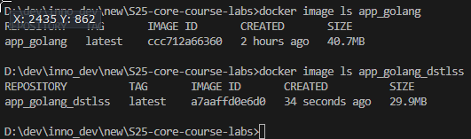

# Docker

## Best practices employed

- No root user inside, so the container will run safely.
- Using `COPY` to copy only specific files (`go.mod`, `go.sum` and application files from `src`) from the application folder so that confidential files if such exist are not exposed.
- Layer sanity - the commands are grouped as tight as possible to prevent appearance of extra layers. Moreover, the commands that are less likely to change and easier to cache are placed first.
- Using a `.dockerignore` file.
- Using a precise version of the base image and language (`golang:1.23.5-alpine3.21`)
- Implemented multi-stage builds. They enhance the project's structure, since it is required to build the application before running it.
- Installing only necessary packages (excluding packages for linting and formatting which are not required at the runtime).
- Packages installed via `apk add` have specific version specified.
- Dockerfile was linted using [hadolint](https://hadolint.github.io/hadolint/)
- Only one necessary port is exposed (`80`).
- Trusted base image was used in this Dockerfile ([golang](https://hub.docker.com/_/golang) - Docker Official Image)
- `HEALTHCHECK` instruction was included to ensure that the web application is healthy.

## Distroless Image

The distroless image of this Golang application appeared to be 10.8 MB smaller than the original one. In this case, `alpine` image was used without problems. \
The smaller size of a distroless image was most probably caused because the only files that are copied to the distroless image are binary file and templates. \
Additionally, the distroless image was designed to restrict what's in the container to precisely what's necessary for the application runtime (excluding package managers, tools, etc.).

In this particular case, it is an efficient approach because this application requires building a binary file, which is the only file required in the distroless image (including the static templates).
