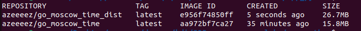

# Moscow Time Web App

## Applied practices

- **Choosing the right base image**: using precise and official base images.
- **Excluding with .dockerignore**: use `.dockerignore` to exlude irrelevant files.
- **No root iamge**: build image with as no-root user for higher security.
- **Multi-stage builds**: used multi-stage build to reduce the image size

## Comparison

Surprisingly, the Distroless image for the Go application is larger than the other image. This may be because the Distroless base image includes additional security features and minimal runtime dependencies that are not present in the minimal Alpine-based image.
