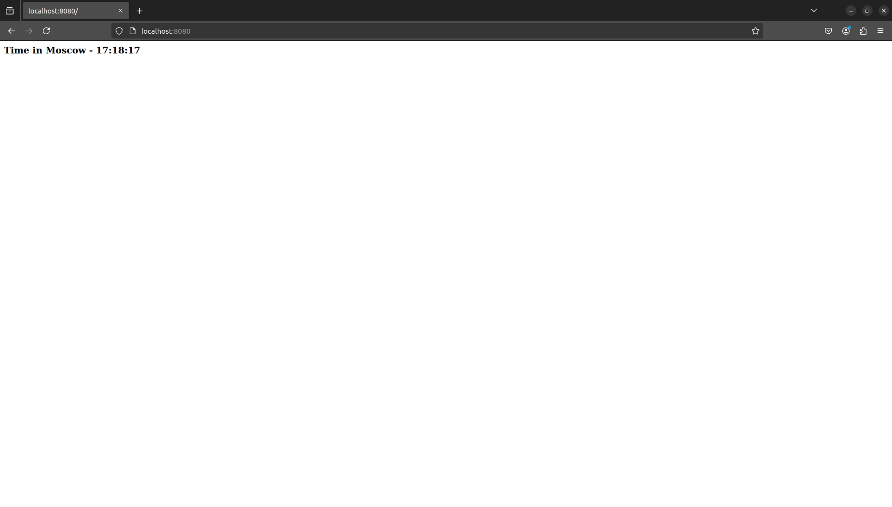

# Moscow Time Web App

## Overview

[](https://github.com/azzyyzz/S25-core-course-labs/actions/workflows/app_golang.yml)

Simple Go web app to show time in Moscow.



## Installation

```bash
git clone -b lab2 https://github.com/azzyyzz/S25-core-course-labs.git
cd S25-core-course-labs/app_golang
```

## Requirements

- [Go](https://golang.org/dl/) 1.16+

## Usage

```bash
go run app.go
```

## Docker

### Clone and build the Docker Image

```bash
git clone -b lab2 https://github.com/azzyyzz/S25-core-course-labs.git
cd S25-core-course-labs/app_golang
docker build -t azeeeez/go_moscow_time .
```

### Pull and Run the Docker Image from Docker Hub

```bash
docker pull azeeeez/go_moscow_time
docker run -p 8080:8080 azeeeez/go_moscow_time
```

### Distroless

You can find distroless image in this [link](https://hub.docker.com/repository/docker/azeeeez/go_moscow_time_dist/general)

## Unit Tests

Unit tests are implemented using the built-in frameworks like `testing` and `net/http/httptest`.
