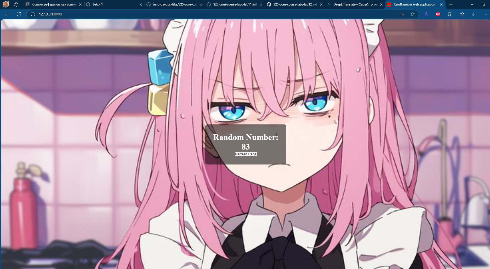
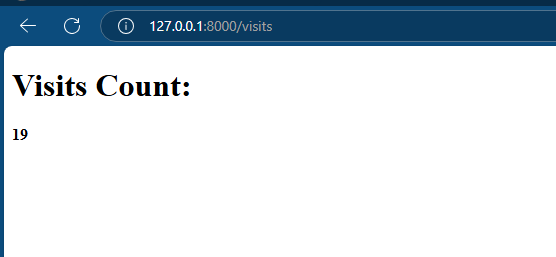
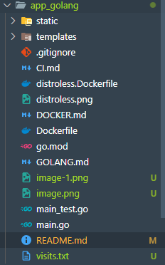

# Random Number Generator Web Application

## Overview

This is a web application that displays a random number (between 0 and 100) each time the page is refreshed. The web application is built using Go and the standard library's `net/http` package for handling web requests. 

## Installation Guide

### Prerequisites

Before you begin, ensure you have the following installed:

*   **Go 1.16+**

### Steps

1.  **Clone the Repository:**

    Clone the project repository to your local machine and navigate to the project directory:

    ```bash
    git clone <repo_url>
    cd <project_directory>
    ```

2. **Navigate to app_golang Folder:**

   Change your current directory to the application folder:
    ```bash
   cd app_golang
    ```

3.  **Run the Application:**

    Execute the following command to start the application:

    ```bash
    go run main.go
    ```

    This command will compile and run the application from the `main.go` file.

### Troubleshooting

If you encounter an error, please ensure that port 8000 is available. You can either make this port available or modify the port number in the `main.go` file to another available port.

## How to Install using Docker?

Below are the instructions for installing the web application using Docker.

Make sure you have Docker installed on your computer.

### Environment Setup
```
cd app_golang/
docker build -t lekski/golang-web-app:latest .
```

### Launching the Web App
```
docker run -d -p 8000:8000 lekski/golang-web-app:latest
```

You can access the web app at `127.0.0.1:8000`.

### Stopping the Container
```
docker ps
docker stop <container_id>
```

## Distroless Image Version
## How to Install using distroless Docker?

Below are the instructions for installing the web application using distroless Docker.

Make sure you have Docker installed on your computer.

### Environment Setup
```
cd app_golang/
docker build -t lekski/golang-web-app-distroless:latest -f distroless.Dockerfile .
```

### Launching the Web App
```
docker run -d -p 8000:8000 lekski/golang-web-app-distroless:latest
```

You can access the web app at `127.0.0.1:8000`.

### Stopping the Container
```
docker ps
docker stop <container_id>
```

## Unit-test
Below are the instructions for running unit tests.

### Navigating to the correct directory
```
cd app_golang
```

### Running the tests
```
go test
```

### Expected output for successful tests
```
C:\Users\Honor\Desktop\S25-core-course-labs\app_golang>go test
PASS
ok      app_go  0.954s
```

## CI/CD Github Actions
The project has github actions configured to automatically deploy the web-app application when push or pull request to the master branch. 

Settings for workflows:
1.  Navigate to the repository settings: Settings → Secrets → Actions
2.  Create two secrets: `DOCKER_USERNAME` - your Docker login, `DOCKER_PASSWORD` - your Docker login password and `SNYK_TOKEN` - your Snyk api token


## Lab 12 update
      
сайт работает, теперь я обновлю его главную страницу несколько раз и зайду по энпдоинту /visits:



У нас так же создался файл visits.txt, который хранит в себе число посещений. 

