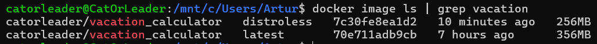

# Overview

Let's begin with a step-by-step explanation of all the solutions I used to create a Dockerfile:

---

## Base Image Selection

- **Precise Image**: Use a specific image version to preserve the stability of the build and ensure that no changes can
  be made by third parties (image owners).
- **Slim Version**: Choose the alpine version to reduce the size of the resulting image.

  ```dockerfile
  FROM maven:3.9-amazoncorretto-17-alpine AS build
  # ...
  FROM openjdk:17-jdk-alpine3.14 as deploy
  ```

## Security Enhancements

- **Non-Root User**: Create a non-root user to enhance security by preventing the use of the root user.

  ```dockerfile
  RUN addgroup -S appgroup && adduser -S appuser -G appgroup
  USER appuser
  ```

## Directory Structure

- **Working Directory**: Setting up the working directory is a standard in image creation because it helps to maintain a
  clear file structure.

  ```dockerfile
  WORKDIR /app
  ```

## File Management

- **Selective File Copying**: Copy only the necessary files for the application to start and run properly.
- **Order of COPY Commands**: Arrange the `COPY` commands in descending order of volatility, from the most volatile
  files to the most stable, to catch build errors earlier.
- **Ownership**: Ensure the correct `appuser` ownership is applied to the application sources.

  ```dockerfile
  COPY pom.xml .
  COPY src ./src
  # ...
  COPY --from=build /app/target/${JAR_FILE} /home/appuser/application.jar
  ```

## Container Startup

- **ENTRYPOINT Command**: Use the `ENTRYPOINT` command because we have a single application and generally do not want
  users to override container startup logic.

  ```dockerfile
  ENTRYPOINT ["java", "-jar", "/home/appuser/application.jar"]
  ```

## Optimization

- **.dockerignore Usage**: Additionally, include a `.dockerignore` file to exclude unnecessary files from the final
  image.
- **Lint**: I used the <https://hadolint.github.io/hadolint/>
- **Multi-Stage Build**: To reduce the size of the final image and have only the necessary
  for application startup files

---

## Distro VS. Distroless Images

| Type       | Size  |
|------------|-------|
| Distroless | 256MB |
| Distro     | 356MB |



## Main Differences

- Distroless images have a smaller image size (obviously),
  because inside the container there is no unnecessary stuff like shells,
  additional OS components, etc. In our case, we have size smaller on 100MB.
- No shell—no additional way to exploit into the image. Absence of such OS components literally reduces the possible attacker's space of entry.
- Not chaotically good—this is hard to debug anything using the distroless image because there are no tools for it.
- Ideal for production development, no need to upgrade the external components (OS, tools) that do not affect the application directly.

---
