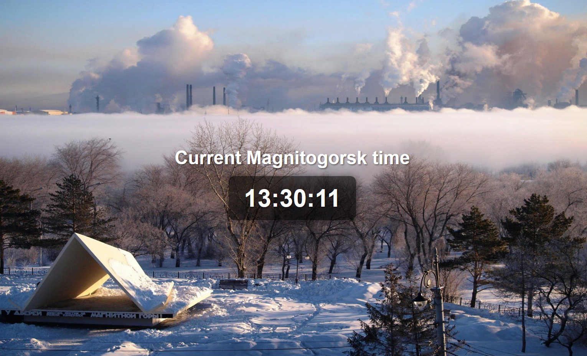

# Magnitogorsk Time Application

This is a Spring Boot web application that displays the current time in Magnitogorsk, Russia. The application uses
Thymeleaf for server-side rendering and includes a dynamically updating clock. 

## I faced some problems with starting my app using terminal so if you will find a problem please give feedback



---

## Table of contents

1. [Prerequisites](#prerequisites)
2. [Cloning the repository](#cloning-the-repository)
3. [Running the application](#running-the-application)
4. [Bulding and running the Docker image](#building-and-running-the-docker-image)

---

## Prerequisites

Before running the application, ensure you have the following installed:

- **JDK 21**: [Download JDK 21](https://www.oracle.com/java/technologies/javase-jdk21-downloads.html)
- **Gradle**: [Install Gradle](https://gradle.org/install/)
- **Git**: [Install Git](https://git-scm.com/)
- **Docker**
```bash
  sudo apt install docker
```

---

## Cloning the repository

To clone the repository, run the following command:

```bash
  git clone https://github.com/MattWay224/S25-core-course-labs.git
```

## Running the application

### Navigate to the app_java directory:

```bash
  cd /<your-path>/S25-core-course-labs/app_java
```

### Build the project using Gradle:

```bash
  gradle build
```

```bash
  gradle wrapper
```

```bash
  ./gradlew build
```

### Run the application:

```bash
  ./gradlew bootRun
```

### Open your browser and navigate to:

```
  http://localhost:8080
```

## Building and running the Docker image

### Build the Docker Image

```bash
  gradle wrapper
```
```bash
  docker build -t magnitogorsk-app .
```

### Run the Docker Container

```bash
  docker run -p 8080:8080 magnitogorsk-app
```
