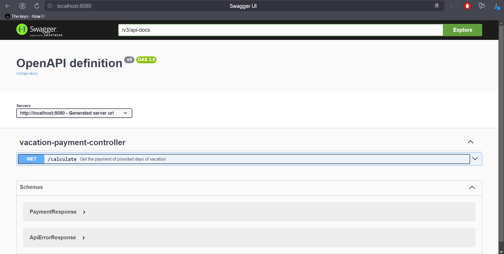
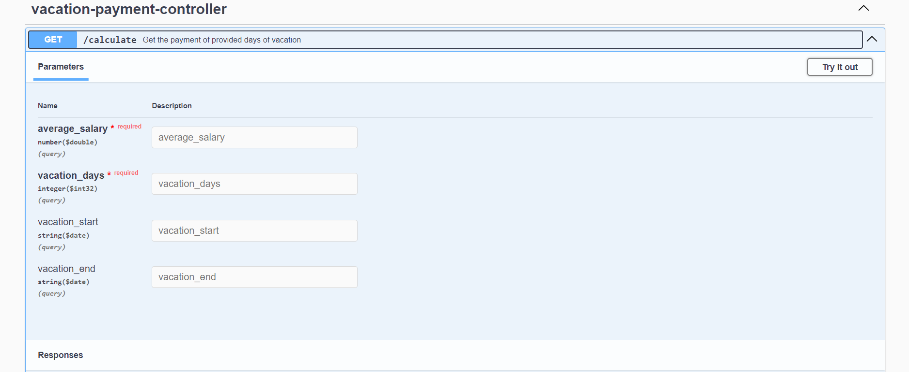
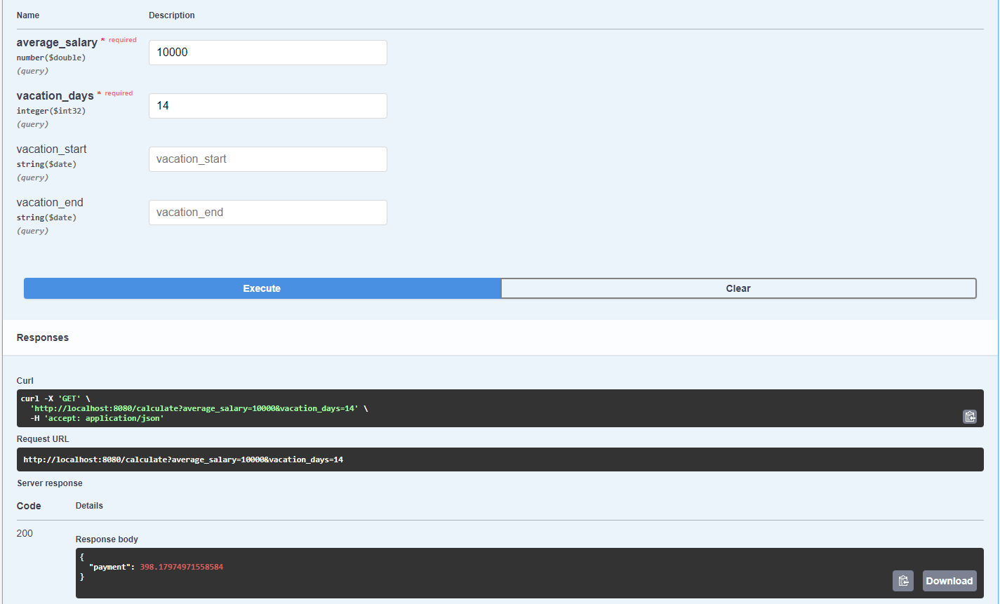

# Vacation Payment Calculator

[](https://github.com/CatOrLeader/S25-core-course-labs/actions/workflows/app_java.yml)

## Overview

Vacation... What can actually be better than this? However, alongside with the "chill" time, there is another
thing: vacation payments. And it is kinda hard to properly get the final payment during your vacation.
To get rid of such problems, this application gave you the opportunity to calculate the amount of money
you receive during the best time of a year!

## Application

To briefly explain the application, I can say next:

* This is API that returns you the amount of money you receive after the vacations. For now,
  there is a single handler for the GET request, and you can use it by opening
  the Swagger of the application (available upon the application start)

## Usage

To start your application, you need firstly to package your application into single executable `.jar` by the command:

```bash
mvn clean package
```

But to make your life even easier, I keep the `app_java-0.1.jar` in the root of the project. So, you need just to
type in the bash:

```bash
java -jar app_java-0.1.jar
```

### _Reminder: take in mind that you need installed JDK (ver. >= 21) on your PC_

Then, start the browser and type `localhost:8080`, and...
That's all! You are great, prepare for the weekends and calculate the width of your wallet

## Example







## Docker

---

### How to build?

* **Quick Answer**: Execute the following script in the same folder as the Dockerfile:

  ```bash
  docker build -t vacation_calculator .
  ```

* **Enhanced Answer**: There are many arguments you can use.
  Check each one by running `docker build --help`.
  Here are my favorites:

  * `-f, --file string`: Specify the name of the Dockerfile (default: "PATH/Dockerfile").
  * `--label stringArray`: Set metadata for an image.
  * `--no-cache`: Do not use cache when building the image (useful when building on different runners).
  * `-t, --tag stringArray`: Name and optionally tag the image (format: "name:tag").

### How to Pull?

* **Quick Answer**: Execute this command from anywhere:

  ```bash
  docker pull catorleader/vacation_calculator:latest
  ```

* **Enhanced Answer**: There are many arguments you can pass to the `docker pull` command, along with the image tag.
  However, I usually use the default one.

### How to Run?

* **Quick Answer**: Execute this command from anywhere:

  ```bash
  docker run -d -p 8080:8080 --name vacation_calculator catorleader/vacation_calculator:latest
  ```

* **Enhanced Answer**: For this command, there are some necessary variables to pass as CLI arguments:

  * `-d`: Start the container in the background and receive only the container ID in the output (do not follow the
    application logs).
  * `-p`: Publish ports from the container's internal network to the host machine (to access the application
    via `localhost:8080`).
  * `-n, --name`: Assign a name to the container for easier manipulation.
  * `catorleader/vacation_calculator:latest`: The image name you want to start.

## Distroless Image Version

Lightweight image for mostly production use, without tools for debugging and OS components (shell and etc.)

---

### Ver2.0: How to Build?

  ```bash
  docker build -t vacation_calculator:distroless .
  ```

### Ver2.0: How to Pull?

  ```bash
  docker pull catorleader/vacation_calculator:distroless
  ```

### Vet2.0: How to Run?

  ```bash
  docker run -d -p 8080:8080 --name watch catorleader/vacation_calculator:distroless
  ```

---

### Unit Tests

To properly keep the code quality on the significant level, project has covered by an exhaustive set of unit tests.
The covered business functionality by tests:

* `/calculate` - the single endpoint that evaluated by different HTTP status codes that returned
* Util Classes which are used for the calculation process
