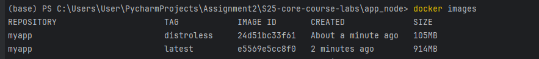

# Build the Docker Images
Build the Docker images with the following commands:

Build the multi-stage image:
```
docker build -t myapp:latest .
```

Build the Distroless image:
```
docker build -f distroless.Dockerfile -t myapp:distroless .
```

Run the multi-stage image:
```
docker run -p 3001:3001 myapp:latest
```

Run the Distroless image:
```
docker run -p 3001:3001 myapp:distroless
```


For the Distroless image:
```
docker build -t my-node-app-distroless -f distroless.Dockerfile .
```

# Verify and Compare Image Sizes

Check the sizes of the Docker images:
- Run docker images to see the image sizes.
- You should see that the Distroless image is smaller because it doesn't include unnecessary packages, runtime libraries, or a shell.

# The benefits of using Distroless images
- Distroless images only contain the application and its runtime dependencies, which results in smaller image sizes.
- By not including unnecessary tools (e.g., package managers, shells), the attack surface is significantly reduced.
- Fewer components mean fewer potential vulnerabilities.


The image size comparison between the standard and Distroless images:
```
docker images
```
