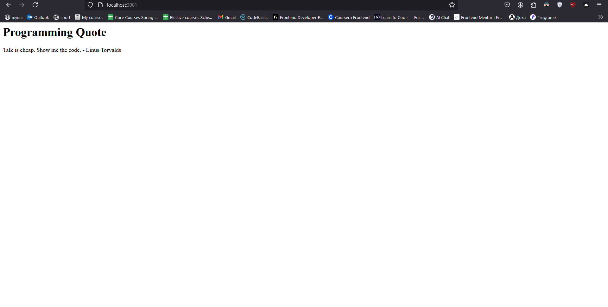

# Overview
This is a simple web application built with Node.js and Express. It displays a random programming quote each time the page is refreshed.

# Best Practices Applied
Lightweight Framework: Used Express, a fast and minimalistic Node.js web framework.

Separation of Concerns: Logic for generating random quotes is encapsulated in the getRandomQuote function.

Dynamic Content: The app updates the displayed quote on every refresh.

# Error Handling:
Minimal error handling is included (e.g., ensuring the array of quotes is not empty).

Dependencies are managed via package.json.

# How to Run the Application Locally
1. Install Node.js.
2. Clone the repository and navigate to the app_node folder.
3. Install dependencies:
```bash
npm install express
```

# Run the application:

```bash
node app.js
```

Open your browser and navigate to [link](http://localhost:3000)

Screenshot: 
