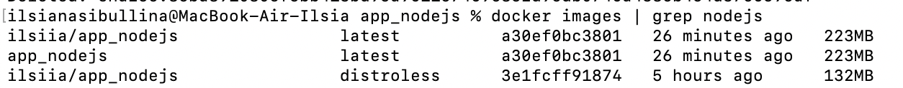

# Docker Best Practices for Node.js App

## Best Practices Implemented

1. **Non-Root User**:
   - Added a non-root user (`nonrootuser`) for better security.

2. **Efficient Layer Caching**:
   - Copied only `package.json` and `package-lock.json` for dependency installation to utilize Docker layer caching effectively.

3. **Clean Installations**:
   - Used `--only=production` to avoid installing unnecessary development dependencies.

4. **.dockerignore Usage**:
   - Excluded unnecessary files like `node_modules`, `.git`, and other files.

In this particular case, a multi-stage build would not provide significant benefits because the application is relatively simple and does not require a 
complex build process or large dependencies that need to be separated.

## Distroless Image

The Distroless image for the Node.js app is 132MB, which is 100MB smaller than the previous image (223MB). This 
reduction in size is due to the Distroless image excluding unnecessary OS components, leaving only the essential 
runtime required to execute the application. The smaller size improves security by reducing the attack surface, 
speeds up deployments, and optimizes resource usage.

