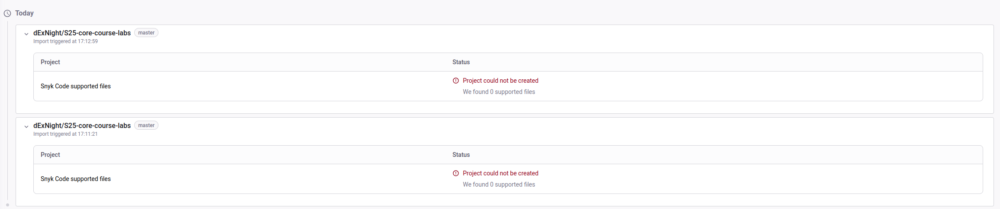

# CI: Best Practices and Implementation

## Overview
Python project implements continuous integration using GitHub Actions, which enables automatic code quality checks, testing, and deployment

## Implemented CI/CD Practices

### 1. Workflow Trigger Optimization
```yaml
on:
  push:
    branches: [ "master" ]
    paths:
      - 'app_python/**'
  pull_request:
    branches: [ "master" ]
    paths:
      - 'app_python/**'
```
I've configured workflow triggers to respond only to changes in the app_python directory. This approach provides several benefits:
- Eliminates unnecessary CI/CD pipeline executions
- Conserves computational resources
- Improves pipeline efficiency

### 2. Dependency Caching
```yaml
- name: Cache pip packages
  uses: actions/cache@v3
  with:
    path: ~/.cache/pip
    key: ${{ runner.os }}-pip-${{ hashFiles('app_python/requirements.txt') }}
```

- Speeds up dependency installation process
- Reduces load on external package repositories
- Minimizes network usage

### 3. Multi-Stage Code Verification
Current CI process incorporates multiple verification stages:
- Code linting with flake8 for style consistency
- Unit testing through pytest for functionality verification
- Docker image build verification for deployment readiness

### 4. Secure Secret Management
```yaml
- name: Login to Docker Hub
  uses: docker/login-action@v3
  with:
    username: ${{ secrets.DOCKERHUB_USERNAME }}
    password: ${{ secrets.DOCKERHUB_TOKEN }}
```
All sensitive information is stored securely in GitHub secrets, ensuring:
- Protection of confidential credentials
- Credential rotation capability
- Secure access management

### 5. Automated Deployment
The deployment automation system includes:
- Automatic Docker image building
- Docker Hub image publishing
- Consistent deployment process


# Snyk Errors
I tried different api keys, however there are no solutions that worked
