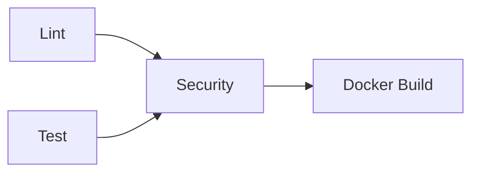

# Continuous Integration Best Practices

## Implemented Practices

1. Workflow Status Badge
2. Optimized Pipeline Structure
3. Efficient Dependency Management
4. Security & Maintenance
5. Quality Enforcement

## Cache Strategy

**Location:** `~/.cache/pip`
**Key:** `${{ runner.os }}-py3.10-${{ hashFiles('app_python/requirements.txt') }}`

## Workflow Diagram

