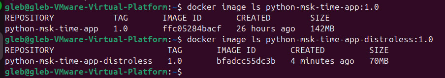

# Python Web App - Docker Best Practices

## Linter

To ensure that Dockerfile is well-formatted and adheres most of best practices I used **hadolint** (installed on Ubunut and as an extension for Visual Studio Code).

-----

## Best Practices

1. **Non-Root User**: The container runs as a non-root user (`python_user`) to achieve enhansed security.
2. **Small Base Image**: The `python:3.12-slim` image is used to reduce the image size, it is quite small, but enough for such simple application.
3. **Layer Sanity**: By minimizing the number of layers and optimizing their order
4. **Specific File Copying**: Only needed files (`requirements.txt` and `app.py`) are copied into the image.
5. **No Cache for Dependencies**: The `--no-cache-dir` flag is used to avoid caching of pip packages.
6. **.dockerignore File**: Unnecessary files are excluded from the build context using `.dockerignore` and will not present in the built image.
7. **Precise Versioning**: The base image and dependencies are specified with concrete versions.
8. **Port Exposure**: The port for application (`5000`) is explicitly stated.

-----

## Differences between the distroless image and the usual image

1. **Images sizes**: My basic image `python:3.12-slim` includes only a minimal Linux distribution with onlu essential libraries required to run Python. However, in distroless image `gcr.io/distroless/python3` is even more minimal and do not contains tools like a shell (`/bin/sh`), package managers, and other utilities (containt only Python runtime and its dependencies). Therefore, the distroless image is more than twice smaller that the basic image: 

2. **Security**: Reduced attack surface by excluding the shell and other utilities. This makes it harder for attackers (and even inattentive developers) to execute arbitrary commands or escalate privileges within the container.

3. **Debugging and Compatibility**: Due to absence of shell or common utilities in distroless image, it is more challenging to debug or imtagrate with another Python applications of tools, and may become possible only after some adjustments to the application and distroless.Dockerfile.

-----
