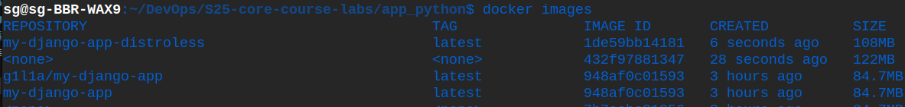

# Docker Best Practices

## 1. Rootless Container
- A non-root user (`webuser`) is created and used.

## 2. Minimization
- `pip install --no-cache-dir` is used to install dependencies without caching.

## 3. Using a Precise Base Image
- `python:3.12-alpine3.18` is used to ensure stability.

## 4. Using `.dockerignore`
- Unnecessary files (`__pycache__/`, `.git/`, `venv/`, etc.) are excluded to reduce image size.

## 5. Optimized Copying
- `COPY` is used twice:
  - First, only `requirements.txt` is copied to cache dependency installation. This ensures that dependencies are reinstalled only when requirements.txt changes.
  - Then, only the necessary app files are copied to prevent unnecessary dependency reinstalls when code changes.

## 6. Layer Sanity
- Used `COPY --chown` to set file ownership during the copy process, eliminating the need for separate RUN chown commands and reducing layers.
- Merged related commands into single RUN statements to minimize the total number of layers.
- Ordered instructions for caching.

## 7. Health Checks
- Implemented a `HEALTHCHECK` directive to periodically verify that the application is running correctly.

## 8. Environment Variables
- Set environment variables to optimize Python's behavior within the container.

# Distroless Image

## Key Differences
- Size: 121MB for Latest image tag VS 83.1MB for Distroless version of image.
- Base OS: Alpine VS No traditional OS for distroless image.
- Security: More dependencies, larger attack surface VS reduced attack surface for distroless image.
- Shell Acceess: Shell VS No /bin/sh or /bash for distroless image.
- Package Manager: apk/apt VS nothing.

## Explanations
- Distroless images strip away unnecessary OS-level utilities, reducing the final image size.
- Since Distroless images do not include package managers, shells, or debugging tools, they minimize potential security vulnerabilities.
- Distroless images follow best security practices by only including the runtime environment needed for the application.

## Screenshot
