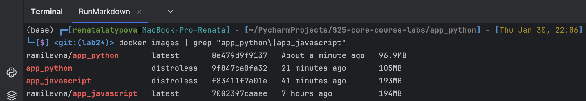

# Docker Best Practices for `app_python`

## Base Image Choice
- I use `python:3.11.5-alpine3.18` for a small, secure image.

## Security Enhancements
- The container runs as `appuser` (not root).
- No unnecessary packages are installed.

## Layer Optimization
- Dependencies are installed **before** copying source code to optimize caching.
- `.dockerignore` is used to exclude unnecessary files.

# Dockerization Process

## Multi-Stage Builds
I implemented multi-stage builds for both the Python and JavaScript applications. The primary benefits include:
- **Separation of concerns**: Dependencies are installed in a dedicated build stage, reducing the size of the final runtime image.
- **Optimized performance**: Only necessary files are copied to the final image.
- **Smaller image size**: By eliminating unnecessary files, we reduce disk space usage.

## Distroless Images
I explored Google Distroless images to improve security and reduce attack surface.

### Key Features of Distroless:
- **No shell**: The image does not include a package manager or shell, reducing attack vectors.
- **Smaller attack surface**: Fewer dependencies mean a reduced risk of vulnerabilities.
- **Minimalist approach**: Only required runtime dependencies are included.

## Image Size Comparison
Below is a comparison of the standard images versus the Distroless images:

| Application      | Standard Image | Distroless Image |
|-----------------|---------------|-----------------|
| app_python      | 96.9MB        | 105MB          |
| app_javascript  | 194MB         | 193MB          |

## Observations:
- The **app_python** distroless image is **slightly larger** (+8.1MB) than the standard one. This might be due to additional required runtime dependencies in the Distroless Python base.
- The **app_javascript** distroless image has **no significant reduction** compared to the standard image. This indicates that Alpine-based images for JavaScript applications might already be well-optimized.
- Despite minimal size reductions, **security and maintainability improvements** justify the use of Distroless images.

## Screenshot of Image Sizes

## Conclusion
Using **multi-stage builds** and **Distroless images**, I optimized security and maintainability. While Distroless did not significantly reduce image sizes, it enhances security by removing unnecessary dependencies and reducing the attack surface. Future improvements could explore using more optimized base images to reduce the final size further.