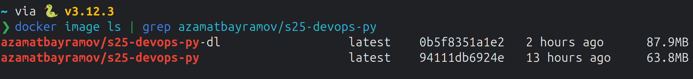

# Docker Best Practices Implemented

## Right base image

### Regular Docker Image

I used `python:3.12.8-alpine3.21` as the base image.
It is a lightweight image that contains only the necessary packages.
So, the final image is smaller.

### Distroless Docker Image

I used `debian:12-slim` as the base build image. It has the same OS as the final distroless image.
For the final distroless image, I used `gcr.io/distroless/python3-debian12:nonroot`.
It is a minimal image that contains only the necessary packages.

## Multi-stage builds

For the distroless image, I used multi-stage builds.

## Usage of `.dockerignore`

I used a `.dockerignore` file to exclude unnecessary files and directories
from the build context, improving the build performance.

## Creation of ephemeral container

Container needs no configuration to run. It is ready to run as soon as it is created.

## Installation of only necessary packages

The `requirements.txt` file contains only the necessary packages.

## Right order of instructions

The instructions are ordered in such a way that
the layers that change the least are placed at the top.
This way, the cache can be used more effectively.

## Pin base image version

I pinned the version of the base image to the following specific versions:

### Regular Docker Image

```
python:3.12.8-alpine3.21@sha256:ba13ef990f6e5d13014e9e8d04c02a8fdb0fe53d6dccf6e19147f316e6cc3a84
```

### Distroless Docker Image

```
debian:12-slim@sha256:f70dc8d6a8b6a06824c92471a1a258030836b26b043881358b967bf73de7c5ab
```

```
gcr.io/distroless/python3-debian12:nonroot@sha256:66f3e24fd4906156a7360d2861731d31d3457a02f34fd3c4491f0b710a259988
```

This way, the base image will not change unexpectedly.

## Usage of non-root user

### Regular Docker Image

I created a non-root user to run the application.

### Distroless Docker Image

I used the `nonroot` tag to ensure the image runs with non-root privileges.

## Disabling of Python cache

In regular Docker image I disabled the Python cache to reduce the size of the final image.

## Writing maintainer label

I wrote the maintainer label in the Dockerfiles.

## Dockerfile linting

I linted the Dockerfiles using the [hadolint](https://hadolint.github.io/hadolint/).

## Distroless Image Version

I created a distroless image for the Python app.
But the size of the distroless image is bigger than the regular image.
Perhaps this was due to the fact that I used alpine for the regular image.
Alpine is a very lightweight distribution.
Also, distroless image has less attack surface than the regular image.
It is because distroless image contains almost no packages in comparison to the regular image.


