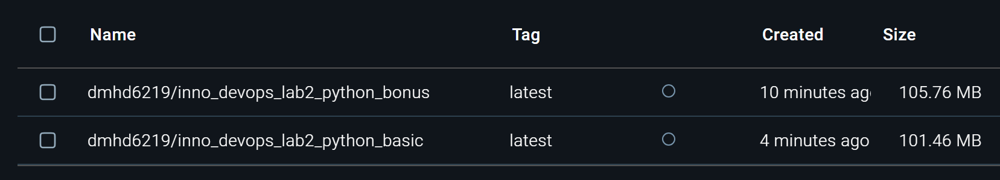

# Best practices

## 1. Specific image with specific version: `FROM python:3.10-alpine3.18 AS base`.

Alpine image reduces image size and pinned version helps to avoid issues after image update.

## 2. Copying only needed files

Copy only the files required for the build to reduce the attack surface.

## 3. Formatting file with `hadolint`

Lint and format Dockerfile using `hadolint` to ensure best practices.

## 4. Dockerignore file

Use a `.dockerignore` file to exclude unnecessary files from the build context.

## 5. Rootless container

Run containers as a non-root user to enhance security.

# Comparison with Distroless image

## 1. Size

As we can see, distroless container is a bit bigger than usual container. 
I think that reason is that for basic task I used alpine linux, which is significantly smaller,
but for bonus task for building dependencies I used slim python image because I couldn't launch
my application with using alpine linux.

## 2. Base image
* Previous: Used `python:3.10-alpine3.18` as the base image. This is an Alpine-based image,
known for its small size but includes a package manager and shell.

* Distroless: Uses a `distroless/python3-debian12:nonroot` image for the runtime. 
Distroless images are minimal and include only the runtime environment required for the application,
with no shell or package manager.

## 3. Security

* Previous: A non-root user is manually created (`app_python_user`), 
but the Alpine base image may still include unused packages and tools, which could introduce vulnerabilities.

* Distroless: The `nonroot` tag enforces the use of a non-root user
and avoids additional unnecessary tools, further reducing the attack surface.

## 4. Build Process

* Previous: Combined the build and runtime stages in a single image, leading to a larger final image.

* Distroless: Introduces a multi-stage build process:

  * A `deps-env` stage for preparing production dependencies.
  * A final `run-env` stage that only includes the built application and runtime dependencies.